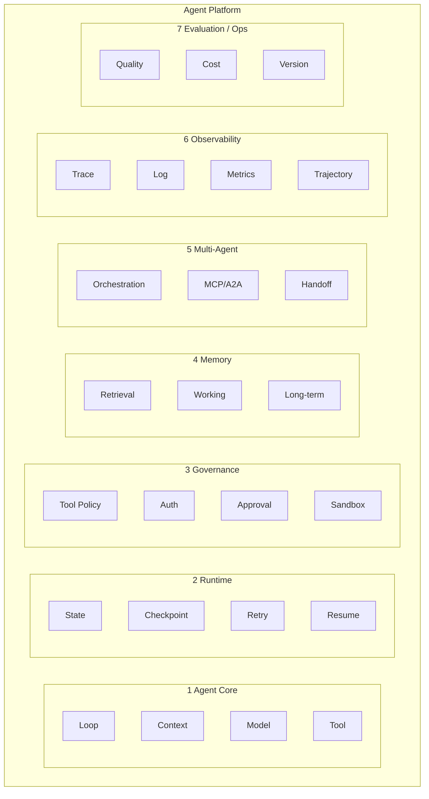
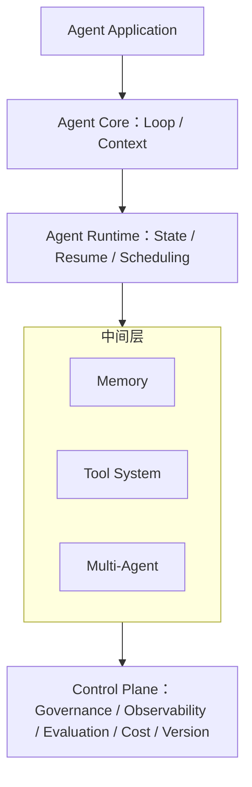

# Agent Platform 模块地图：必备内核 + 按需模块

> 来源：外部文章《7 层 Agent Platform 模型》汇总整理（2026-09-11 收录）。
> 性质定位：能力分层地图，当复习提纲和缺口检查表用，不当知识源用——零对照系统、缺成本工程、Runtime 只列名词，按综述标准三条都不满足。
> 增量料（对照系统、失败模式、成本工程）继续从 KP 文献清单取：`learning-path-2026-09-knowledge-points.md`。
> 本文不改变四档优先级判断：`learning-path-2026-09-arch-gap.md`。

---

## 0. 一页收口

一个 Agent 框架 = 1 个必备内核 + 6 个按需模块。

核心公式：**Agent = State + Loop + Tool + Model**
五原语：**AgentLoop + State + Tool + Event + Checkpoint**

| 模块 | 解决什么问题 | 按需判据（什么时候需要） | 不需要时的形态 |
|---|---|---|---|
| Agent Core（内核） | 怎么思考和行动 | 永远需要，没有它就不是 Agent | 不存在此选项 |
| Runtime | 怎么可靠地跑 | 任务生命周期超过单次进程存活时间（分钟/小时/天级） | 一次 HTTP 请求内完成的短任务 |
| Governance | Agent 能干什么（安全边界） | 工具能碰到真实世界（删库/花钱/发消息）或多租户 | 单租户、只读工具、个人脚本 |
| Memory | 怎么记住 | 跨会话、跨任务需要延续知识 | 一次性任务（翻译一篇文章） |
| Multi-Agent | 怎么协作 | 单 Agent 上下文装不下、或人格/工具集必须隔离 | 单 Agent 上下文和工具集够用 |
| Observability | 到底干了什么 | 进入生产环境就需要 | 学习期 demo 可推迟 |
| Evaluation / Ops | 到底做得好不好 | 要做版本迭代、prompt 对比才需要 | 一次性脚本、不迭代 |

栈式结构（文章最重要的洞察）：**不要把 7 层看成平级模块**，Governance / Observability / Evaluation / Cost / Version 收进同一个 Control Plane，它们是同一类东西——跨切面的平台治理能力。

---

## 1. 总图

7 层平级视图（文章第一张图，按能力域切）：



栈式视图（文章第二张图，按架构位置切，更接近真实 Agent Platform）：



两个视角正交：平级图答「有哪些能力域」，栈式图答「能力挂在架构哪个位置」。交叉使用，缺口不漏项。

---

## 2. 内核（必备）：Agent Core——怎么思考和行动

循环本体：

```text
User Goal → Context → LLM → Decision → Tool / Sub-Agent → Observation → Context Update → LLM → ...
```

内核必须自己设计好的八件事：

| 构成 | 内容 |
|---|---|
| Agent Loop | 循环本体：状态转移函数，不是线程不是回调 |
| Context 构建 | 每轮给 LLM 喂什么：人格、历史、检索、临时上下文 |
| Prompt / Instruction | 指令的组装与版本 |
| Tool Calling | 工具注册、schema、调用、结果回填 |
| Observation | 工具结果如何进入下一轮上下文 |
| Stop Condition | 什么时候停：maxSteps、无工具调用、显式完成信号 |
| Token / Context Window | 窗口管理：装不下怎么办 |
| Retry / Error Handling | 模型调用失败、工具失败的重试语义 |

为什么必备：去掉任何一件，Agent 退化成普通后端或不可用的 demo。

agent4j 对照（业界水准，7 层里最深的一层）：

- Loop 是 config+state→state 纯状态转移，execute/stream 同一循环（决策 0 / 4，`ReActAgentLoop` 的 runLoop + ModelInvoker）
- 人格在请求边界注入：每次请求从 config 注入、位置固定最前（决策 23）
- Stop Condition：maxSteps 边界（决策 3）
- Retry：RetryPolicy + `AgentEvent.RetryStarted` 事件 + attemptPrefix 计费口径

五原语与 agent4j 映射（文章提议「从五原语开始设计最小 Runtime」，agent4j 内核已经是这五个原语的一个实现）：

| 原语 | agent4j 实现 | 出处 |
|---|---|---|
| AgentLoop | `ReActAgentLoop.runLoop` | 决策 0 / 1 / 4 |
| State | `AgentState`（handoff 后步数全局共享，state 是 SSOT） | 决策 2 / 24 |
| Tool | `ToolRegistry` + `DefaultToolExecutor` | 决策 7 |
| Event | `AgentEvent` 流（Handoff、RetryStarted、TurnTrace） | 决策 24 |
| Checkpoint | `CheckpointStore`（只存 state 不存 request） | 决策 8 / 10 |

---

## 3. 按需模块一：Runtime——怎么可靠地跑

解决的问题：Agent 不是一次 HTTP Request，而是一个可能运行几分钟、几小时甚至几天的任务。

任务生命周期九件套：

```text
Task
 ├── Run
 ├── Pause
 ├── Resume
 ├── Retry
 ├── Timeout
 ├── Cancel
 ├── Checkpoint
 ├── Schedule
 └── Recovery
```

crash 恢复示例：

```text
Agent Run #123
Step 1 ✓
Step 2 ✓
Step 3 ✓
Step 4 → 调用外部 API → Crash → Restart → 从 Step 4 checkpoint 恢复
```

按需判据：任务生命周期超过单次进程存活时间才需要。72 小时验证的 demo、单轮对话、同步脚本都不需要；一旦任务要跨进程重启、跨天调度、可暂停人工介入，Runtime 从可选变必需。

这一层是「Demo Agent」和真正 Agent Runtime 之间最大的区别。

agent4j 对照：

- 已有：图工作流 + CheckpointStore，checkpoint 只存 state 不存 request（request 可重算，决策 8 / 10）
- 硬边界：单 JVM checkpoint，进程重启 = 执行中工具调用状态丢失，Temporal / Orleans 谱系未碰（KP8 未走）

文章没画的深水区（真往这层走时从这个问题进门，不从列更多名词进门）：checkpoint 恢复后，外部副作用（已扣款、已删库、已发消息）重放几次？决策 8 挡住了「request 可重算」这一半，没挡住「副作用已发生但 result 未写回 state」的间隙那一半。幂等键挂在 ToolExecutor 层还是 Checkpoint 层，答案是不同的。

关联：KP8 Durable Execution；`stage-6-article-4-idempotency.md`（幂等）。

---

## 4. 按需模块二：Governance——Agent 能干什么

定位：Agent 的 Operating System / Security Boundary。

治理链路：

```text
Agent → Tool Gateway → Permission → Policy → Approval → Sandbox → Tool
```

一个危险工具调用的完整裁决链：

```text
Who? → Which Agent? → Which User? → Which Tool? → What Parameters?
→ Permission? → Need Approval? → Audit → Execute
```

关键立场：`delete_database()` 这类调用不能直接执行，裁决链是 Runtime 的组成部分，不是外挂的运营功能。

按需判据：工具能触到真实世界（删库、花钱、发消息、写文件）或多租户场景，需要全链路；单租户 + 只读工具 + 个人脚本，最小化到审计日志即可。

agent4j 对照（治理链业界水准，Java 生态平均没这厚度）：

- 已有：`GovernedToolExecutor` 装饰链——权限三档（决策 11）+ 净化层（决策 12）+ 审计全量（决策 13）+ fail-closed
- 边界：沙箱停在 ClassLoader + Process，谱系第二级（单租户合理，多租户不够）；间接注入防御仅工具输出净化一层，缺「检索内容入上下文前净化」和 scoped 短期凭证

关联：KP5 Guardrails 时机、KP9 沙箱谱系（`dsh-sandbox-analysis.md` 三个借鉴点已沉淀）、KP10 间接注入。

---

## 5. 按需模块三：Memory——怎么记住

文章的五分类（MemGPT 系存储视角的标准话术）：

```text
Short-term Memory → 当前 Context
Working Memory    → 当前任务产生的中间状态
Long-term Memory  → 用户 / 项目 / Agent 的长期知识
Episodic Memory   → 过去执行过什么任务、结果如何
Semantic Memory   → 提炼后的知识 / Facts
```

Memory 与 Context Management 强耦合，不是独立模块：

```text
Memory → Retrieval → Context Assembly → LLM
```

所以文章的第 1 层（Context 构建）和第 4 层（Memory）不是完全独立的——Memory 的出口就是 Context 的入口。

按需判据：跨会话、跨任务需要延续知识才需要。一次性任务（翻译一篇文章、跑一次脚本）不需要；产品化 Agent（记住用户偏好、项目事实）必需。

agent4j 对照（深于文章的一层）：

- 13 字段 `MemoryEntry`（含 embedding、lifecycle、双时间轴规划）
- 写侧演进已落地：EVOLVE→HISTORICAL / CONFLICT→SUPERSEDED 分流（搬家场景：默认只见上海，历史查询能查回深圳）
- 读侧语义检索已落地：`HybridRankingStrategy`（语义 0.5 / 词面 0.3 / 重要度 0.2）+ 三档降级链
- 设计深度超出文章：对账环（写入前捞旧账给 LLM 挑键）、双时间轴四戳（业务轴答「世界当时怎样」，系统轴答「系统当时知道什么」）

关联：`discussion-memory-system-design.md`（9 轮设计讨论收口）。

---

## 6. 按需模块四：Multi-Agent / Interoperability——怎么协作

文章的关键拆分：这里实际是两个正交问题，不是一个。

问题一，Agent Orchestration（应用结构问题）：

```text
Planner
 ├── Research Agent
 ├── Coding Agent
 ├── Browser Agent
 └── Review Agent
```

回答：谁调用谁？任务怎么拆？怎么汇聚结果？

问题二，MCP / A2A（标准化通信问题）：

回答：Agent / Tool / 外部系统之间如何标准化通信。

统一视图：

```text
Agent Collaboration
 ├── Orchestration
 ├── Handoff
 ├── Delegation
 ├── MCP
 └── A2A
```

按需判据：单 Agent 上下文装得下、工具集不分人格就不需要。需要 Multi-Agent 的真实信号：不同子任务要不同人格/权限/上下文隔离（coding agent 不该看到 tavern 的人格），或上下文总量超窗口必须物理分摊。

agent4j 对照：

- Handoff 语义已落地且深于文章：循环内 config 换牌（决策 24，OpenAI SDK 同款），控制权转移不伪造历史；续跑契约已文档化（Handoff 事件是宿主重入的唯一信号源）
- A2A 协议对齐但仅 `InProcessA2AClient`，无 HTTP 传输（KP6）
- MCP 仅 stdio 无 SSE

关联：KP1 Handoff 三件套（E1 已内化）、KP6 A2A（周 2 计划）。

---

## 7. 按需模块五：Observability——到底干了什么

定位修正（文章对个人分类的调整，采纳）：Observability 不是「运营」的附属品，是 Runtime 的基础设施能力。

观测的粒度是逐步的：

```text
Agent Run → Step 1 → LLM Call → Tool Call → Observation → Step 2 → LLM Call → ...
```

每一步可记录的十四项：Input、Output、Model、Prompt Version、Tool、Tool Arguments、Tool Result、Token、Latency、Error、Cost、Context、Trace ID、Parent Agent / Child Agent。

终点产物：**Agent Trajectory**（轨迹）。它是 Debug、Evaluation、Cost Control、版本迭代四个下游的共同输入。

按需判据：进入生产环境（有真实用户、要排障、要算成本）就需要；纯学习 demo 可以只留日志。

agent4j 对照（持平，且数据管道是最被低估资产）：

- TurnTrace 记真实 prefix token（修复后用被接受尝试的 attemptPrefix）/ 延迟 / 召回
- trace 导出 S-A-O-R-D JSONL + DPO 偏好对
- M 系列（M7 黄金集、M9 每轮审计）直接依赖这条管道

---

## 8. 按需模块六：Evaluation / Ops——到底做得好不好

Agent 与普通后端系统的本质区别：

```text
传统系统：请求 → 程序 → 结果          对 / 错
Agent：   Goal → Trajectory → Result  必须回答「这次执行到底好不好」
```

评估七维：Task Success、Tool Accuracy、Answer Quality、Trajectory Quality、Cost、Latency、Safety。

版本迭代闭环（AgentOps 的入口）：

```text
Prompt Version A → 1000 tasks → Evaluation
Prompt Version B → 1000 tasks → Evaluation → A vs B
```

顺序立场：先有黄金集（离线回归），再谈 A/B（在线对比）。没有黄金集的 A/B 是没有锚点的漂流。

按需判据：要迭代 prompt、要做版本对比、要监控上线后漂移才需要；一次性脚本不需要。

agent4j 对照：

- 已有：`EvaluationRunner` 离线规则断言 + 回归集
- 立场：决策 22 有意不做 LLM-as-judge（可审计性保留）
- 缺口：无在线监控闭环、无漂移告警（KP7）；M7 黄金集在 Moonlit 规划中

关联：KP7 在线评估；`stage-18-article-2-how-to-evaluate.md`。

---

## 9. 文章边界：作为综述缺四块

钉这张图当总图可以，但要记住地图有、地形没有的四块：

| 缺口 | 具体 | 手里的对应物 |
|---|---|---|
| 零对照系统 | LangGraph / OpenAI Agents SDK / Letta / Temporal / AutoGen 一个名字都没出现 | `learning-path-2026-09-arch-gap.md` 四档差距（与代码核对过） |
| 成本工程整块缺席 | 无 prefix caching、无全局预算器——2026 生产端最贵的一条腿 | E3 已做（决策 26），且证伪一条普适直觉：OpenAI 写免费计价下 flapping（$0.003051）反胜 stable（$0.003135），前缀纪律是供应商定价决定的，不是普适真理 |
| Runtime 只列名词 | Run/Pause/Resume 九个名词列完，副作用重放问题没碰 | 思考题见 §3；`stage-6-article-4-idempotency.md` |
| Evaluation 停在指标清单 | 在线/离线分界、先黄金集再 A/B 的顺序没有 | KP7 + M7 黄金集路线 |

---

## 10. agent4j 缺口自检表（7 层 × 现状）

| 层 | agent4j 现状 | 判定 | 对应 KP |
|---|---|---|---|
| 1 Agent Core | Loop 纯状态转移 / execute-stream 合一 / 五原语齐 | 已有机制（业界水准） | KP1（E1 已内化） |
| 2 Runtime | CheckpointStore 只存 state；单 JVM 硬边界 | 仅骨架（durable 未碰） | KP8 |
| 3 Governance | GovernedToolExecutor 全链 fail-closed；沙箱第二级 | 治理链已有机制；沙箱仅骨架 | KP5 / KP9 / KP10 |
| 4 Memory | 写侧演进 + 读侧 embedding 已落地；对账环待做 | 已有机制（深于文章） | 记忆四步路线 |
| 5 Multi-Agent | Handoff 已落地（决策 24）；A2A 无 HTTP；MCP 无 SSE | Handoff 已有机制；协议层仅骨架 | KP6 |
| 6 Observability | TurnTrace + S-A-O-R-D + DPO 管道就绪 | 已有机制（持平） | — |
| 7 Evaluation | EvaluationRunner 离线断言；无在线闭环 | 仅骨架 | KP7 |

三色结论：已有机制 4 层（Core / 治理链 / Memory / Observability），仅骨架 3 处（Runtime / 沙箱 / 协议层 / 在线评估，其中 Runtime 与 KP8、评估与 KP7 对齐）。与四档差距分析结论一致：缺的全是钱和规模问题，成本工程（E2/E3）已补完，剩下的是 durable execution 与在线评估两条天花板线。

---

## 11. 思考题（接续）

crash 发生在 `delete_database()` 已在外部世界生效、tool result 尚未写回 `AgentState` 的间隙——恢复重放后，外部副作用执行几次？

提示一：决策 8「checkpoint 只存 state、request 可重算」挡住了这个问题的一半，没挡住哪一半？
提示二：幂等键挂在 ToolExecutor 层（工具执行去重）还是挂在 Checkpoint 层（步骤完成标记），恢复语义是不同的——前者拦不住「重放时换了新键」，后者拦不住「checkpoint 写入与副作用发生之间的最后一隙」。
