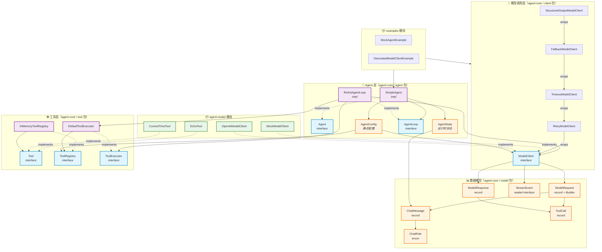
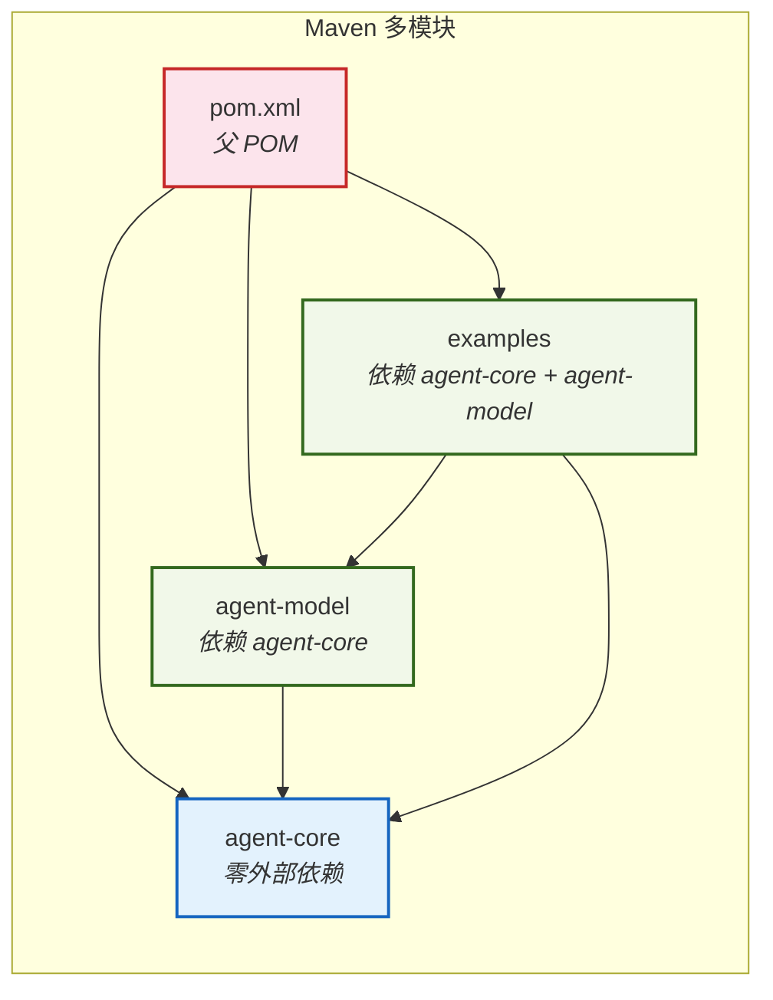
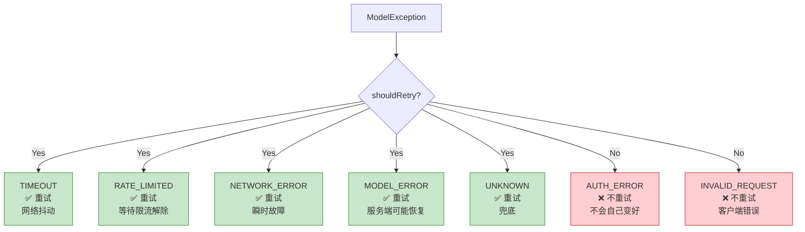
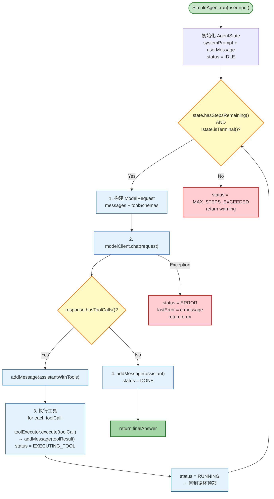
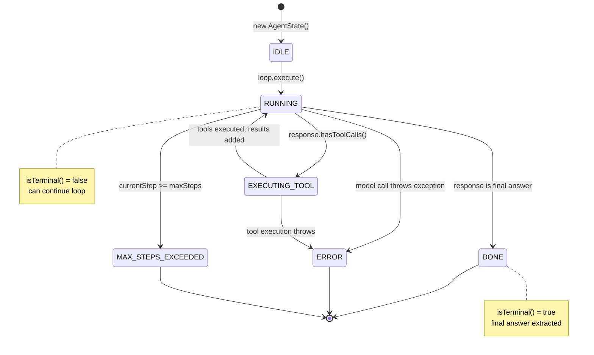
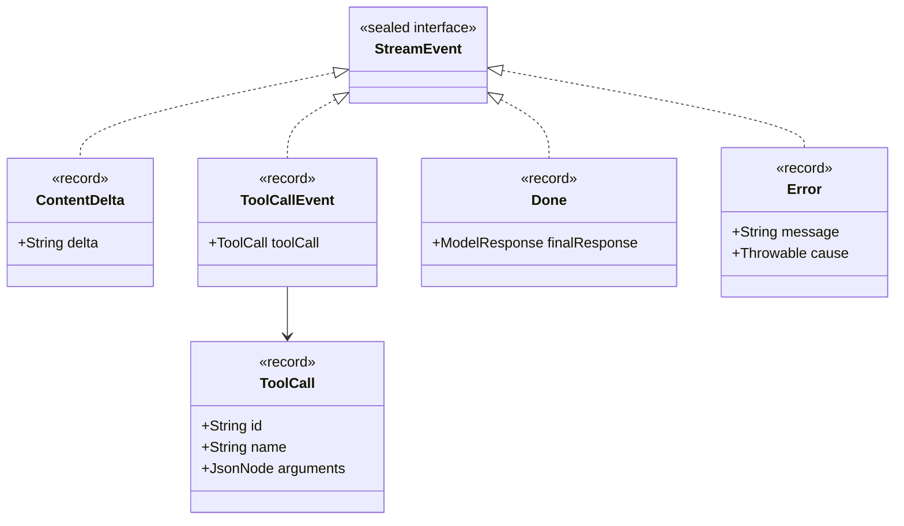
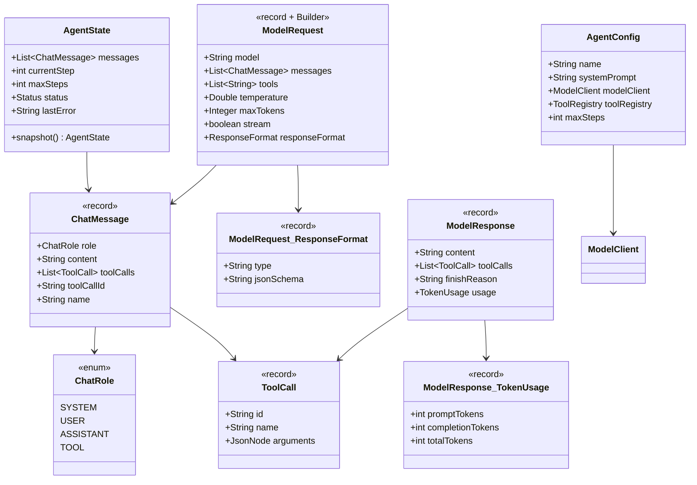
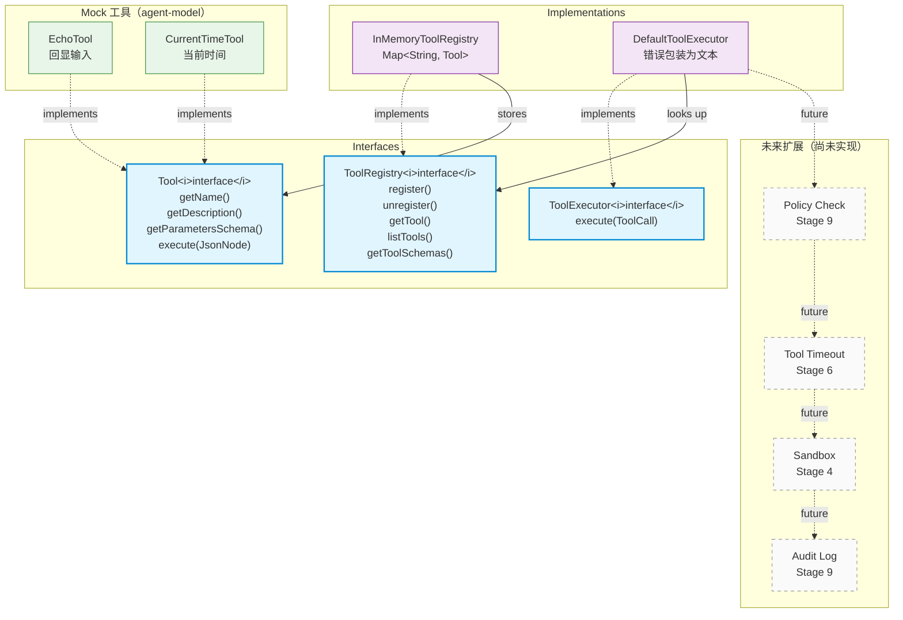
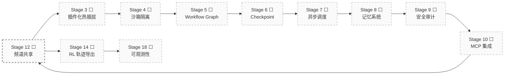

# Architecture Diagram — Stage 1-2

> Java Agent Framework 已完成阶段架构图
> 阶段：Stage 1（模型调用层）+ Stage 2（最小 Agent Loop）
> 时间：2026-08-12 ~ 2026-08-13

---

## 1. 整体分层架构（Layered Architecture）



---

## 2. 模块依赖关系



---

## 3. 装饰器链（Decorator Chain）

> ModelClient 装饰器组合是 Stage 1 的核心设计。
> 从外到内依次执行，每层只做一件事，可自由组合。

```mermaid
graph LR
    Caller["ReActAgentLoop<br/>.chat(request)"]
    Structured["StructuredOutputModelClient<br/>━━━━━━━━━━━━━━━━<br/>职责：JSON 验证 + 修正重试<br/>机制：responseFormat + 校验"]
    Fallback["FallbackModelClient<br/>━━━━━━━━━━━━━━━━<br/>职责：多级链式降级<br/>机制：主模型失败 → 备用1 → 备用2"]
    Timeout["TimeoutModelClient<br/>━━━━━━━━━━━━━━━━<br/>职责：强制超时<br/>机制：CompletableFuture.orTimeout"]
    Retry["RetryModelClient<br/>━━━━━━━━━━━━━━━━<br/>职责：重试瞬时故障<br/>机制：指数退避 + 错误码分类"]
    Real["实际 ModelClient<br/>━━━━━━━━━━━━━━━━<br/>OpenAiModelClient<br/>或 MockModelClient"]

    Caller --> Structured
    Structured -->|delegate| Fallback
    Fallback -->|primary / fallbacks| Timeout
    Timeout -->|delegate| Retry
    Retry -->|delegate| Real

    Real -.->|HTTP/SSE| Provider["OpenAI / Azure / Ollama / 火山方舟"]

    classDef caller fill:#fff9c4,stroke:#f57f17,stroke-width:2px
    classDef decorator fill:#e1f5fe,stroke:#0288d1,stroke-width:2px
    classDef real fill:#e8f5e9,stroke:#388e3c,stroke-width:2px
    classDef external fill:#fafafa,stroke:#999,stroke-dasharray: 5 5

    class Caller caller
    class Structured,Fallback,Timeout,Retry decorator
    class Real real
    class Provider external
```



### 重试错误码分类



---

## 4. ReAct 循环流程

> Stage 2 核心：ReActAgentLoop 是整个框架的心脏。
> AgentLoop 是函数不是线程——可测试、可组合、可暂停。



---

## 5. Agent 状态机



---

## 6. StreamEvent 类型体系（Sealed Interface）



---

## 7. 数据模型关系



---

## 8. 工具子系统



---

## 9. 完整调用链路（End-to-End）

```mermaid
sequenceDiagram
    participant User
    participant Example as MockAgentExample
    participant Agent as SimpleAgent
    participant Loop as ReActAgentLoop
    participant ModelClient as ModelClient<br/>(装饰器链)
    participant ToolExec as DefaultToolExecutor
    participant Registry as InMemoryToolRegistry
    participant LLM as LLM Provider<br/>(OpenAI/Mock)

    User->>Example: main()
    Example->>Agent: run("现在几点？")

    Note over Agent: 创建 AgentState<br/>systemPrompt + userMessage

    Agent->>Loop: execute(config, state)
    Note over Loop: status = RUNNING

    loop ReAct 循环
        Loop->>Loop: buildRequest(messages + tools)
        Loop->>ModelClient: chat(request)

        Note over ModelClient: Structured → Fallback<br/>→ Timeout → Retry → Real

        ModelClient->>LLM: HTTP POST /chat/completions
        LLM-->>ModelClient: response (toolCalls)

        alt 有工具调用
            ModelClient-->>Loop: ModelResponse(toolCalls)
            Loop->>Loop: addMessage(assistantWithTools)
            Loop->>ToolExec: execute(toolCall)
            ToolExec->>Registry: getTool("get_current_time")
            Registry-->>ToolExec: CurrentTimeTool
            ToolExec->>ToolExec: tool.execute(arguments)
            ToolExec-->>Loop: "当前时间: 14:30"
            Loop->>Loop: addMessage(toolResult)
            Note over Loop: status = EXECUTING_TOOL → RUNNING
        else 最终答案
            ModelClient-->>Loop: ModelResponse(content, "stop")
            Loop->>Loop: addMessage(assistant)
            Note over Loop: status = DONE
        end
    end

    Loop-->>Agent: finalState
    Agent-->>Example: "现在是 14:30"
    Example-->>User: 打印结果
```

---

## 10. 文件清单与所属层

```
agent-core/src/main/java/com/seven/agent/core/
├── model/                          # ─── 数据模型层（零依赖，纯 record/enum）
│   ├── ChatRole.java              #     enum: SYSTEM / USER / ASSISTANT / TOOL
│   ├── ChatMessage.java           #     record: 对话消息
│   ├── ToolCall.java              #     record: 工具调用描述
│   ├── ModelRequest.java          #     record + Builder: 模型请求
│   ├── ModelResponse.java         #     record: 模型响应（含 TokenUsage）
│   ├── StreamEvent.java           #     sealed interface: 流式事件
│   └── Builder.java               #     ModelRequest.Builder
│
├── client/                         # ─── 模型调用层（接口 + 装饰器）
│   ├── ModelClient.java           #     interface: chat() + stream()
│   ├── ModelException.java        #     异常 + ErrorCode 枚举
│   ├── RetryModelClient.java      #     装饰器：重试 + 指数退避
│   ├── TimeoutModelClient.java    #     装饰器：超时控制
│   ├── FallbackModelClient.java   #     装饰器：多级降级
│   └── StructuredOutputModelClient.java  # 装饰器：JSON 验证
│
├── tool/                           # ─── 工具层（接口 + 默认实现）
│   ├── Tool.java                  #     interface: 工具契约
│   ├── ToolException.java         #     工具异常
│   ├── ToolRegistry.java          #     interface: 注册表
│   ├── ToolExecutor.java          #     interface: 执行器
│   ├── InMemoryToolRegistry.java  #     默认注册表
│   └── DefaultToolExecutor.java   #     默认执行器
│
└── agent/                          # ─── Agent 层（循环 + 状态）
    ├── Agent.java                  #     interface: run()
    ├── AgentConfig.java            #     静态配置
    ├── AgentState.java             #     运行时状态 + 状态机
    ├── AgentLoop.java              #     interface: execute()
    ├── ReActAgentLoop.java         #     ReAct 循环实现
    └── SimpleAgent.java            #     默认 Agent 实现

agent-model/src/main/java/com/seven/agent/model/
├── mock/                           # ─── Mock 实现
│   ├── MockModelClient.java       #     脚本模式 + 规则模式
│   ├── EchoTool.java              #     回显工具
│   └── CurrentTimeTool.java       #     时间工具
└── openai/                         # ─── OpenAI 实现
    └── OpenAiModelClient.java      #     Java 21 HttpClient + SSE

examples/src/main/java/com/seven/agent/examples/
├── MockAgentExample.java          #     基础 Agent 示例
└── DecoratedModelClientExample.java  #  装饰器组合示例
```

---

## 设计原则总结

| 原则 | 体现 |
|------|------|
| **接口优先** | ModelClient / Tool / ToolRegistry / ToolExecutor / Agent / AgentLoop 全是接口 |
| **装饰器模式** | Retry / Timeout / Fallback / StructuredOutput 四层装饰器可自由组合 |
| **Registry-Executor 分离** | 元数据管理 vs 安全执行分离，为 Policy/Sandbox 留口子 |
| **函数式 AgentLoop** | `execute(config, state) → state`，不是 Thread/Runnable |
| **Sealed Interface** | StreamEvent 封闭类型，编译器保证模式匹配穷尽性 |
| **Mutable State + Snapshot** | AgentState 可变但支持 snapshot()，为 Checkpoint 预留 |
| **Builder 模式** | ModelRequest 用 Builder 构建，支持流式 API |
| **错误码分类** | ModelException.ErrorCode 区分可重试/不可重试 |

---

## 后续阶段预览


