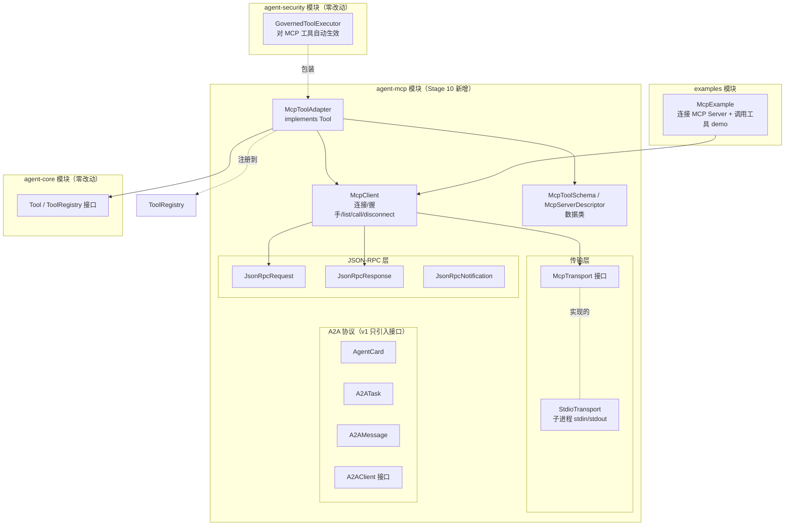

# Stage 10 架构设计：MCP 与外部生态集成

> 对应阶段：Stage 10 - MCP 与外部生态集成
> 状态：设计定稿，待实现
> 模块：新增 `agent-mcp` Maven 模块，依赖 `agent-core`（不依赖 workflow/scheduler/memory/security）
> 前置：Stage 1-9 已完成（工具/插件/沙箱/Workflow/Checkpoint/调度器/记忆/工具治理，213 测试全绿）

---

## 1. 核心命题：从「本地工具」到「远程生态」

Stage 1-9 的工具系统有一个贯穿始终的隐藏假设：**工具是本地 Java 类**。

```text
Stage 1: 写一个 Tool 实现，注册到 InMemoryToolRegistry
Stage 3: 插件系统从 jar 加载 Tool 类
Stage 9: GovernedToolExecutor 包装 ToolExecutor 执行 Tool
         全程都是"本地 Java 对象的方法调用"
```

这带来一个限制：**要用新工具，必须写 Java 代码、打包、注册**。模型能用什么工具，由开发者提前决定。

Stage 10 的答案：**接入 MCP（Model Context Protocol），让 Agent 连接任意外部工具服务器，运行时动态获得新工具。**

一句话（接 Stage 6/7/8/9 的递进叙事）：

```text
Stage 6 让 Run 能暂停-恢复
Stage 7 让 Run 能自动恢复
Stage 8 让 Agent 能记住
Stage 9 让 Agent 能被信任
Stage 10 让 Agent 能连接 -- 不再是"我写什么你用什么"，是"连上什么有什么"
```

---

## 2. MCP 是什么：Agent 的 USB 接口

MCP（Model Context Protocol）是 Anthropic 2024 年底发布的开放协议，定位精准：

```text
USB 之前：
  每种外设一个专用接口，键盘 PS/2、打印机并口、鼠标串口
  -> 用新设备 = 装新驱动 = 写新代码

USB 之后：
  统一接口，插上就用
  -> 用新设备 = 插上，驱动自动加载

MCP 之前（我们 Stage 1-9）：
  每个工具是一个 Java 类，注册到 ToolRegistry
  -> 用新工具 = 写 Java + 打包 + 注册

MCP 之后：
  统一协议，连上 MCP Server 就自动获得它暴露的工具
  -> 用新工具 = 启动一个 MCP Server，Agent 自动发现
```

### MCP 的三层抽象

```text
1. 传输层（Transport）：字节怎么传
   - stdio：本地子进程，stdin/stdout 通信（v1 实现这个）
   - SSE/HTTP：远程服务器（v2）

2. 消息层（JSON-RPC 2.0）：请求/响应怎么关联
   - 每个请求有 id，响应携带相同 id 关联
   - 通知（notification）无 id，单向

3. 协议层（MCP semantic）：有哪些方法
   - initialize / initialized：握手
   - tools/list：列出工具
   - tools/call：调用工具
   - shutdown：优雅关闭
```

### MCP 工具长什么样

MCP Server 通过 `tools/list` 返回的工具定义：

```json
{
  "name": "get_weather",
  "description": "Get current weather for a city",
  "inputSchema": {
    "type": "object",
    "properties": {
      "city": { "type": "string" }
    },
    "required": ["city"]
  }
}
```

这跟我们 `Tool` 接口的三个方法（getName / getDescription / getParametersSchema）**一一对应**。MCP 工具天然能映射成我们的 Tool 接口--这是 Stage 10 设计的幸运起点。

### 工具调用结果

MCP `tools/call` 返回 content 数组（文本/图片/资源引用）：

```json
{
  "content": [
    { "type": "text", "text": "Beijing: 25°C, sunny" }
  ],
  "isError": false
}
```

v1 只处理 text 类型的 content，拼成一个字符串返回（符合我们 Tool.execute() 返回 String 的约定）。

---

## 3. 核心抽象（10 个）

| 抽象 | 层 | 一句话 |
|---|---|---|
| `McpServerDescriptor` | 数据 | 连接配置：name / transport / command 或 url |
| `McpToolSchema` | 数据 | 从 MCP server 拉来的工具定义：name/description/inputSchema |
| `JsonRpcRequest` | 数据 | JSON-RPC 2.0 请求：id + method + params |
| `JsonRpcResponse` | 数据 | JSON-RPC 2.0 响应：id + result 或 error |
| `JsonRpcNotification` | 数据 | JSON-RPC 2.0 通知：method + params（无 id） |
| `McpTransport` | 传输 | 接口：send(String) / receive() / close() |
| `StdioTransport` | 传输 | 子进程实现：ProcessBuilder + stdin/stdout |
| `McpClient` | 协议 | 连接/握手/list tools/call tool/disconnect |
| `McpToolAdapter` | 适配 | implements Tool，execute() 内部走 McpClient.callTool() |
| `AgentCard` / `A2ATask` / `A2AMessage` / `A2AClient` | A2A | A2A 协议数据类 + 客户端接口（v1 只引入接口，重活留 Stage 11） |

### 3.1 关键接口草图

```java
// ---- MCP 客户端 ----
public class McpClient {
    private final McpServerDescriptor descriptor;
    private final McpTransport transport;
    private final AtomicLong nextId = new AtomicLong(1);
    private volatile boolean initialized = false;

    public void connect();                              // initialize 握手
    public List<McpToolSchema> listTools();              // tools/list
    public String callTool(String name, JsonNode args); // tools/call
    public void disconnect();                           // shutdown
}

// ---- 工具适配器（MCP 工具 -> 我们的 Tool 接口）----
public class McpToolAdapter implements Tool {
    private final McpClient client;
    private final McpToolSchema schema;

    @Override
    public String getName() { return schema.name(); }
    @Override
    public String getDescription() { return schema.description(); }
    @Override
    public String getParametersSchema() { return schema.inputSchema().toString(); }

    @Override
    public String execute(JsonNode arguments) {
        return client.callTool(schema.name(), arguments);  // 远程调用
    }
}

// ---- 传输接口 ----
public interface McpTransport extends AutoCloseable {
    void send(String json);
    String receive();  // 阻塞直到收到一条消息
    void close();
}
```

---

## 4. 关键设计决策（8 个）

### D1. MCP 工具映射成 Tool 接口，对调用方完全透明

```text
McpToolAdapter implements Tool
  -> 可以注册到 ToolRegistry
  -> 可以被 DefaultToolExecutor 执行
  -> 可以被 GovernedToolExecutor 包装（治理四件套照常生效！）
  -> 可以被 ModelClient 当作普通工具塞进 ModelRequest.tools
```

**为什么重要**：这意味着 Stage 1-9 的所有能力（权限/审批/审计/净化/限流）对 MCP 工具**自动生效**，零额外代码。装饰器哲学的回报：新接入方式 = 新的 Tool 实现，治理层不变。

### D2. Transport 抽象，v1 只做 stdio

```text
McpTransport 接口
  ├── StdioTransport   v1：本地子进程（ProcessBuilder + stdin/stdout）
  └── SseTransport     v2：远程 HTTP/SSE
```

stdio 是 MCP 最常见的部署形态（Claude Desktop、Cursor 都用 stdio 跑本地 MCP server）。v1 只做这个，v2 接 SSE 时换实现不动 McpClient。

### D3. JSON-RPC 同步阻塞，不做异步

```text
callTool:
  1. 构造 JsonRpcRequest(id=N, method="tools/call", params={...})
  2. transport.send(request.toJson())
  3. 阻塞 transport.receive() 等响应
  4. 解析 JsonRpcResponse，匹配 id=N
  5. 返回 content 拼接的字符串
```

v1 不做异步/回调/Promise。理由：教学型框架优先可测；MCP 工具调用本质是请求-响应，同步模型够用。异步 v2 再加（要支持 server 推送 progress 通知）。

### D4. MCP 工具默认 REQUIRES_APPROVAL（呼应 Stage 9）

```text
接入 MCP Server 时：
  McpToolPolicy 默认把所有 MCP 工具设为 REQUIRES_APPROVAL
  
  -> 理由：MCP server 是外部来源，不受你控制
  -> Stage 9 第 7 层讲过：MCP 时代 DENY + Sanitizer 从加分变生死线
  -> 默认保守，管理员显式升级已知安全的工具到 AUTO
```

这个决策把 Stage 9 的治理哲学延伸到 Stage 10：**新工具来源不受控时，权限默认档位要降级**。

### D5. Server 生命周期：connect / disconnect / 进程管理

```text
connect:
  1. transport.open()（启动子进程）
  2. send initialize request（客户端能力声明）
  3. receive initialize response（server 能力声明）
  4. send initialized notification（握手完成）

disconnect:
  1. send shutdown request
  2. receive shutdown response
  3. transport.close()（杀子进程）
  
崩溃检测：
  transport.receive() 抛 IOException / EOF
  -> McpClient 标记 disconnected
  -> v2 加自动重连
```

### D6. MCP 工具结果必经 ResultSanitizer

```text
McpToolAdapter.execute() 返回的字符串
  -> 来自外部 server，可能含注入指令
  -> 必须经 GovernedToolExecutor 的 ResultSanitizer 净化
```

这条**不需要额外代码**--只要 McpToolAdapter 注册后用 GovernedToolExecutor 执行，净化自动发生。这是 D1（透明适配）的回报。

### D7. 工具爆炸：v1 全量注册，v2 白名单过滤

```text
v1：connect 后 listTools，全部 McpToolAdapter 注册到 ToolRegistry
    -> 简单，但一次接入几十个工具会撑爆 ModelRequest.tools

v2：白名单配置 + 按需加载
    -> 只有白名单内的工具才注册
    -> 或者懒加载（模型问到再注册）
```

### D8. A2A 基础接口引入，编排留 Stage 11

```text
v1 只引入数据类和客户端接口：
  AgentCard    Agent 的能力声明（name/description/skills/endpoints）
  A2ATask      跨 Agent 任务委托（taskId/recipient/delegate/payload）
  A2AMessage   Agent 间消息（from/to/content/protocol）
  A2AClient    接口：sendTask / getTaskStatus / getMessage

不做：
  - 多 Agent 编排器
  - 任务图
  - 信任分级矩阵
  - 成本归属计算
  -> 全部留 Stage 11
```

理由：A2A 的真正价值在"多 Agent 协作编排"，那是 Stage 11 的核心。Stage 10 只是把协议数据结构立起来，证明"Agent 之间能通信"。

---

## 5. 分层架构图



依赖关系：`agent-mcp -> agent-core`（用 Tool / ToolRegistry 接口）。**agent-mcp 不依赖 agent-security**--但 McpToolAdapter 注册后可被 GovernedToolExecutor 包装，治理自动生效（D1 + D6 的回报）。

---

## 6. 完整时序：连接 MCP Server 并调用工具

```text
T0: 应用启动
    -> McpClient client = new McpClient(descriptor);
    -> client.connect()
       1. StdioTransport.open() 启动子进程（如 "python weather_server.py"）
       2. send initialize request: {method: "initialize", params: {clientInfo, capabilities}}
       3. receive initialize response: {serverInfo, capabilities}
       4. send initialized notification
       -> 握手完成

T1: 发现工具
    -> List<McpToolSchema> tools = client.listTools()
       1. send tools/list request
       2. receive response: [{name: "get_weather", description, inputSchema}, ...]
       3. 返回 List<McpToolSchema>

T2: 注册到 ToolRegistry
    -> for each schema: registry.register(new McpToolAdapter(client, schema))
    -> 现在 ToolRegistry 里既有本地工具，也有 MCP 工具
    -> 模型能看到它们的 schema（在 ModelRequest.tools 里）

T3: 模型调用 MCP 工具
    -> 模型产出 ToolCall("get_weather", {city: "Beijing"})
    -> GovernedToolExecutor.execute(toolCall)
       1. PermissionChecker.check("get_weather")
          -> MCP 工具默认 REQUIRES_APPROVAL（D4）
          -> ToolApprovalService.request()
          -> 人批准
       2. delegate.execute(toolCall)  # DefaultToolExecutor
          -> registry.getTool("get_weather")  # 拿到 McpToolAdapter
          -> adapter.execute({city: "Beijing"})
             -> client.callTool("get_weather", {city: "Beijing"})
                -> send tools/call request
                -> receive response: {content: [{type: "text", text: "25°C"}]}
                -> 拼接 content -> "25°C"
             -> 返回 "25°C"
       3. ResultSanitizer.sanitize("25°C")
          -> 干净，原样通过
       4. AuditLogger 记 EXECUTED
    -> 返回 "25°C" 给模型

T4: 关闭
    -> client.disconnect()
       1. send shutdown request
       2. receive shutdown response
       3. transport.close() 杀子进程
```

---

## 7. 模块结构

```text
agent-mcp/
└── src/main/java/io/github/qwzhang01/agent/mcp/
    ├── McpClient.java                # MCP 客户端：连接/list/call/disconnect
    ├── McpServerDescriptor.java      # 连接配置 record
    ├── McpToolSchema.java            # 工具定义 record（从 server 拉来的）
    ├── McpToolAdapter.java           # implements Tool，远程调用包装
    ├── transport/
    │   ├── McpTransport.java         # 传输接口
    │   └── StdioTransport.java        # 子进程实现
    ├── jsonrpc/
    │   ├── JsonRpcRequest.java        # 请求 record
    │   ├── JsonRpcResponse.java       # 响应 record
    │   └── JsonRpcNotification.java   # 通知 record
    └── a2a/
        ├── AgentCard.java            # A2A Agent 能力声明
        ├── A2ATask.java              # A2A 任务委托
        ├── A2AMessage.java           # A2A 消息
        └── A2AClient.java           # A2A 客户端接口（v1 只接口）

examples/（新增 1 个）
└── McpExample.java                   # 连接 MCP Server + 注册工具 + 调用 demo
```

---

## 8. 实现里程碑（建议 4 天）

| # | 里程碑 | 交付 | 验证 |
|---|--------|------|------|
| M10.1 | JSON-RPC + Transport | JsonRpcRequest/Response/Notification + McpTransport 接口 + StdioTransport 实现 | 能启动子进程，发一条 ping 请求收响应 |
| M10.2 | McpClient 协议层 | McpClient + McpServerDescriptor + connect/listTools/callTool/disconnect | 能连接真实 MCP server（或 mock），list 工具，call 工具 |
| M10.3 | McpToolAdapter 适配 | McpToolSchema + McpToolAdapter implements Tool + 注册到 ToolRegistry | MCP 工具能被 DefaultToolExecutor 执行，能被 GovernedToolExecutor 包装治理 |
| M10.4 | 验收示例 + 测试 + README | McpExample + Mock Mcp Server（教学用） + 测试补齐 | 规划 3 条验收全过；全仓测试全绿 |
| M10.5（轻量） | A2A 接口引入 | AgentCard/A2ATask/A2AMessage/A2AClient 数据类+接口 | 接口可编译，不做编排（Stage 11） |

依赖：M10.2 依赖 M10.1；M10.3 依赖 M10.2；M10.4 收口；M10.5 独立。

---

## 9. 验收标准（对齐 18 周规划）

```text
1. Agent 能连接一个外部 MCP Server 并使用其工具
   ✅ M10.2 + M10.3

2. MCP 工具自动注册为框架 Tool，与本地工具无差异使用
   ✅ M10.3（McpToolAdapter implements Tool）

3. 两个 Agent 能通过 A2A 协议委托任务和返回结果
   ✅ M10.5（接口引入 + 简单请求-响应；编排留 Stage 11）
```

---

## 10. 测试策略

- **JSON-RPC 序列化**：request/response/notification 三种消息的 toJson/parse 互逆
- **Transport 往返**：echo server（自己写一个简易 mock），send 一条收一条
- **McpClient 握手**：连接 mock server，initialize -> initialized -> listTools -> callTool -> shutdown 全流程
- **McpToolAdapter 透明性**：注册后 ToolRegistry.listTools() 含 MCP 工具；DefaultToolExecutor.execute() 能调用
- **治理透明性**：用 GovernedToolExecutor 包装，MCP 工具默认 REQUIRES_APPROVAL，ResultSanitizer 净化外部内容
- **进程崩溃**：杀掉子进程后 callTool 抛异常（不挂死）
- **A2A 接口可编译**：数据类能构造，接口可被实现
- **向后兼容**：不配 MCP 时行为与 Stage 9 完全一致（存量 213 测试不动全绿）

### Mock MCP Server（教学用）

写一个简易的 mock MCP server（Java 进程内 echo，或 Python 单文件脚本）：
- 支持 initialize/tools/list/tools/call/shutdown
- 暴露一个 `echo(text)` 工具
- 用于测试和 demo，不依赖真实外部 server

---

## 11. 文章规划（7 篇 -> 里程碑映射）

| 文章 | 写作时机 | 素材来源 |
|---|---|---|
| 《MCP 是什么：Agent 的 USB 接口》 | M10.1 | §2（USB 比喻 + 三层抽象） |
| 《MCP Client 如何嵌入 Java Agent 框架》 | M10.2 | D1（McpToolAdapter 透明适配） + 完整时序 |
| 《MCP Server 作为远程插件：与本地插件的区别》 | M10.2 | 与 Stage 3 插件系统对比 |
| 《MCP 的 5 道生产坎》 | M10.3 | 工具爆炸/不可信 Server/进程管理/鉴权透传/Trace 透传 |
| 《MCP vs A2A：纵向接工具 vs 横向连 Agent》 | M10.5 | D8（MCP 工具生态 vs A2A Agent 协作） |
| 《MCP Server 进程管理：stdio 与 SSE 的工程取舍》 | M10.3 | D2 + D5（生命周期） |
| 《A2A 协议：Agent 之间的外交语言》 | M10.5 | AgentCard/A2ATask/A2AMessage 数据结构 |

---

## 12. 本阶段不做（范围控制）

- **MCP SSE/HTTP transport** -- v1 只做 stdio；远程服务器 v2
- **MCP Resources / Prompts** -- v1 只做 Tools；MCP 另外两 capability（资源/Prompt 模板）v2 再加
- **MCP 鉴权透传 / OAuth** -- 接外部需要鉴权的 server 时再做
- **MCP Trace 透传** -- 跨进程 trace 传播，Stage 18（可观测性）的事
- **MCP Server 进程自动重启** -- 崩溃后不自动重连（v2）
- **MCP 工具懒加载 / 白名单过滤** -- v1 全量注册；v2 按需
- **A2A 多 Agent 编排** -- Stage 11 的核心
- **A2A 信任分级矩阵 + 成本归属** -- Stage 11/15
- **MCP Server 的 server 端实现** -- 我们只做 client 端，不做"把自己工具暴露给别的 Agent"（那是另一个方向）
