# Stage 3 架构图与执行流程

> 插件系统架构图 + 执行流程图
> 对应阶段：Stage 3 - 插件化与热插拔系统

---

## 1. 整体分层架构

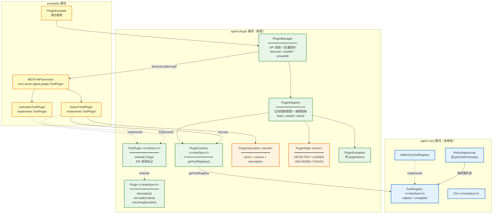

---

## 2. 模块依赖关系

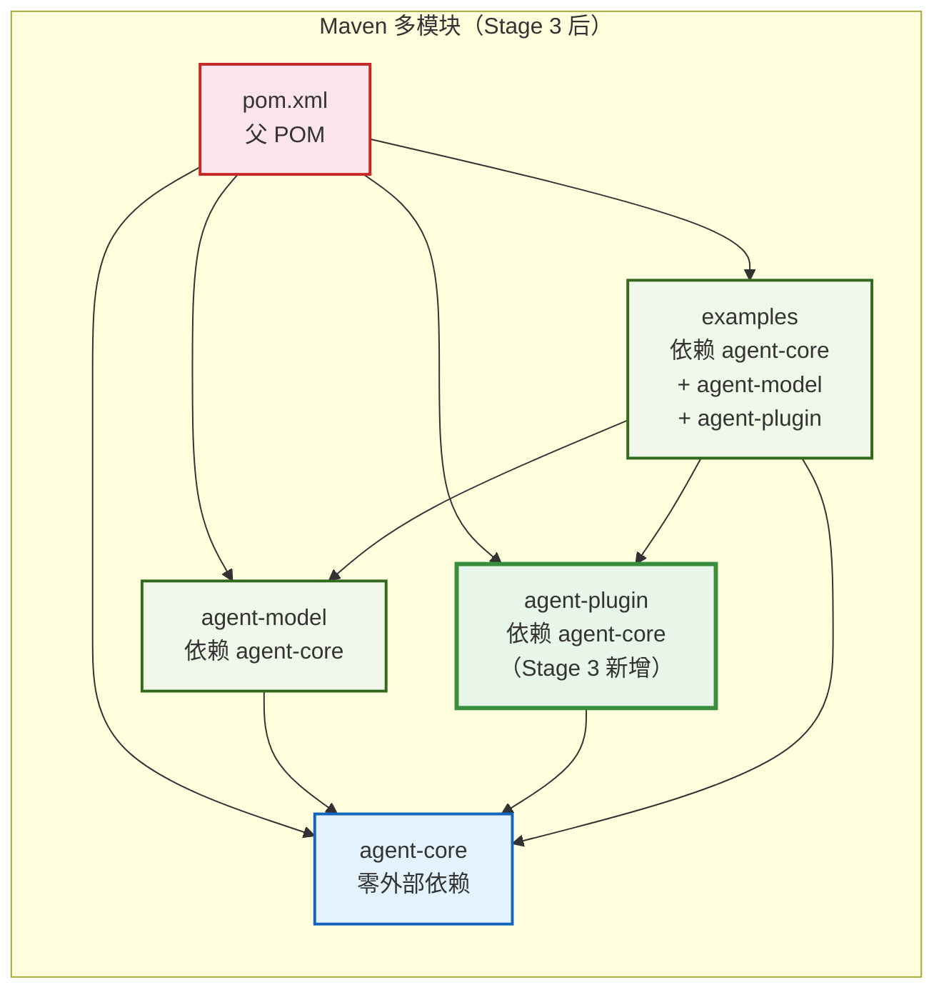

---

## 3. SPI 发现机制

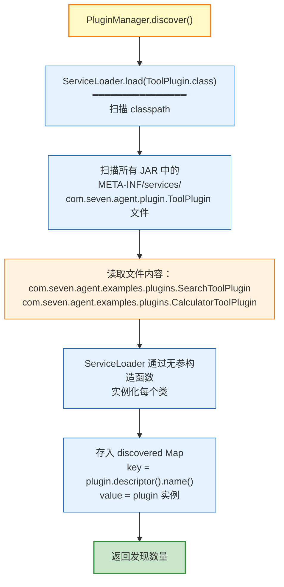

---

## 4. 插件生命周期状态机

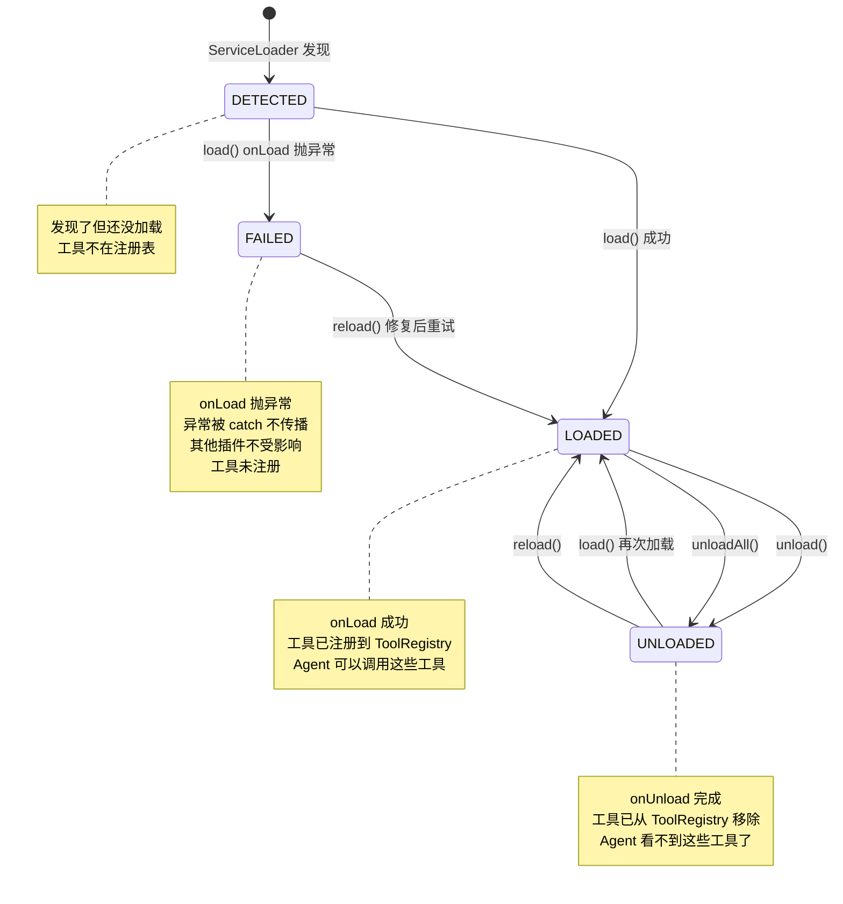

---

## 5. 加载流程（load）

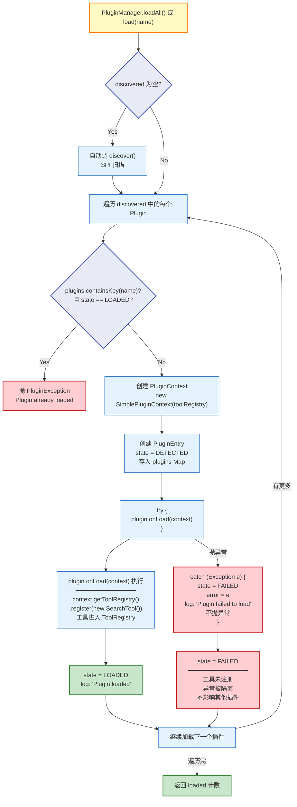

---

## 6. 卸载流程（unload）

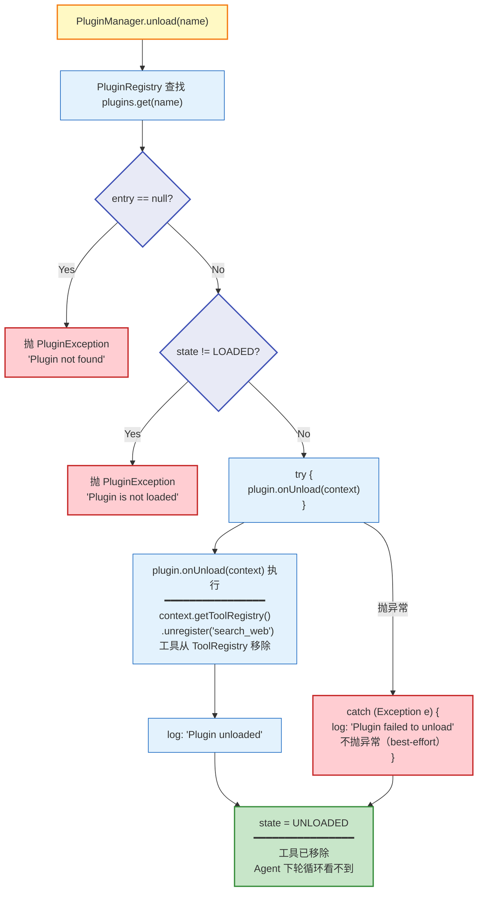

---

## 7. 故障隔离流程

```mermaid
flowchart TD
    Start["loadAll() 加载 3 个插件"]

    PluginA["插件 A：SearchToolPlugin<br/>onLoad 正常"]
    PluginB["插件 B：FailingPlugin<br/>onLoad 抛 RuntimeException"]
    PluginC["插件 C：CalculatorToolPlugin<br/>onLoad 正常"]

    TryA["try { pluginA.onLoad() }"]
    OnLoadA["registry.register(SearchTool)<br/>成功"]
    SuccessA["state = LOADED<br/>工具在注册表中"]

    TryB["try { pluginB.onLoad() }"]
    OnLoadB["抛 RuntimeException<br/>'Intentional failure'"]
    CatchB["catch (Exception e) {<br/>  state = FAILED<br/>  error = e<br/>  不抛异常<br/>}"]
    FailedB["state = FAILED<br/>━━━━━━━━━━━━━━━━<br/>工具未注册<br/>异常被隔离"]

    TryC["try { pluginC.onLoad() }"]
    OnLoadC["registry.register(CalculatorTool)<br/>成功"]
    SuccessC["state = LOADED<br/>工具在注册表中"]

    Result["最终结果：<br/>━━━━━━━━━━━━━━━━<br/>ToolRegistry 中有 [search_web, calculate]<br/>插件 A 和 C 正常工作<br/>插件 B FAILED 但不影响 A 和 C<br/>Agent 正常运行，只是少了 B 的工具"]

    Start --> PluginA
    PluginA --> TryA --> OnLoadA --> SuccessA
    SuccessA --> PluginB
    PluginB --> TryB --> OnLoadB
    OnLoadB --> CatchB --> FailedB
    FailedB --> PluginC
    PluginC --> TryC --> OnLoadC --> SuccessC
    SuccessC --> Result

    classDef start fill:#fff9c4,stroke:#f57f17,stroke-width:2px
    classDef plugin fill:#e3f2fd,stroke:#1565c0,stroke-width:2px
    classDef try fill:#f3e5f5,stroke:#7b1fa2
    classDef success fill:#c8e6c9,stroke:#388e3c,stroke-width:2px
    classDef error fill:#ffcdd2,stroke:#c62828,stroke-width:2px
    classDef result fill:#fff3e0,stroke:#ef6c00,stroke-width:2px

    class Start start
    class PluginA,PluginB,PluginC plugin
    class TryA,OnLoadA,TryB,OnLoadB,TryC,OnLoadC try
    class SuccessA,SuccessC success
    class CatchB,FailedB error
    class Result result
```

---

## 8. 完整执行时序图

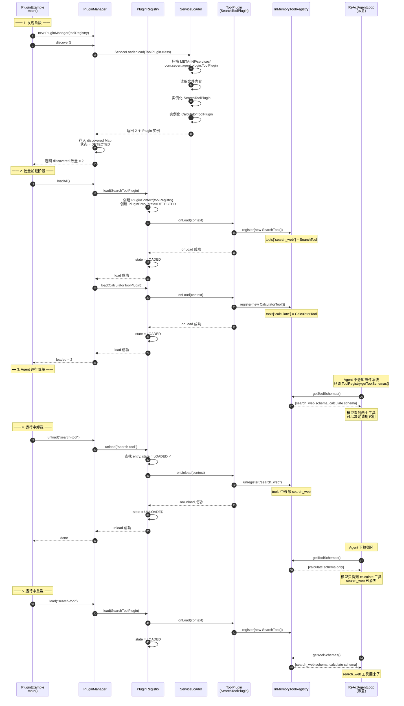

---

## 9. 插件与 Agent 的关系

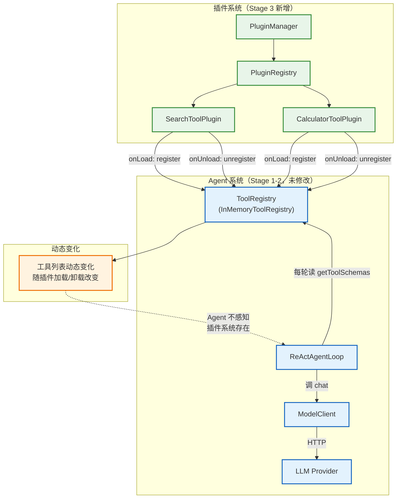

---

## 10. PluginManager API 调用关系

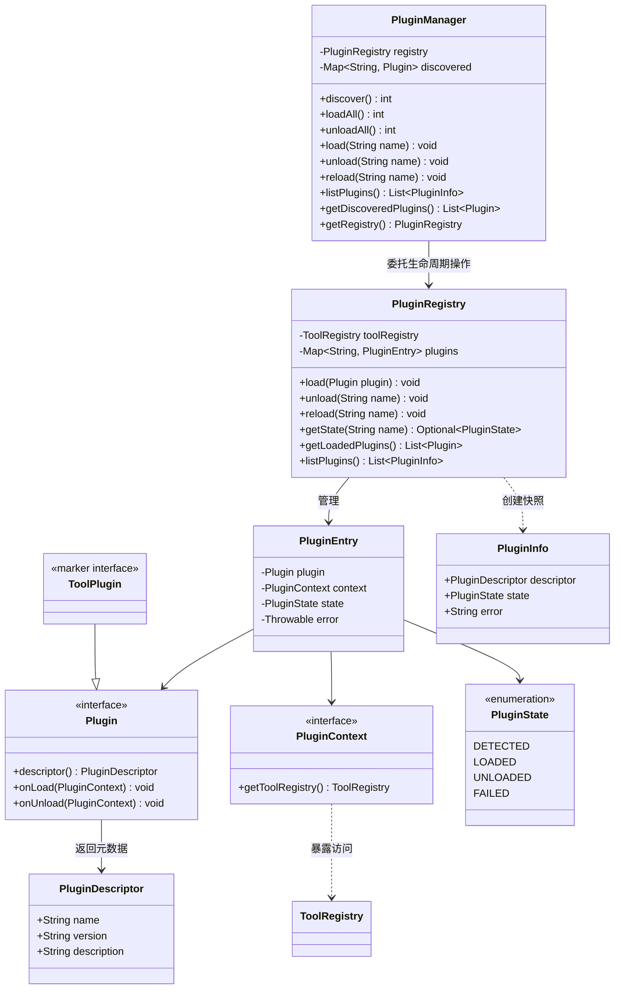

---

## 11. 与 Stage 1-2 的集成全景

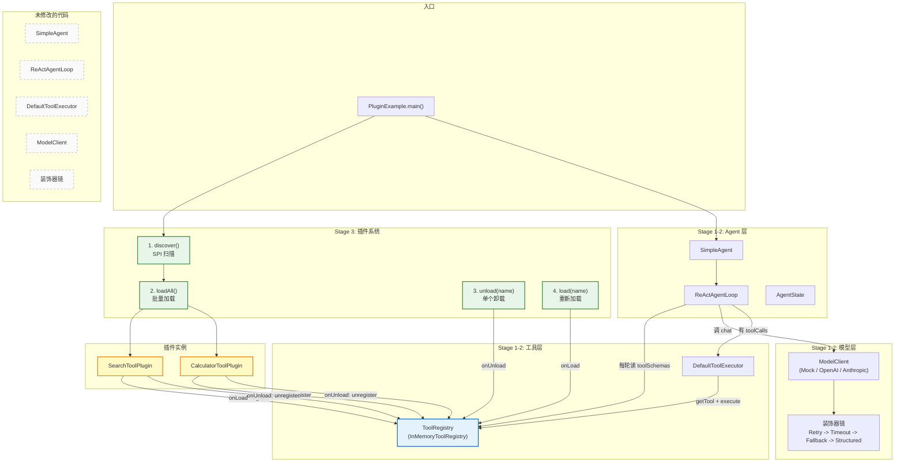

---

## 12. 文件清单

```
agent-plugin/                                      # Stage 3 新增模块
├── pom.xml                                        # Maven 配置
├── src/main/java/com/seven/agent/plugin/
│   ├── Plugin.java                               # 插件接口
│   ├── PluginDescriptor.java                     # 元数据 record
│   ├── PluginState.java                          # 状态枚举
│   ├── PluginException.java                      # 插件异常
│   ├── PluginContext.java                        # 插件上下文接口
│   ├── ToolPlugin.java                           # Tool 插件标记接口
│   ├── PluginRegistry.java                       # 生命周期管理
│   └── PluginManager.java                        # SPI 发现 + 批量操作
└── src/test/java/com/seven/agent/plugin/
    ├── PluginLifecycleTest.java                  # 11 个生命周期测试
    └── PluginManagerTest.java                    # 8 个管理器测试

examples/                                          # Stage 3 新增示例
├── src/main/java/com/seven/agent/examples/
│   ├── PluginExample.java                        # 演示程序
│   └── plugins/
│       ├── SearchToolPlugin.java                 # 示例插件 1
│       └── CalculatorToolPlugin.java             # 示例插件 2
└── src/main/resources/META-INF/services/
    └── com.seven.agent.plugin.ToolPlugin         # SPI 声明文件

修改的文件
├── pom.xml                                        # 父 POM：加 agent-plugin 模块
└── examples/pom.xml                              # 加 agent-plugin 依赖
```
