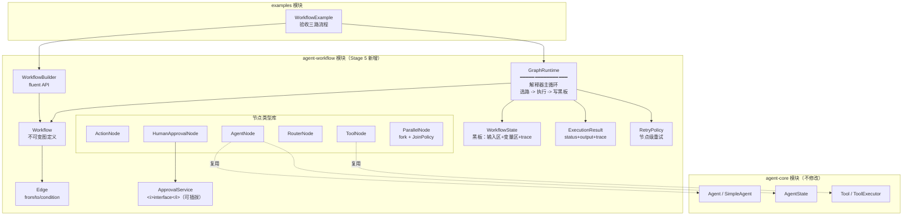

# Stage 5 架构设计：Workflow 和 Graph Runtime

> 对应阶段：Stage 5 - Workflow 和 Graph Runtime
> 状态：✅ 已实现（2026-08-17，23 个测试全绿；验收示例 WorkflowSupportFlowExample 三路流程跑通）
> 实现备注：路由语义为「条件边优先唯一命中，无条件边仅兜底」；实现中发现 otherwise 边与命中条件边会形成二义性，已在
> GraphRuntime.route 中修复
> 模块：`agent-workflow`（新增），依赖 `agent-core`

---

## 1. 核心命题：Workflow 和 Agent 是两个正交的东西

```text
Agent    = 不确定性决策：下一步做什么，LLM 说了算（概率系统）
Workflow = 确定性控制：下一步做什么，代码说了算（图结构）
Graph Runtime = 把两者粘起来的执行平面：
                图结构是确定的，节点内部可以是不确定的
```

一句话理解：**Agent 是图里的一个节点，不是图的对立面。**

一个 AgentNode 内部有自己的 ReAct 循环（可能 10 步），但对图来说，它只是一个
"可能耗时较长的同步步骤"。图不关心节点内部发生了什么，只关心：

1. 节点执行完了没有（成功 / 失败 / 需要审批）
2. 下一步走哪条边（条件求值）

这就是"同一 Runtime 支持企业 Agent / 酒馆游戏 / Coding Agent"的机制基础：
三个场景 = 三张不同的图 + 共享的节点类型库。

---

## 2. 核心抽象（6 个）

| 抽象                | 角色   | 一句话                                              |
|-------------------|------|--------------------------------------------------|
| `Workflow`        | 图定义  | nodes + edges + START/END，**不可变、可复用**，定义一次执行 N 次 |
| `WorkflowNode`    | 节点接口 | `id()` + `execute(ctx)`，行为单元                     |
| `Edge`            | 边    | `from -> to` + 可选条件 `Predicate<WorkflowState>`   |
| `WorkflowState`   | 共享状态 | 黑板模式（blackboard），全图唯一可变状态                        |
| `GraphRuntime`    | 执行器  | 从 START 走到 END 的解释器循环                            |
| `ExecutionResult` | 终态   | status + output + state 快照 + step trace          |

### 2.1 节点类型体系

```text
WorkflowNode (interface)
├── ActionNode            # 确定性 Java 逻辑（lambda 即节点）
├── AgentNode             # 包装 agent-core 的 Agent，LLM 决策点
├── ToolNode              # 直接执行一个 Tool（确定性，无 LLM 参与）
├── RouterNode            # 输出路由 key（复杂代码路由，和条件边互补）
├── HumanApprovalNode     # 人工审批（Stage 6 Checkpoint 的接入缝）
└── ParallelNode          # fork-join：并行执行分支 + JoinPolicy 收敛
```

### 2.2 关键接口草图

```java
// ---- 节点：行为单元 ----
public interface WorkflowNode {
    String id();
    NodeResult execute(NodeContext ctx) throws Exception;
}

// ---- 节点执行结果：output 进黑板，next 可显式跳转（优先级高于边）----
public record NodeResult(Object output, String next) {
    public static NodeResult of(Object output) { ... }          // 走边
    public static NodeResult jump(String next, Object out) { ... } // 显式跳转
}

// ---- 节点上下文：黑板 + 节点自身配置 ----
public interface NodeContext {
    WorkflowState state();
    <T> T inputAs(Class<T> type);       // 上游输出反序列化
}

// ---- 黑板：全图共享的可变状态 ----
public class WorkflowState {
    // 输入区（run 时写入，只读约定）
    // 变量区：node 输出按 node id 存放，路由条件从这里读
    // trace：每步记录（Stage 14 trajectory 直接消费）
    Object get(String key);
    void put(String key, Object value);
}

// ---- 边：路由声明 ----
public record Edge(String from, String to, Predicate<WorkflowState> condition) {}

// ---- 图定义：不可变 ----
public final class Workflow {
    static final String START = "__START__";
    static final String END   = "__END__";
    // Map<String, WorkflowNode> nodes
    // List<Edge> edges（邻接表组织）
}
```

---

## 3. 分层架构图



依赖关系：`agent-workflow -> agent-core`（只为 AgentNode / ToolNode 复用），Java 17，零其他外部依赖。

---

## 4. 执行模型：GraphRuntime 主循环

```text
cursor = START, state = 初始化黑板（写入用户输入）
while cursor != END:
    1. 选路 next(node, state)：
         节点显式跳转(result.next)  >  条件边求值  >  唯一无条件边
         多条条件边命中 -> 报错（路由必须是确定的）
         零条边命中     -> 死端异常
    2. 执行 node.execute(ctx)，外层套：
         RetryPolicy（节点级重试，指数退避）
         maxSteps 环保护（默认 25，防条件边成环）
    3. 写黑板：state.put(node.id(), result.output())
    4. 记 trace：StepRecord(nodeId, status, 耗时, output 摘要)
    5. cursor = next
return ExecutionResult(SUCCEEDED / FAILED, 末节点输出, state, trace)
```

**特殊节点的执行语义**：

- `AgentNode`：调用 `agent.run(input, agentState)`，返回文本写黑板。input 从黑板取（上游节点输出或初始输入），AgentState 按节点
  id 持有（保持节点内多轮上下文）。
- `ParallelNode`：`CompletableFuture.supplyAsync` 并行跑分支（每个分支是子节点序列），`JoinPolicy.ALL_OF` 等全部完成聚合为
  Map，`ANY_OF` 取首个完成。
- `HumanApprovalNode`：调用 `ApprovalService.approve(request)`，v1 同步阻塞（Mock 自动批 / 控制台交互），reject 则整个
  Workflow 以 FAILED 终止。

---

## 5. 七个关键设计决策

### D1. Workflow 是数据，不是代码

图结构（谁连谁、什么条件）用 POJO 表达，与执行分离。

- **为什么**：Stage 13 声明式搭建（YAML 定义 Agent）、DAG 可视化、图版本管理，都依赖"图可以被当成数据"。
- **取舍**：v1 节点行为是 Java 对象（lambda/类），不可序列化；v2 加 `NodeDescriptor` 注册表（名字 -> 工厂），行为按名字解析，图即
  100% 可序列化。

### D2. Agent 是一种节点（AgentNode）

- **为什么**：不确定性被收敛在节点内部，图保持确定性。`Agent.run(input, state)` 接口已存在，零改动复用。
- **面试表达**："Workflow 不是 Agent 的替代，是 Agent 的容器。确定性流程里嵌不确定性决策点。"

### D3. 黑板模式共享状态，而非消息传递

- **为什么**：v1 简单（一个对象看完整个流程）；可快照（Stage 6 Checkpoint = 序列化黑板）；可观测（调试时 dump 黑板即全貌）。
- **取舍**：并行分支写黑板按 key 隔离（分支内约定用各自 node id 前缀），避免写冲突；跨进程消息传递留给 Stage 11 Multi-Agent。

### D4. 条件放在边上，而不是节点里

- **为什么**：路由逻辑集中在图定义，看图即知全部可能路径；节点保持"做事"单一职责。
- **取舍**：超过 5-6 路的复杂路由会污染图，退化用 `RouterNode`（代码路由，输出 key，边条件只做相等比较）。两种风格都支持。

### D5. 并行 v1 用 ParallelNode，不做图级多出边调度

- **为什么**：图级并行需要就绪节点调度器（入度计数 + 屏障同步），复杂度大一截；`ParallelNode` 内部 fork-join 覆盖 80% 场景。
- **取舍**：图结构上看不出并行（可观测性弱），v2 再升级为图级并行 + 独立 `JoinNode`。

### D6. HumanApprovalNode 同步阻塞 + 可插拔 ApprovalService

- **为什么**：真正的"暂停-恢复"需要 Checkpoint（Stage 6 范围），现在做异步暂停等于提前实现 Stage 6。用接口抽象先占住语义位置。
- **价值**：Stage 6 到来时只替换 ApprovalService 实现（暂停 -> 存档 -> 恢复），**图定义不变**。这就是"留缝"。

### D7. 治理语义与 Agent 层同构（复用已验证模式）

| 语义   | Agent 层（已有）                    | Workflow 层（Stage 5）                        |
|------|--------------------------------|--------------------------------------------|
| 步数保护 | `AgentState.hasStepsRemaining` | `maxSteps` 环保护                             |
| 重试   | `RetryModelClient` 指数退避        | `RetryPolicy` 节点级重试                        |
| 执行记录 | AgentState step 记录             | `StepRecord` trace（Stage 14 trajectory 消费） |

同一套治理概念在两层行为一致，这是框架内部一致性的来源。

---

## 6. 验收示例：三路流程（对齐规划）

```java
Workflow wf = Workflow.builder("support-flow")
    // 节点
    .node(AgentNode.of("intent", intentAgent))            // LLM 意图识别
    .node(ToolNode.of("query", ticketQueryTool))          // 查询流程（确定性）
    .node(HumanApprovalNode.of("approval", "退款申请"))    // 审批流程
    .node(ActionNode.of("handoff", ctx -> "已转人工"))     // 人工接管
    // 边
    .edge(Workflow.START, "intent")
    .edge("intent", "query").when(s -> "QUERY".equals(s.get("intent")))
    .edge("intent", "approval").when(s -> "REFUND".equals(s.get("intent")))
    .edge("intent", "handoff").otherwise()                // 兜底路由
    .edge("query", Workflow.END)
    .edge("approval", Workflow.END)
    .edge("handoff", Workflow.END)
    .build();

ExecutionResult r = new GraphRuntime().run(wf, WorkflowState.of("用户输入…"));
```

---

## 7. 模块结构

```text
agent-workflow/
└── src/main/java/io/github/qwzhang01/agent/workflow/
    ├── Workflow.java            # 不可变图定义 + START/END 常量
    ├── WorkflowBuilder.java     # fluent builder（node/edge/when/otherwise/build）
    ├── WorkflowNode.java        # 节点接口
    ├── NodeContext.java         # 节点执行上下文
    ├── NodeResult.java          # output + 显式 next
    ├── Edge.java                # from/to/condition
    ├── WorkflowState.java       # 黑板（输入区/变量区/trace）
    ├── GraphRuntime.java        # 解释器主循环
    ├── ExecutionResult.java     # 终态 + trace
    ├── RetryPolicy.java         # 节点级重试
    ├── ApprovalService.java     # 人工审批接口（mock/console 实现）
    └── nodes/
        ├── ActionNode.java
        ├── AgentNode.java       # 复用 agent-core Agent
        ├── ToolNode.java        # 复用 agent-core Tool
        ├── RouterNode.java
        ├── HumanApprovalNode.java
        ├── ParallelNode.java
        └── JoinPolicy.java      # ALL_OF / ANY_OF
```

---

## 8. 实现里程碑（每步可运行、可测试）

| #    | 里程碑       | 交付                                                | 验证                         |
|------|-----------|---------------------------------------------------|----------------------------|
| M5.1 | 骨架 + 线性执行 | 模块 + 6 核心抽象 + builder + GraphRuntime 主循环          | 2-3 节点线性流跑通，trace 正确       |
| M5.2 | 条件路由      | 条件边 + otherwise 兜底 + 死端检测 + 环保护                   | 多条件路由测试 + 成环图被 maxSteps 拦截 |
| M5.3 | 智能节点      | AgentNode（接 MockModelClient）+ ToolNode            | Mock 脚本驱动意图分类，三路各一测试       |
| M5.4 | 控制流       | RetryPolicy + onError 边 + ParallelNode(fork/join) | flaky 节点重试测试 + 并行聚合测试      |
| M5.5 | 人审 + 验收   | HumanApprovalNode（mock/console）+ 验收示例             | 三路流程 demo + 全部单测绿          |

## 9. 测试策略

- **确定性**：MockModelClient 脚本模式让意图分类可复现 -> 三条路径各一个确定性测试；
- **重试**：计数式 flaky node（前 2 次抛异常第 3 次成功）验证 RetryPolicy；
- **并行**：sleep 节点 + JoinPolicy 断言聚合结果和总耗时 < 串行耗时；
- **审批**：MockApprovalService reject 路径 -> Workflow FAILED；
- **防环**：A<->B 互指的图 -> maxSteps 超限异常而非死循环。

## 10. 本阶段不做（范围控制）

- 图级多出边并行调度（v2，见 D5）
- 图的持久化 / YAML 序列化（Stage 13 声明式层）
- 真正的暂停-恢复 Checkpoint（Stage 6，见 D6）
- 分布式执行（Stage 11 Multi-Agent）
- 可视化（只保证图结构是数据，渲染留给前端）
