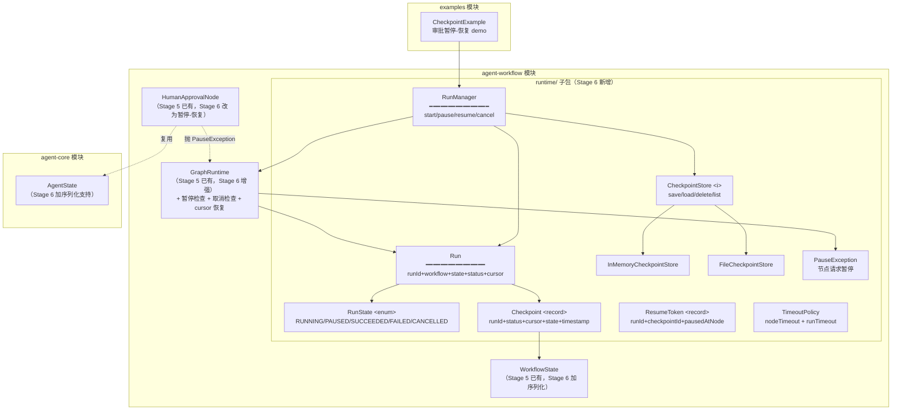

# Stage 6 架构设计：State、Checkpoint 和长任务

> 对应阶段：Stage 6 - State、Checkpoint 和长任务
> 状态：✅ 已实现（2026-08-18 暂停-恢复收口；**2026-08-25 补齐 M6.3/M6.4 旧缺口**：`TimeoutPolicy` 真实落地 + `AgentState` 进黑板/Checkpoint，workflow 测试 39）
> 模块：在 `agent-workflow` 模块内新增 `runtime` 子包（不新建 Maven 模块）
> 前置：Stage 5 已完成（Workflow + GraphRuntime + 7 种节点 + 23 测试全绿）

---

## 1. 核心命题：让图能暂停、能恢复、挂了能续

Stage 5 的 `GraphRuntime.run()` 是一个「一跑到底」的同步方法--从 START 走到 END，中间不停。这有三个问题：

```text
问题 1：人工审批会阻塞线程
        HumanApprovalNode 的 ApprovalService 是同步的，审批要等几小时甚至几天，线程就一直占着

问题 2：进程挂了，全部白跑
        跑了 10 个节点，第 11 个节点时进程崩了，重启后从头再来（Workflow 虽然可复用，但 WorkflowState 在内存里丢了）

问题 3：没法取消长任务
        一个跑了 20 分钟的 Workflow，用户想取消，没有机制
```

Stage 6 要解决的就是这三件事：**暂停-恢复（Pause-Resume）、持久化执行（Durable Execution）、取消与超时（Cancellation & Timeout）。**

核心机制一句话：**把 WorkflowState 序列化存盘 = Checkpoint；从 Checkpoint 读回 = Resume；Resume 时跳过已完成节点 = 幂等恢复。**

---

## 2. 核心抽象（7 个，全部新增到 `agent-workflow/runtime/`）

| 抽象 | 角色 | 一句话 |
|---|---|---|
| `RunState` | 运行状态 | 一次 Workflow 执行的完整生命周期状态（RUNNING/PAUSED/SUCCEEDED/FAILED/CANCELLED） |
| `Run` | 执行句柄 | 对一次执行的引用：runId + workflow + state + status，RunManager 操作的对象 |
| `Checkpoint` | 快照 | 某一时刻的 RunState + WorkflowState + cursor（下一个待执行节点） |
| `CheckpointStore` | 持久化 | 存/取/删 Checkpoint 的接口（InMemory / File 两个实现） |
| `RunManager` | 生命周期管理 | start / pause / resume / cancel / getRun，Checkpointer 的门面 |
| `ResumeToken` | 恢复令牌 | 暂停时返回给调用方的凭证，携带 runId + checkpointId |
| `TimeoutPolicy` | 超时策略 | 单节点超时 + 整 Run 超时，超时后触发 Cancel |

### 2.1 关键接口草图

```java
// ---- 运行状态 ----
public enum RunState {
    RUNNING,      // 正在执行
    PAUSED,       // 已暂停（等人工/等事件），可恢复
    SUCCEEDED,    // 正常完成
    FAILED,       // 失败终止
    CANCELLED     // 被取消
}

// ---- 执行句柄 ----
public final class Run {
    private final String runId;
    private final Workflow workflow;
    private WorkflowState state;
    private RunState status;
    private String cursor;       // 下一个待执行节点（Resume 的关键）
    private String errorMessage;
    // 转换为 Checkpoint / 从 Checkpoint 恢复
}

// ---- 快照 ----
public record Checkpoint(
    String checkpointId,
    String runId,
    RunState status,
    String cursor,              // 暂停/崩溃时走到哪
    WorkflowState state,        // 黑板完整快照
    long timestamp
) {}

// ---- 持久化 ----
public interface CheckpointStore {
    String save(Checkpoint checkpoint);           // 返回 checkpointId
    Optional<Checkpoint> load(String runId);
    void delete(String runId);
    List<String> listRunIds();
}

// ---- 生命周期管理 ----
public class RunManager {
    Run start(Workflow wf, Object input);
    ResumeToken pause(String runId);              // 暂停 -> 存 Checkpoint -> 返回 Token
    ExecutionResult resume(String runId);         // 从 Checkpoint 恢复 -> 继续跑
    boolean cancel(String runId);                 // 取消
    Optional<Run> getRun(String runId);
}

// ---- 恢复令牌 ----
public record ResumeToken(String runId, String checkpointId, String pausedAtNode) {}
```

---

## 3. 关键设计决策（6 个）

### D1. Checkpoint = 序列化 WorkflowState，不存 Workflow 本身

```text
Checkpoint 存什么：
  - RunState（状态）
  - cursor（下一个待执行节点）
  - WorkflowState（黑板：input + variables + trace）  ← 关键

Checkpoint 不存什么：
  - Workflow（图定义）  ← 不可变，runId 关联到 workflow name 重新加载即可
  - 节点实例            ← 节点是无状态的（除 AgentNode 的 agentState，见 D5）
```

**为什么**：Workflow 是静态知识（可复用、可 YAML 化），存它浪费空间；WorkflowState 是动态数据，丢了就白跑了。这也呼应 Stage 5 的 D1「Workflow 是数据不是代码」--Checkpoint 只存数据。

### D2. Resume 靠 cursor + trace 做幂等跳过

恢复时怎么知道哪些节点跑过了？看 trace：

```text
Resume 流程：
  1. load Checkpoint -> 拿到 cursor + state.trace
  2. 把 Run 交给 GraphRuntime，但 cursor 从 Checkpoint 的 cursor 开始（不是 START）
  3. 已完成节点的输出已在 state.variables 里，不重跑
  4. 继续正常执行：route -> execute -> 写黑板 -> 前进
```

**幂等性保证**：Resume 不重跑已完成节点，因为 cursor 指向的是「下一个待执行节点」，trace 里记录的节点已经执行过且输出在黑板里。这是「不重新执行全部步骤」的核心机制。

### D3. 暂停靠「节点抛 PauseException」，不靠 Runtime 主动查

```java
// HumanApprovalNode v2（Stage 6 版本）
public NodeResult execute(NodeContext ctx) throws Exception {
    if (ctx.isResuming()) {
        // 恢复路径：检查审批结果，通过则透传，拒绝则抛 RejectedException
        boolean approved = approvalService.checkDecision(ctx.runId());
        if (!approved) throw new ApprovalRejectedException(id);
        return NodeResult.of(ctx.input());
    } else {
        // 首次路径：发起审批请求，然后抛 PauseException 暂停
        approvalService.requestApproval(ctx.runId(), id, summary, ctx.input());
        throw new PauseException(id, "Waiting for approval");
    }
}
```

```java
// Runtime 捕获 PauseException
try {
    result = node.execute(ctx);
} catch (PauseException pe) {
    // 暂停：存 Checkpoint，返回 PAUSED
    state.record(StepRecord.paused(node.id(), pe.getMessage()));
    return ExecutionResult.paused(runId, resumeToken, state);
}
```

**为什么不用 Runtime 轮询**：轮询意味着每个节点执行前 Runtime 要查「要不要暂停」，侵入性强。抛异常是节点自主表达「我需要暂停」，Runtime 只需 catch--和 onError 失败路由是同一种模式。

### D4. Cancellation 靠中断标志，不靠 kill 线程

```java
public class Run {
    private volatile boolean cancelled = false;

    public void cancel() { this.cancelled = true; }
    public boolean isCancelled() { return cancelled; }
}

// GraphRuntime 主循环每步检查
while (!END.equals(cursor)) {
    if (run.isCancelled()) {
        state.record(StepRecord.cancelled(cursor));
        return ExecutionResult.cancelled(state);
    }
    // ... 正常执行
}
```

**为什么不用 Thread.interrupt()**：interrupt 会打断 IO 操作（包括 LLM 调用），行为不可控。volatile 标志是协作式取消--节点执行完当前步骤后检查标志，干净退出。代价是取消不是即时的（要等当前节点完成），但对 Agent 场景可接受。

### D5. AgentNode 的 AgentState 怎么持久化

Stage 5 的 `AgentNode` 持有 `AgentState`（节点内多轮记忆）。这是 Stage 5 的 D2「Agent 是节点」带来的副作用：节点不是完全无状态的。

```text
方案：AgentNode 的 AgentState 序列化进 WorkflowState.variables
key = "agentState:" + nodeId
value = 序列化的 AgentState（messages + steps）

Resume 时：AgentNode 从黑板读回自己的 AgentState，恢复对话上下文
```

这需要 `AgentState` 支持序列化（它已经是 POJO，加 Jackson 注解即可）。**这是 Stage 6 对 agent-core 的唯一改动**--给 AgentState 加序列化支持，其他 agent-core 代码不动。

### D6. CheckpointStore 先做 InMemory + File，不做数据库

```text
InMemoryCheckpointStore  -- 测试用，Map<runId, Checkpoint>
FileCheckpointStore      -- 演示用，JSON 文件写到 ~/.agent4j/checkpoints/
```

**为什么不做数据库**：Stage 6 的目标是理解 Checkpoint 机制，不是生产级持久化。数据库实现留给 Stage 18（可观测性与成本治理）或真实部署时加。接口已抽象，换实现零改动。

---

## 4. 分层架构图



---

## 5. GraphRuntime 主循环改造（Stage 5 -> Stage 6）

```text
Stage 5 主循环：
  cursor = route(START)
  while cursor != END:
    execute node -> 写黑板 -> route -> 前进
  return SUCCEEDED

Stage 6 主循环（新增 3 个检查点）：
  cursor = checkpoint.cursor ?? route(START)          ← 新增：从 Checkpoint 恢复 cursor
  while cursor != END:
    if run.isCancelled(): return CANCELLED             ← 新增：取消检查
    if run.isTimedOut(): return FAILED(timeout)        ← 新增：超时检查
    try:
      execute node -> 写黑板 -> route -> 前进
    catch PauseException:
      save Checkpoint(cursor=nextNode)                 ← 新增：暂停时存档
      return PAUSED + ResumeToken
  return SUCCEEDED
```

**关键：主循环结构不变，只加 3 个检查点。** 这就是 Stage 5 「留缝」的价值--GraphRuntime 的设计天然支持扩展暂停/取消/恢复。

---

## 6. 一次暂停-恢复的完整时序

```text
场景：退款流程，审批节点暂停 -> 人工审批 -> 恢复

T1: RunManager.start(wf, "退款请求")
    -> 创建 Run(runId=r1, status=RUNNING)
    -> GraphRuntime 跑：intent(AgentNode) -> approval(首次执行)
    -> approval 抛 PauseException
    -> 存 Checkpoint(cursor=execute_refund, state={intent:REFUND, approval:...})
    -> 返回 ExecutionResult(PAUSED, resumeToken={r1, cp1, "execute_refund"})

    ⏳ 几小时后，人工审批通过 ⏳

T2: RunManager.resume(r1)
    -> load Checkpoint(cp1) -> 拿到 cursor=execute_refund + state
    -> GraphRuntime 从 execute_refund 开始（不重跑 intent、approval）
    -> execute_refund(ActionNode) -> END
    -> 返回 ExecutionResult(SUCCEEDED, "退款已执行")
```

---

## 7. 模块结构

```text
agent-workflow/src/main/java/io/github/qwzhang01/agent/workflow/
├── (Stage 5 已有的类不动)
├── ExecutionResult.java        # 扩展：加 PAUSED / CANCELLED 状态
├── WorkflowState.java          # 扩展：加 Jackson 序列化注解
├── GraphRuntime.java           # 扩展：加暂停/取消/恢复检查点
└── runtime/                    # Stage 6 新增子包
    ├── Run.java
    ├── RunState.java
    ├── Checkpoint.java
    ├── CheckpointStore.java
    ├── InMemoryCheckpointStore.java
    ├── FileCheckpointStore.java
    ├── RunManager.java
    ├── ResumeToken.java
    ├── TimeoutPolicy.java
    └── PauseException.java

agent-core/src/main/java/.../agent/
└── AgentState.java             # 扩展：加 Jackson 序列化注解（唯一改动）
```

---

## 8. 实现里程碑（每步可运行、可测试）

| # | 里程碑 | 交付 | 验证 |
|---|--------|------|------|
| M6.1 | 核心抽象 + InMemory | Run/RunState/Checkpoint/CheckpointStore/RunManager/ResumeToken + InMemory 实现 | 能 start 一个 Run，手动 save/load Checkpoint |
| M6.2 | 暂停-恢复 | PauseException + GraphRuntime 暂停检查 + HumanApprovalNode v2（暂停-恢复） | 审批节点暂停 -> resume 后从断点继续，不重跑已完成节点 |
| M6.3 | 取消 + 超时 | Run.cancel() + GraphRuntime 取消检查 + TimeoutPolicy | 跑到一半取消 -> CANCELLED；超时 -> FAILED(timeout) |
| M6.4 | File 持久化 + AgentState 序列化 | FileCheckpointStore + AgentState Jackson 注解 | 进程重启后从文件恢复 Run（模拟崩溃恢复） |
| M6.5 | 验收示例 + 全测试 | CheckpointExample（审批暂停-恢复 demo）+ 全部测试绿 | 验收标准达标 |

---

## 9. 验收标准（对齐规划）

规划要求：「让一个需要人工审批的 Agent 在审批前暂停，审批后能够从原位置恢复，而不是重新执行全部步骤。」

验收 demo：

```text
1. start 退款流程 -> intent 跑完 -> approval 暂停 -> 返回 ResumeToken
2. （断言：intent 的输出在黑板里，approval 没有执行完）
3. （模拟人工审批通过）
4. resume(runId) -> 从 execute_refund 继续 -> SUCCEEDED
5. （断言：intent 没有被重跑，trace 里 intent 只有一条记录）
```

---

## 10. 测试策略

- **幂等恢复**：跑 3 个节点 -> 第 2 个暂停 -> resume -> 断言 trace 里节点 1 只有一条记录（没重跑）
- **取消**：跑到第 2 个节点时 cancel() -> 断言 status=CANCELLED，trace 里第 3 个节点没出现
- **超时**：设 nodeTimeout=100ms + sleep 节点 -> 断言 FAILED(timeout)
- **File 持久化**：save Checkpoint -> 新建 RunManager -> load -> resume -> 断言成功
- **审批暂停-恢复**：MockApprovalService 首次返回「待决定」（触发暂停）-> resume 时返回 true -> 断言 SUCCEEDED

---

## 11. 本阶段不做（范围控制）

- **数据库 CheckpointStore** -- 留给 Stage 18 或生产部署
- **分布式 Resume** -- 跨进程/跨机器恢复（Stage 11 Multi-Agent）
- **Checkpoint 版本管理** -- 同一 runId 的多版本快照（先只存最新）
- **可视化 Run 看板** -- Stage 13 声明式层时做
- **Workflow YAML 序列化** -- Stage 13
- **真正的异步 Run**（CompletableFuture/虚拟线程）-- 先做同步阻塞的暂停-恢复，异步调度是 Stage 7 的范围
