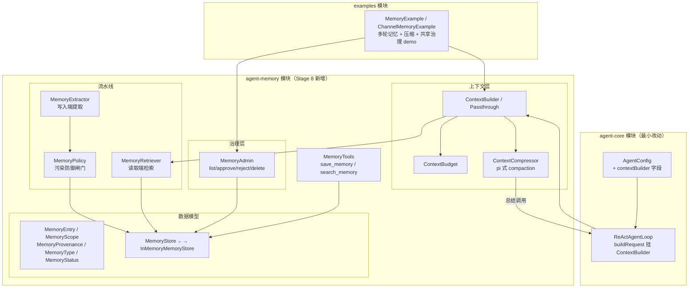

# Stage 8 架构设计：Memory、Context 与共享记忆治理

> 对应阶段：Stage 8 - Memory、Context 与共享记忆治理（v3 扩展版）
> 状态：✅ 已实现（2026-08-19）。v1 为内存存储；持久化 Store 留后续。
> 模块：新增 `agent-memory` Maven 模块，依赖 `agent-core`（不依赖 workflow/scheduler）
> 前置：Stage 1-7 已完成（AgentLoop / 插件 / 沙箱 / Workflow / Checkpoint / 调度器，112 测试全绿）

---

## 1. 核心命题：从「消息列表」到「记忆系统」

Stage 1-7 的 Agent 有一个贯穿始终的隐藏假设：**`AgentState.messages` 就是全部状态**。

```java
// ReActAgentLoop.buildRequest() 现状（Stage 1 写的，一直没动）
ModelRequest request = ...messages(new ArrayList<>(state.getMessages()))...;
```

这带来三个问题：

```text
问题 1：记不住
  AgentState 是 run 级的，run 结束状态即丢。
  用户上一轮说"我对花生过敏"，下一轮 Agent 不知道。

问题 2：装不下
  buildRequest 把全部消息塞回 prompt，无预算、无压缩。
  长会话 -> token 膨胀 -> 成本上升 + 超上下文窗口 + 指令遵循退化。

问题 3：不可治理
  一旦引入频道级共享（Claude Tag 式多人共享 Agent），
  谁写的记忆？错了怎么办？误删怎么办？错误结论被反复检索放大怎么办？
  原始 ChatMessage 没有元数据，无法治理。
```

Stage 8 的答案：**分层记忆 + scope 隔离 + 治理闭环**。

一句话（接 Stage 6/7 的递进叙事）：

```text
Stage 6 让 Run 能暂停-恢复
Stage 7 让 Run 能自动恢复
Stage 8 让 Agent 能记住 —— 且多人共享时，记得干净（可治理、可溯源、防污染）
```

---

## 2. 记忆模型：三横一纵

### 2.1 三横（时间层次）

```text
┌─────────────────────────────────────────────────────┐
│ Working Memory（工作记忆）                            │
│   = AgentState.messages（run 内工作集，Stage 1 已有）  │
│   生命周期：一个 Agent run                             │
│   归 Checkpoint 管（Stage 6 已覆盖）                   │
├─────────────────────────────────────────────────────┤
│ Session Memory（会话记忆）                            │
│   = 多轮对话的消息累积（会话层持有，逐轮传入 AgentState）│
│   生命周期：一个会话                                   │
│   归会话层管（examples 提供 ChatSession 辅助类）        │
├─────────────────────────────────────────────────────┤
│ Long-term Memory（长期记忆）                          │
│   = MemoryStore 中的 MemoryEntry（提炼后的事实/偏好）  │
│   生命周期：跨会话、跨 run 持久                         │
│   归 Stage 8 管（本阶段核心交付）                       │
└─────────────────────────────────────────────────────┘
```

**关键**：长期记忆存的不是原始 `ChatMessage`，而是**提炼后的 `MemoryEntry`**（带 type / subject / provenance / status 元数据）。原始消息的归档属于会话日志（Checkpoint 已覆盖 run 级），不与本阶段混做。

### 2.2 一纵（空间隔离）：MemoryScope

```text
MemoryScope = 命名空间字符串：
  agent:{name}        # 这个 Agent 自己的常识（如 weather-bot 的城市代码表）
  user:{userId}       # 用户个人偏好（只对该用户可见）
  session:{sessionId} # 会话级事实
  task:{runId}        # 任务工作记忆（对应 Stage 7 的 AsyncTask）
  channel:{channelId} # 频道级共享记忆（多人可见、可补充 —— 对标 Claude Tag）

隔离与共享是同一机制的两面：
  换 scope = 换可见性。ChannelMemory 不是一套新系统，
  它就是 scope=channel:c1 的 MemoryEntry 查询结果集。
```

多租户隔离 = Store 层强制 scope 校验（查询不允许跨租户前缀），不需要另建隔离机制。

---

## 3. 记忆流水线：两端口 + 一闸门

```text
                 ┌────────────── 写入端（run 结束）──────────────┐
                 │                                              │
  run 结束 ────> MemoryExtractor ──候选条目──> MemoryPolicy ──通过──> MemoryStore
                 │  （规则提取 + 显式标记）      （污染防御闸门）        │（带 provenance）
                 │                                              │
                 │ ┌──────────── 治理面（管理员）────────────────┐ │
                 │ │ MemoryAdmin：list / approve / reject /     │ │
                 │ │             update / delete / supersede    │ │
                 │ └─────────────────────────────────────────────┘ │
                 └──────────────────────────────────────────────┘

                 ┌────────────── 读取端（run 开始 / 轮中）──────────┐
  run 开始 ────> MemoryRetriever ──命中条目──> ContextBuilder ──────> ModelRequest
                 │  （scope + type + keyword）  （预算内组装）
                 │                                  ▲
                 │                        token 超预算时
                 │                        ContextCompressor（pi 式 compaction：
                 │                        旧消息段总结成 summary，保留最近 K 条）
                 └──────────────────────────────────────────────┘
```

四个时机：

| 时机 | 动作 | 组件 |
|---|---|---|
| run 开始 | recall：按 scope 集检索，注入上下文 | Retriever + ContextBuilder |
| 轮中（每次 buildRequest） | 预算检查，超限则压缩 | ContextBudget + Compressor |
| run 结束 | extract -> policy -> write | Extractor + Policy + Store |
| 治理时（随时） | admin 审核干预 | MemoryAdmin |

---

## 4. 核心抽象（16 个）

| 抽象 | 层 | 一句话 |
|---|---|---|
| `MemoryEntry` | 数据 | record：id + scope + type + subject + content + importance + provenance + status + createdAt/expireAt |
| `MemoryScope` | 数据 | scope 解析与匹配（agent/user/session/task/channel） |
| `MemoryType` | 数据 | PREFERENCE / FACT / EPISODE / SUMMARY / EVENT |
| `MemoryStatus` | 数据 | ACTIVE / PENDING_REVIEW / REJECTED / SUPERSEDED / EXPIRED |
| `MemoryProvenance` | 数据 | 来源溯源：sourceType（USER_SAID/TOOL_RESULT/MODEL_DERIVED/ADMIN_EDIT）+ actor + runId + at |
| `MemoryQuery` | 数据 | 查询条件：scope 集合 + type + subject + keyword + limit |
| `MemoryStore` | 存储 | 接口：write / query / update / delete（v1: InMemoryMemoryStore） |
| `MemoryRetriever` | 读取 | 按 scope 集检索 + keyword 匹配，只返回 ACTIVE |
| `MemoryExtractor` | 写入 | run 结束从 messages 提取候选记忆（v1 规则 + 显式标记） |
| `MemoryPolicy` | 闸门 | shouldStore(entry)：重要度阈值 + 频控 + 冲突 supersede —— 污染防御 v1 |
| `MemoryAdmin` | 治理 | list / approve / reject / update / delete（管理员接口） |
| `ContextBuilder` | 上下文 | 接口：system + recalled memories + recent window -> List<ChatMessage> |
| `PassthroughContextBuilder` | 上下文 | 默认实现，透传现有 messages（向后兼容） |
| `ContextBudget` | 上下文 | token 预算（v1 估算：chars / 4，不引 tokenizer） |
| `ContextCompressor` | 上下文 | pi 式 compaction：旧段总结成一条 summary message |
| `MemoryTools` | 工具 | save_memory / search_memory 两个 Tool（模型自决存取） |

### 4.1 关键接口草图

```java
// ---- 统一记忆条目 ----
public record MemoryEntry(
    String id,
    String scope,              // "user:u1" / "channel:c1" / ...
    MemoryType type,           // PREFERENCE / FACT / ...
    String subject,            // 主题键，冲突检测用（如 "饮食禁忌"）
    String content,            // "对花生过敏"
    double importance,         // 0.0 ~ 1.0，写入闸门用
    MemoryProvenance provenance,
    MemoryStatus status,       // ACTIVE / PENDING_REVIEW / ...
    Instant createdAt,
    Instant expireAt           // TTL，null = 永久
) {}

// ---- 来源溯源 ----
public record MemoryProvenance(
    SourceType sourceType,     // USER_SAID / TOOL_RESULT / MODEL_DERIVED / ADMIN_EDIT
    String actor,              // 谁说的 / 哪个工具 / 哪个模型
    String runId,              // 从哪次 run 提取的
    Instant at
) {}

// ---- 存储 ----
public interface MemoryStore {
    MemoryEntry write(MemoryEntry entry);
    List<MemoryEntry> query(MemoryQuery query);
    Optional<MemoryEntry> findActiveBySubject(String scope, String subject);
    MemoryEntry update(MemoryEntry entry);   // status 变更 / 内容修订
    boolean delete(String id);
}

// ---- 写入闸门（污染防御） ----
public class MemoryPolicy {
    boolean shouldStore(MemoryEntry candidate, MemoryStore store);
    // 三道闸（D6）：
    // 1. importance >= 阈值（或显式 save_memory 调用）
    // 2. 频控：同 subject 短窗口内不重复写入
    // 3. 冲突：同 subject 已有 ACTIVE -> 旧条目标 SUPERSEDED（不物理删）
}

// ---- 上下文组装（挂 AgentConfig） ----
public interface ContextBuilder {
    List<ChatMessage> build(AgentConfig config, AgentState state);
    // 组装顺序：system prompt + recalled memories（渲染成一段）
    //           + 共享记忆（channel scope）+ 最近消息窗口
}
```

---

## 5. 关键设计决策（8 个）

### D1. AgentState 与 MemoryStore 的边界：working vs long-term

```text
AgentState.messages = working memory（run 内），保持 mutable，Checkpoint 已覆盖
MemoryStore        = 提炼后的长期记忆（跨 run），存 MemoryEntry 不存 ChatMessage
会话历史           = 会话层持有（ChatSession 辅助类），逐轮传入 AgentState
```

**为什么**：三层的生命周期、持久化方式、治理要求完全不同，混在一起就是 Stage 1 问题 1+2+3 的根源。AgentState / Checkpoint 语义零改动，现有 112 个测试不受影响。

### D2. 记忆是结构化 MemoryEntry，不是原始消息

```text
一条记忆 = subject（主题键）+ type + content + provenance + status + importance
```

**为什么**：治理需要元数据。review 要 status，溯源要 provenance，冲突检测要 subject，污染防御要 importance。原始 ChatMessage 上加不了这些，也不该加。

### D3. 共享与隔离统一为 MemoryScope，不单独造 ChannelMemoryStore

```text
个人记忆   = scope "user:u1"
频道共享   = scope "channel:c1"
多租户隔离 = Store 层强制 scope 前缀校验（查询不许跨租户）
```

**为什么**：如果为频道单独造一套 ChannelMemoryStore，就会出现两套存储、两套查询、两套治理。scope 是比"共享与否"更本质的抽象——**共享只是 scope 的一个取值**。

### D4. 压缩借鉴 pi 的 compaction：分段总结 + 保留最近 K 条

```text
触发：buildRequest 时估算 token（chars/4）> budget
动作：保留最近 K 条消息（默认 6）+ system prompt
      旧消息段交给 ModelClient 总结成一条 summary message（user 角色）
      替换旧段，形成 [system, summary, ...最近 K 条]
归档：被压缩的原文以 type=SUMMARY 的 MemoryEntry 存入 MemoryStore（可回溯）
改写：AgentState.messages 被就地改写（有损但可回溯）
```

**为什么改写 AgentState 而不是只压缩请求副本**：Checkpoint 存的与执行的保持一致，恢复语义简单（Stage 6 的 snapshot 哲学）；有损的代价用"原文归档进 MemoryStore"补回，等价于 pi 的 CompactionEntry 思路（Stage 6 对比笔记的遗留借鉴项）。

### D5. ContextBuilder 挂 AgentConfig（可选），ReActAgentLoop 最小改动

```java
// AgentConfig 新增（nullable，默认 null = Passthrough 行为）
public Builder contextBuilder(ContextBuilder cb) { ... }

// ReActAgentLoop.buildRequest 唯一改动：
List<ChatMessage> msgs = config.getContextBuilder() != null
        ? config.getContextBuilder().build(config, state)
        : new ArrayList<>(state.getMessages());
```

**为什么**：与框架一贯的"可选组合 + 装饰器"风格一致（RetryModelClient / TimeoutModelClient 同理）。不配 Memory 的用法完全不变，存量测试零影响。

### D6. 污染防御 v1 = 三道闸 + 惰性 TTL

```text
污染的本质：错误结论写入长期记忆 -> 被反复检索 -> 持续放大。

闸 1（写入前）：MemoryPolicy.shouldStore —— importance >= 阈值，
               或显式 save_memory（用户/模型主动存的高置信信息）
闸 2（写入后）：scope=channel:* 的写入默认 PENDING_REVIEW（待人确认），
               检索只返回 ACTIVE，未确认的记忆不会进入上下文
闸 3（更新时）：同 subject 再写 -> 旧条目 SUPERSEDED（不物理删除，可回滚），
               而非无脑共存或覆盖

TTL：expireAt 到期由查询惰性过滤（不建后台线程），清理任务可后补
```

**为什么这样切**：三道闸分别卡在写入前 / 写入后 / 更新时，是"防进入-防生效-防覆盖"的最小完备集。v1 不做 LLM 评判重要度和语义矛盾检测（成本高、不可测）。

### D7. 检索 v1 = scope + type + subject + keyword，不做向量

```text
MemoryRetriever：query(scopes=[user:u1, channel:c1], keyword=...)
```

**为什么**：向量检索 / embedding 是 Stage 15（Enterprise Profile 的 RAG）范围。接口按 `query(MemoryQuery)` 抽象留好，v2 换向量实现不动调用方。

### D8. 模型自决存取：MemoryTools（对齐 Stage 3 自进化风格）

```text
save_memory(scope, subject, content)    # provenance = MODEL_DERIVED
search_memory(keyword)                  # 查自己可见的 scope
```

**为什么**：与 Stage 3 的"插件管理 Tool"（Agent 自己管自己的能力）同一哲学——Agent 自己管自己的记忆。这也是 Claude / OpenAI memory tool 的业界同款思路，面试叙事顺理成章。save_memory 显式调用同时是 D6 闸 1 的豁免条件（模型主动存 = 高置信）。

---

## 6. 分层架构图



依赖关系：`agent-memory -> agent-core`（只用 ChatMessage / ModelClient / Tool / AgentConfig）。agent-memory **不依赖** agent-workflow / agent-scheduler，保持记忆层独立（Stage 11/12 复用时零负担）。

---

## 7. 两个完整时序

### 7.1 频道级共享记忆（跨用户，对标 Claude Tag）

```text
T1: 用户 A 在频道 c1 说："我对花生过敏"
    -> run(A) 结束
    -> Extractor 提取候选：FACT / subject="饮食禁忌" / importance=0.9
       provenance=USER_SAID(actor=A, runId=r1)
    -> Policy 闸 2：scope=channel:c1 -> 写入 status=PENDING_REVIEW

T2: 管理员 approve
    -> admin.approve(entryId) -> status=ACTIVE

T3: 用户 B 在频道 c1 问："帮我安排 A 的午餐"
    -> run(B) 开始
    -> Retriever: query(scopes=[user:B, channel:c1], keyword="午餐|饮食")
       命中"饮食禁忌: 花生过敏"（ACTIVE）
    -> ContextBuilder 注入 -> Agent 避开花生 ✅

T4: 后来发现 A 其实不过敏（当初口误）
    -> 管理员写入更正（同 subject="饮食禁忌"）
    -> 闸 3：旧条目 SUPERSEDED（不删，可回溯"曾经记错过"）
    -> 检索只返回更正后的 ACTIVE 条目 ✅
```

### 7.2 轮内压缩（pi 式 compaction）

```text
第 N 轮 buildRequest：
  estimate(messages) = 5000 token > budget 4000
  -> Compressor：
     保留 [system, ...最近 6 条]
     旧段（30 条）打包 -> ModelClient 总结
     -> "[此前对话摘要] 用户在排查一个 MCP 连接问题，已试过 A/B 方案..."
     -> messages 就地改写为 [system, summary, ...最近 6 条]（4 段 -> 约 1200 token）
     -> 原始旧段归档：MemoryEntry(type=SUMMARY, scope=session:xx,
        provenance=MODEL_DERIVED)
  -> estimate = 1800 <= 4000 -> 发送 ✅
```

---

## 8. 模块结构

```text
agent-memory/
└── src/main/java/io/github/qwzhang01/agent/memory/
    ├── MemoryEntry.java            # 统一记忆条目 record
    ├── MemoryScope.java            # scope 解析与匹配
    ├── MemoryType.java             # PREFERENCE/FACT/EPISODE/SUMMARY/EVENT
    ├── MemoryStatus.java           # ACTIVE/PENDING_REVIEW/REJECTED/SUPERSEDED/EXPIRED
    ├── MemoryProvenance.java       # 来源溯源 record
    ├── MemoryQuery.java            # 查询条件 record
    ├── MemoryStore.java            # 存储接口
    ├── InMemoryMemoryStore.java    # v1 实现（ConcurrentHashMap）
    ├── MemoryRetriever.java        # 检索（scope+type+keyword）
    ├── MemoryExtractor.java        # 写入端提取
    ├── MemoryPolicy.java           # 污染防御闸门
    ├── MemoryAdmin.java            # 管理员治理接口
    ├── ContextBuilder.java         # 上下文组装接口
    ├── PassthroughContextBuilder.java
    ├── ContextBudget.java          # token 预算（chars/4 估算）
    ├── ContextCompressor.java      # pi 式压缩
    └── tools/
        └── MemoryTools.java        # save_memory / search_memory

examples/（新增 3 个）
├── MemoryExample.java              # 多轮个人记忆闭环
├── CompressionExample.java         # 超预算自动压缩
└── ChannelMemoryExample.java       # 频道共享 + 治理（A/B 用户 + Admin 三角色）
```

---

## 9. 实现里程碑（建议 4 天）

| # | 里程碑 | 交付 | 验证 |
|---|--------|------|------|
| M8.1 | 数据模型 + Store + Scope 隔离 | MemoryEntry/Scope/Provenance/Store + InMemory 实现 | user:u1 写入 u2 查不到；channel 可见；scope 前缀校验 |
| M8.2 | 上下文层：Builder + Budget + Compressor | ContextBuilder/Passthrough/Budget/Compressor + AgentConfig/Loop 挂接 | 50 条消息超预算 -> 自动压缩 -> 最近 6 条保留 + summary 在场 + 原文归档 |
| M8.3 | 流水线闭环：Extract + Policy + Recall | MemoryExtractor/Policy/Retriever + ChatSession 辅助类 | 多轮 demo：第 1 轮说偏好 -> 第 2 轮 recall 注入 -> 回答引用偏好 |
| M8.4 | 共享与治理 | channel scope 默认待审 + MemoryAdmin + supersede + TTL | A 存（待审）-> approve -> B 检索命中；更正后旧条目 SUPERSEDED |
| M8.5 | MemoryTools + 验收示例 + 全量测试 | save/search 工具 + 3 个 Example + 测试补齐 | 规划 8 条验收全过；全仓测试全绿 |

依赖关系：M8.2 依赖 M8.1（Compressor 归档要用 Store）；M8.3/M8.4 依赖 M8.2；M8.5 收口。

---

## 10. 验收标准（对齐 18 周规划，8 条逐条映射）

| 规划验收 | 实现 |
|---|---|
| 当前会话记忆 | ChatSession 会话层持有 + 逐轮传入 |
| 用户偏好记忆 | scope=user:{id} 的 PREFERENCE 条目 |
| 当前任务工作记忆 | AgentState（working）+ scope=task:{runId} |
| 历史信息按需检索 | MemoryRetriever query |
| 超上下文预算时压缩 | ContextBudget + ContextCompressor（M8.2） |
| 频道级共享记忆（多人可见可补充） | scope=channel:{id}，A 写 B 读（M8.4） |
| 管理员可查看和删除记忆条目 | MemoryAdmin list/delete（M8.4） |
| 每条记忆有来源溯源 | MemoryProvenance（M8.1，全链路强制） |

---

## 11. 测试策略

- **scope 隔离**：user:u1 写入 -> user:u2 查询为空；channel:c1 两用户均可见；跨租户查询被拒
- **压缩**：预算 1000 + 构造 5000 token 会话 -> 断言消息数减少、最近 6 条原样保留、summary 存在、旧文归档为 SUMMARY entry
- **多轮记忆**：第 1 轮 MockModelClient 记录请求；第 2 轮断言请求中包含注入的偏好记忆
- **待审闸**：channel 写入 -> PENDING_REVIEW -> 检索不返回 -> approve -> 返回
- **supersede**：同 subject 二次写入 -> 旧条目 SUPERSEDED -> 检索只回新的 -> admin 可查历史版本
- **TTL**：expireAt 设为过去 -> 检索不返回（惰性过滤）
- **污染防御**：importance 0.2 的候选被 Policy 拒绝；同 subject 高频重复写被频控拦截
- **溯源**：随机抽条目断言 provenance 四字段完整（sourceType/actor/runId/at）
- **向后兼容**：不配 ContextBuilder 时行为与 Stage 7 完全一致（存量 112 测试不动全绿）

---

## 12. 文章规划（9 篇 -> 里程碑映射）

| 文章 | 写作时机 | 素材来源 |
|---|---|---|
| 《短期记忆、长期记忆和工作记忆的边界》 | M8.1 | 三横模型（本文 §2.1） |
| 《多用户 Agent 的 Memory Namespace 设计》 | M8.1 | MemoryScope 一纵模型（§2.2）+ D3 |
| 《记忆来源溯源：谁说的、从哪来的》 | M8.1 | MemoryProvenance + D2 |
| 《Memory 不是把聊天记录全部塞回 Prompt》 | M8.2 | 核心命题三问题（§1）—— 本阶段立意篇 |
| 《Java Agent 的 Context Builder 如何设计》 | M8.2 | D5 + 组装顺序 |
| 《上下文压缩、摘要和 Reference ID》 | M8.2 | D4（pi compaction 借鉴 + 归档回溯） |
| 《频道级共享记忆：Claude Tag 的跨线程记忆怎么做》 | M8.4 | §7.1 时序 + D3 |
| 《记忆治理：管理员可查看、修改、删除记忆》 | M8.4 | MemoryAdmin + 三道闸 |
| 《记忆污染防御：防止错误结论持续放大》 | M8.4 | D6 全篇 —— 本阶段最有面试价值的一篇 |

---

## 13. 本阶段不做（范围控制）

- **向量检索 / embedding** -- Stage 15（Enterprise Profile RAG）；`query(MemoryQuery)` 接口已留好
- **跨进程 MemoryStore backend**（Redis / DB）-- v1 InMemory（接口已抽象，后续可加 JsonlMemoryStore 对照 Stage 6 的 FileCheckpointStore）
- **记忆图谱 / 实体关系抽取** -- 记忆条目之间的关系（引用、矛盾链）v2 再说
- **LLM 自动提取的完整 pipeline 精调** -- v1 规则提取 + 显式 save_memory；LLM 判定 important 可作为可选实验
- **语义级冲突检测** -- v1 只按 subject 键做 supersede；语义矛盾检测需要 embedding，归入 v2
- **跨 Agent 记忆共享协议** -- Stage 11（Multi-Agent）/ Stage 12（频道级 Agent）再谈，本阶段 scope=channel 已给足语义
- **会话历史独立持久化** -- run 级 Checkpoint 已覆盖（Stage 6）；会话级日志归档是 Stage 18/产品层的事
- **真 LRU 淘汰** -- v1 用 TTL + 容量上限（超出按 oldest-first 淘汰），不维护访问序
