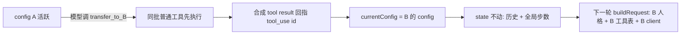

# 决策 24：Handoff 是循环内的 Config 换牌，不是消息重写、不是子调用

日期：2026-09-09

## 五字段立场卡

- 我的选择：handoff 实现为 `runLoop` 内的 active config 切换。`HandoffSpec` 直接持有目标 `AgentConfig` 引用（OpenAI Agents SDK 同款，天然支持 A↔B 环形声明），声明在源 config 的 `handoffs` 字段。循环把每个声明暴露为无参工具（默认名 `transfer_to_<name>`，schema 与 `ToolRegistry.getToolSchemas()` 同构）。模型调用该工具时：同批普通工具先按序执行并写回结果，handoff 排最后；合成 tool result 必须回指模型生成的 `tool_use` id（provider 硬约束，悬空 tool_use 直接报 API 错）；写完后 `currentConfig = target`，下一轮 `buildRequest` 自然用新人格、新 client、新工具表。`AgentState` 原样保留：历史不重写、步数预算全局共享。`AgentEvent.Handoff(from, to, toolName)` 在切换后发射。铁律：入口 config 的普通工具恒走循环构造时注入的 executor（宿主可能已包治理/审计装饰链），只有切换目标才按其 registry 建缓存 plain executor。
- 对比替代：①不采用「重写 messages[0] 人格」——历史不该有需保护的特殊槽位，伪装历史身份破坏审计；②不采用「A 把 B 当 tool 调用、B 起独立 state」——每次交接丢失共享历史，乒乓场景成本爆炸，且无法用全局步数预算防死循环；③不采用「handoff 做成 ToolExecutor 内的拦截」——handoff 是控制流不是工具语义，executor 无权也不该知道 config 切换。
- 代价：切换后目标 agent 的普通工具走 plain `DefaultToolExecutor`，宿主给入口配的治理装饰链（审计/权限/沙箱）不自动覆盖 handoff 目标——P3 硬化项，短期由「handoff 目标必须显式装配自己的治理 executor」契约兜底；`targetExecutors` 缓存是 loop 实例字段（IdentityHashMap，按 config 身份缓存，并发复用同一 loop 实例跑多 run 属既有未支持场景）；构造期校验「handoff 工具名不得与 registry 普通工具同名」（拦截优先会静默遮蔽同名普通工具）；活跃身份不持久化——`currentConfig` 是 runLoop 局部变量，run 结束即随栈帧消失，续跑/checkpoint 恢复默认以入口 config 人格重入（详见「续跑契约」节）；P1 全量携带历史，跨 agent 历史经济学（按目标预算裁剪）留给 P2。
- 什么场景会改：目标 config 需要继承宿主治理链时，引入 `HandoffTargetResolver` 让装配方显式提供目标 executor；历史膨胀到必须裁剪时，P2 的 `HandoffInputFilter` 接预算系统；需要链式 A→B→C 每跳都要触发宿主侧审批时，把 Handoff 事件升级为可否决的 before-hook。
- 证据：`HandoffLoopTest` 七场景——A→B→C 链一次 run 完成、切换后请求首条 system 等于新人格且 state 无 SYSTEM、toolCall/toolResult 每对配平、`Handoff` 事件字段正确、handoff schema 进请求、未声明目标走 unknown-tool 回退、同批普通工具先执行、全局步数预算压过目标 config 的 maxSteps。全仓 2,722 项测试通过（2026-09-09，JDK 17，`mvn -B -fae test`）。

## 心智模型

Handoff 语义上像电话转接：接线员不变（宿主循环）、通话记录不变（共享 state）、只是接听的人换了（active config）。用户感知不到切换发生，只感知到「对面的人」专业领域变了。

## 续跑契约（2026-09-10 复查补档）

> 本节原为隐性契约（只存在于事件语义里），2026-09-10 复查发现后显性化：此前立场卡、javadoc、README 均未记载。

**边界**：`AgentState` 只持久化五样东西——messages、currentStep、maxSteps、status、lastError，没有任何身份字段（决策 23 的直接后果：身份是配置，历史是事实，人格绝不进 state；且 `AgentConfig` 持有 ModelClient/ToolRegistry 活对象，本就不可序列化）。而 handoff 的活跃身份 `currentConfig` 是 `runLoop` 的局部变量，run 结束即随栈帧消失。

**后果**：run 存活期内一切正确（currentConfig 每轮被 buildRequest/模型调用/工具执行三个消费点重读）。但任何「run 之间」的续跑——多轮对话、checkpoint 恢复、进程重启——框架只认入口 config。若 state 的历史里发生过 handoff（存在 `transfer_to_*` tool result），以入口 config 重入会让历史末尾的目标 agent 回答与「已转给 B」的记录错位：模型要么再转一次（多烧一步），要么以错误人格作答（决策 24 承诺的「用户感知不到切换」在该轮破功）。同族小问题：`SimpleAgent.prepare()` 每轮 `setMaxSteps(config.getMaxSteps())`，全局步数预算跨 run 也被入口 config 重置——但步数可从入口 config 重新推导，身份不能。

**宿主正确姿势（今天就可行，框架零改动）**：订阅 `AgentEvent.Handoff(from, to, toolName)`，记住最后一次的 `to`，下一轮以 `agentB.run(newInput, state)` 重入。契约已写入三处 javadoc：`Agent.run(String, AgentState)`（主声明位）、`AgentEvent.Handoff`（事件是唯一信号源）、`AgentState`（类级边界说明）。

**修复方向（归 P3，与治理链硬化同一 PR）**：引入 `HandoffTargetResolver`（「名字 → config 实例」解析器，装配方显式提供目标 executor 与映射）+ `AgentState` 记忆 `lastActiveAgentName`（存名字不存 config 引用，保持可序列化）。升档触发条件：一旦任何真实产品面（如 ChatSession 多轮会话）开始实际使用 handoff，本条从「文档债」升为「必须修」——错位将成为每个多轮会话的默认行为。

## 与决策 23 的衔接

决策 23 把人格从历史中拉出、放入 config 请求级注入——这正是本次 handoff 能成立的前提。若人格还住在 `messages[0]`，切换 config 就得重写历史，整条路线回到对比替代①的死胡同。两个决策合起来构成完整主张：身份是配置，历史是事实；换身份不伪造事实。

## 本次没有做的事

- 没有实现 `HandoffInputFilter` / 历史预算裁剪（P2，接 Token Budgeting 四本账）。
- 没有做 handoff 边界的 guardrail（链中 agent 的输入防护，P3）。
- 没有做乒乓检测（A↔B 无限互转时只有全局步数兜底；显式往返计数是 P3）。
- 没有把「续跑契约」做成机制：`AgentState` 仍不持久化活跃身份，`HandoffTargetResolver` + `lastActiveAgentName` 留 P3；本轮只把契约写进三处 javadoc 与本卡（2026-09-10）。
- 没有把 `TurnTrace` 补上 handoff 字段，`AgentEvent.Handoff` 先行覆盖观测需求。
- 没有做 YAML/product 层的 handoff 声明绑定（binder 侧留待需要时接）。

## 验证记录

2026-09-09 08:58，使用 JDK 17 执行 `mvn -B -fae test`，全仓 2,722 项测试通过，0 failure/error/skipped。agent-core 49 项（含 `HandoffLoopTest` 7 项新增）。期间修掉自造测试的三处编排错误：全局预算场景步数推错（A maxSteps 10→3）、自指测试在构造参数里引用构造中对象（Java 不可达，改为断言 `HandoffSpec` 的 null-target/blank-name 组装期防护）、多余括号与游离 javadoc。

2026-09-09 复查轮：发现并修复三处——①`entryConfig` 实例字段是死代码（赋值后从未读取，javadoc 还暗示了不存在的 per-run 捕获机制且埋着跨 run 覆盖竞态），删除，入口 config 改为纯参数传递；②`findDeclaredHandoff` javadoc 残留游离单词；③新增构造期校验：handoff 工具名与 registry 普通工具同名时立即报错（此前会静默遮蔽普通工具，拦截层优先导致其永不可达），补第 8 个测试用例覆盖。修复后 agent-core 49 项全绿、全仓串行 `mvn -B test` BUILD SUCCESS（2,725 项）。注：`-fae` 并发模式偶发 agent-scheduler 模块构建失败，单模块复跑与串行全仓均全绿，属并发资源竞态非代码问题。
