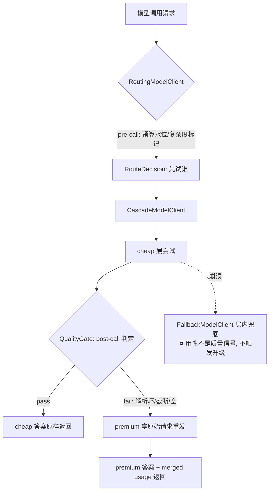

# 决策 25：路由分两层——pre-call 归 ModelRouter，post-call 归级联装饰器

日期：2026-09-10

## 五字段立场卡

- 我的选择：模型路由的信号来源天然分两层，两层互补、永不合并。pre-call 信号（预算水位、任务复杂度标记）归 `ModelRouter` 策略接口——`route(request, budget)` 在调用前被问询，返回 `RouteDecision`；v1 策略族：`BudgetAwareRouter`（经济：预算三档 healthy/constrained/exhausted）、`ComplexityRouter`（内容：消息数阈值 + 任务标记，中英文）。post-call 信号（结构化输出解析失败、finishReason 异常、内容为空）归 `CascadeModelClient` 装饰器——cheap 先答、`QualityGate` 判定、不达标 premium 拿原始请求重发。`ModelRouter` 接口构造上看不见响应，post-call 判定必须住在路由层之上的装饰器里，这不是实现选择而是信息结构决定的边界。推荐组装：`Observing(Cascade(Routing(Fallback(...))))`。
- 对比替代：①不采用「纯预判路由（LLM-as-router 分类器）」——E2 实验数据证明它双输：对深线程盲升 premium 比级联贵 3 倍（$0.001226 vs $0.000409），且 pre-call 看不见响应质量，3 个坏 JSON 原样送达（缺陷 3 vs 0）；②不采用「级联做成 ModelRouter 策略」——接口签名 `route(request, budget)` 无响应参数，级联要判定必须改接口或 hack，信息结构不允许；③不采用「级联升级时带 cheap 失败响应做上下文重试」——污染 premium 上下文（继承 cheap 幻觉）、打掉 KV cache 前缀、把 premium 答案耦合到 cheap 的错误上；clean re-issue 保持级联可证明等价于「premium 从零作答，仅在 cheap 已过关时跳过」。
- 代价：级联对每个 gate 失败付双份钱（cheap 的失败也是真实支出，merged TokenUsage 诚实记账）——E2 数据显示即便如此仍比全 premium 便宜 5 倍；流式路径的 gate 只能后判（cheap 流消费到 Done 才能判定，判定期间用户看不到增量，首 token 延迟 = cheap 全程）——流式场景的固有代价，v1 接受；质量门信号上限是「可证明的坏」（解析失败/截断/空），拦不住「流畅但错误」——打分门 v2 需标注数据且打分本身有成本，会侵蚀级联优势；`ComplexityRouter` 的消息数阈值是粗信号（长 ≠ 难），误路由安全方向：难题落 cheap 由级联兜底，易题落 premium 只多花钱。
- 什么场景会改：质量门引入打分模型（v2，需标注数据与打分成本核算）；流式场景要求首 token 低延迟时，改为「先流 cheap 给用户、gate 失败再切 premium」（UX 抖动换延迟，需产品权衡）；`ModelRouter` 若需要看到上一轮响应（如连续失败降权），接口扩展为 `route(request, budget, lastResponse)` 属新决策；路由决策需要进 TurnTrace 观测（RouteDecision 已强制 reason，但未上事件流）时补 `AgentEvent` 字段。
- 证据：`E2RoutingComparisonExperimentTest`——14 任务三配置对照（校准价格、确定性模拟）：all-premium $0.002095/14 premium/0 缺陷；pre-route $0.001226/4 premium+10 cheap/3 缺陷；cascade $0.000409/3 premium+14 cheap/0 缺陷、3 次升级。结构性不变量断言：级联严格便宜于预判路由且零缺陷；`ComplexityRouterTest` 9 用例证明零改动插入现有 `RoutingModelClient`；`CascadeModelClientTest` 11 用例覆盖原始请求重发、usage 合并、崩溃不升级（留给 Fallback）、流缓冲重放、双败兜底；`RuleBasedQualityGateTest` 15 用例。agent-observability 模块 160/160 通过（JDK 17）。

## 心智模型

路由两层像医院的分诊：预判路由是挂号台的初诊护士（看一眼症状描述就决定挂普通号还是专家号——便宜、快、但只能看「表面」）；质量门是复诊检查（普通号看完了，检查结果异常才转专家——贵一点，但基于「实际证据」）。分诊省不了复诊的钱，复诊也不替代分诊：两层各自回答不同的问题（「先试谁」vs「要不要再试贵的」）。



## E2 实验数据（本决策的直接证据）

```
=== E2 routing comparison (14 tasks, calibrated prices, deterministic sim) ===
config            cost($)  premium calls  cheap calls    defects
all-premium      0.002095             14            0          0
pre-route        0.001226              4           10          3
cascade          0.000409              3           14          0
cascade        escalations: 3 (cheap gate failures re-issued on premium)
```

核心发现：**验证比预判便宜**。预判路由对 4 个深线程任务盲升 premium（4 次全价调用），而级联只在 3 个「可证明缺陷」任务上付费升级——省下的不是升级费，是不必要的 premium prompt 费。级联以基线 1/5 的成本交付零缺陷。

工业界印证：Anthropic 模型路由、OpenAI GPT-5 auto 模式本质都是级联/验证路线；纯预判分类器路由是少数派。

## 与既有决策的关系

- 决策 5（装饰器优于继承）：本决策是它在路由领域的第三次验证——`RoutingModelClient`（Stage 18 D6）、`CascadeModelClient`（E2）都是 `ModelClient` 装饰器，路径保持哑化，能力住在边界。
- 决策 9（compaction 就地改写历史）：级联的 clean re-issue（premium 拿原始请求）与决策 9 的前缀缓存主张一致——升级路径不引入新前缀，premium 侧 KV cache 前缀稳定性不受级联切换影响（量化验证留 E3）。
- KP2（Token Budgeting 四本账）：级联 merged usage 是预算消费侧新入口，BudgetBook 对双记账天然兼容（同一维度记两次 usage 即可）。
- 决策 22（规则断言不做 LLM-as-judge）：质量门三信号与之一脉相承——v1 只用客观可判信号，打分门留待有标注数据时再议。

## 本次没有做的事

- 没有做打分质量门（v2，需标注数据 + 打分成本核算）。
- 没有做真实 API 计费验证（harness 的 Mock 层校准价格已落，`OPENAI_API_KEY` 环境跑真实模型对照留待有 key 时）。
- 没有把 RouteDecision/QualityGate verdict 接入 TurnTrace 事件流（观测挂点现成，`AgentEvent` 扩字段属独立小改动）。
- 没有做流式场景的「先流 cheap 再切换」模式（UX 抖动 vs 首 token 延迟的权衡留产品侧）。
- KV cache 交叉点（级联升级的前缀重叠度对缓存命中率的影响）留给 E3 量化。

## 验证记录

2026-09-10，JDK 17（`JAVA_HOME=/Users/avinzhang/jdk/jdk-17.0.16.jdk/Contents/Home`），`mvn test -pl agent-observability`：160/160 通过，0 failure/error/skipped。新增 47 用例（RuleBasedQualityGateTest 15 + CascadeModelClientTest 11 + ComplexityRouterTest 9 + E2RoutingComparisonExperimentTest 1 + RoutingModelClientTest 既有 11 不变）。期间修掉三处自造错误：E2 断言把「恒为 3 的条件表达式」写成期望 0（语义写反）；`RecordingClient` final 修饰阻止匿名子类复用；`ResponseFormat` 嵌套类 import 路径错；lambda 捕获非 final 循环变量。实验数据推翻「预判路由最便宜」的预设假设——断言按真实数据固化为 E2 headline 发现，这正是实验的意义。
