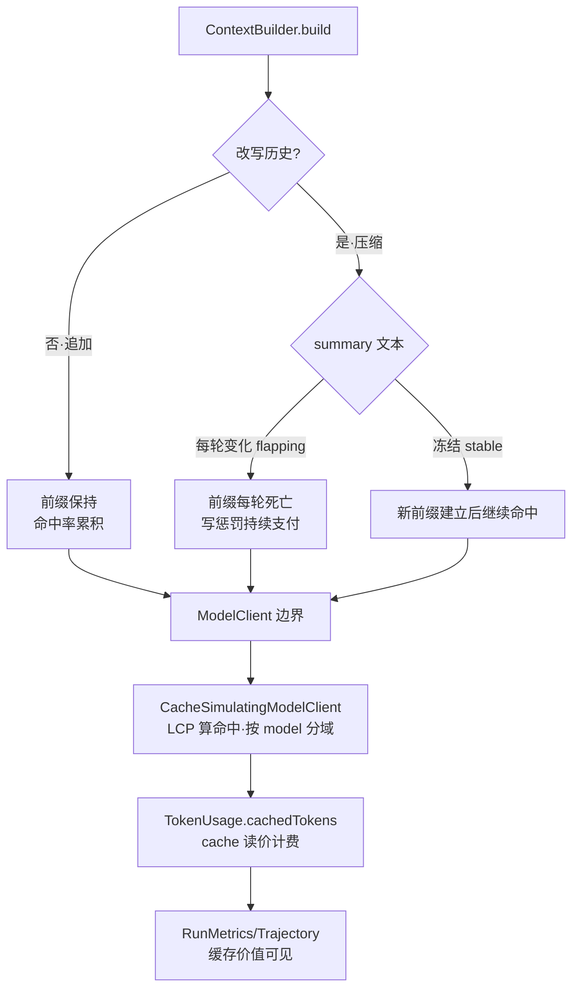

# 决策 26：缓存可见性进 TokenUsage，前缀稳定性写进 ContextBuilder 弱契约

日期：2026-09-10

## 五字段立场卡

- 我的选择：缓存可见性做硬、前缀稳定性做软。硬的一半：`ModelResponse.TokenUsage` 扩展第四字段 `cachedTokens`（`promptTokens` = 完整计费 prompt 含命中部分，`cachedTokens` = 命中部分读折扣；record 四参 + 三参兼容构造器，负值归零、超 prompt 截断），全链路接线——observability 聚合（`ModelCallMetrics`/`RunMetrics`/`MetricsCollector`）、trajectory 序列化（`TrajectoryCodec` 写 `cached_tokens`、旧档读档兼容）、供应商解析（OpenAI `prompt_tokens_details.cached_tokens`，Anthropic `cache_read`/`cache_creation` 折叠 + 流式 `message_start` 捕获）。观测器是 `CacheSimulatingModelClient` 装饰器（agent-observability）：按 model id 分缓存域，LCP 前缀匹配算命中，cachedTokens 写回 usage，供应商已报值优先；计价器是 `CachePricing`（三段互斥：cached×读价 + written×写价 + base×基价，Anthropic 风格 0.1x/1.25x、OpenAI 风格 0.5x/免费，整数 microUSD）。软的一半：`ContextBuilder` javadoc 写入前缀稳定性条款（SHOULD 级）——改写历史时优先冻结 summary 文本（后续轮次追加其上），不做每轮变化的 flapping 摘要；条款明确「违规不是编译错误，是计费事件；可见性即执行机制」。
- 对比替代：①不采用「强机制：PrefixStable 基类/接口或断点 API」——缓存命中是运行时后验事实，编译期查不了；强类型约束只会逼出 `@SuppressWarnings` 式的谎言，且 Anthropic 显式断点（最多 4 个）的摆放策略本身是待实验问题（本轮只做价格参数变体）。②不采用「ContextBuilder 契约只字不提」——实现者随意重排消息顺序时，缓存命中等运气，E3 证明 flapping summary 同体量下损失 24% 缓存价值，这个代价必须有人告知。③不采用「cachedTokens 独立 record 旁路记账」——破坏 TokenUsage 单一计费形态，Cascade 的 merged usage、BudgetBook 的四本账、trajectory 的聚合全要加旁路，收益为零。
- 代价：契约是弱约束，违规只能靠账单发现（cachedTokens 可见性兜底，但需要有人看指标）；`CacheSimulatingModelClient` 的 LCP 模拟按「无断点自动前缀缓存」建模（OpenAI 式），Anthropic 显式断点行为未建模——绝对数字是方向性校准，不是供应商保证；粗分词（长度/4）下绝对 token 数是 orientation 级；流式路径的 usage 改写在 Done 事件上（与 Cascade 同款后判限制）；Anthropic 流式的 prompt 侧 usage 依赖 `message_start` 事件存在（缺失时 prompt 侧记 0，诚实边界）。
- 什么场景会改：接入 Anthropic `cache_control` 显式断点机制（断点摆放成为一等问题，`CachePolicy` 接口已留位）；供应商计价结构变化（写惩罚归零则前缀纪律的收益重算，E3 发现 2 已证明结论可反转）；需要按会话维度分缓存域（当前按 model id，供应商不暴露 session 轴，不过度建模）；cachedTokens 进 TurnTrace 事件流（观测挂点现成，独立小改动）。
- 证据：`E3CacheExperimentTest`——五策略 × 双计价风格对照（确定性模拟）：Anthropic 风格下 A.baseline $0.004413/命中率 0.8094，B.flapping $0.003932/0.4941，B2.stable $0.003702/0.5856（同体量隔离：稳定比 flapping 便宜，缓存价值保住 +24%），C.tail-only $0.004300/0.6985；OpenAI 风格下结论反转（flapping $0.003051 < stable $0.003135）——前缀纪律的价值由供应商写计价决定，不是普适真理。D.cascade 验证级联 clean re-issue 的域隔离语义（premium 首次升级 LCP=0 冷启动、无跨域污染、双重计费诚实）。`CacheSimulatingModelClientTest` 8 用例（冷启动/全命中/前缀命中/改写全失/域隔离/供应商优先/流式/归一化）+ `CachePricingTest` 7 用例。agent-observability 176/176（160 存量 + 16 新增），全仓 22 模块 BUILD SUCCESS。

## 心智模型

前缀缓存像图书馆的复印卡：你上次复印的前 100 页存在店里（缓存写入，付 1.25x 存档费），下次只要前 100 页没变，直接取复印件（0.1x 读费）。**整本换掉 = 存档作废，从第一页重付**。ContextBuilder 是决定「这本书每一页怎么排」的人——它每轮把书重装订一次，图书馆就要重新存档。决策 9 说「可以重装订」（体量控制优先），决策 26 说「重装订时，前面章节的页码别动」（冻结 summary），并且「复印卡账单要看得见」（cachedTokens）。



## E3 实验数据（本决策的直接证据）

```
=== E3 cache comparison (10-turn conversation, deterministic sim) ===
prices: Anthropic-style on $3/M input, $15/M completion; read 0.1x, write 1.25x
scenario          cost($)   prompt tok    cached read  hit rate no-cache($)
A.baseline       0.004413         1946           1575    0.8094    0.008388
B.flapping       0.003932          676            334    0.4941    0.004578
B2.stable        0.003702          666            390    0.5856    0.004548
C.tail-only      0.004300         1307            913    0.6985    0.006471

--- OpenAI-style implicit caching (writes free, reads 0.5x) ---
A.baseline       0.004912         1946           1575    0.8094    0.008388
B.flapping       0.003051          676            334    0.4941    0.004578
B2.stable        0.003135         666            390    0.5856    0.004548
C.tail-only      0.003919         1307            913    0.6985    0.006471
```

三个关键读数：

1. **体量缩减压过缓存损失**：B.flapping 比 A.baseline 便宜（$0.003932 < $0.004413）——全量改写缩掉的体量收益大于命中率损失。「压缩 = 缓存死亡 = 更贵」的直觉不成立。
2. **稳定性变量单独值 24%**：B vs B2 同体量对照，flapping 对自己的 no-cache 线只省 $0.000646，stable 省 $0.000846——前缀不稳定让缓存价值缩水 24%，这是「稳定性」单独的代价。
3. **计价风格反转结论**：写免费（OpenAI 式）时 flapping 反超 stable——前缀纪律是供应商定价的，不是普适真理。

## 与既有决策的关系

- 决策 9（compaction 就地改写历史）：细化而非推翻——错不在「就地改写」，在「改写产物不稳定」。冻结 summary 即可续命中。
- 决策 25（路由两层）：D 场景确认级联 clean re-issue 的缓存语义（域隔离冷启动、无污染、双计费诚实），E2 的设计经缓存维度量化验证。
- 决策 5（装饰器优于继承）：`CacheSimulatingModelClient` 第四次验证——缓存命中是请求序列属性，只能住 ModelClient 边界，loop/ContextBuilder/router 各只见片段。
- 决策 23（system prompt 前置）：persona 固定在请求头 = 天然稳定段，本决策的前缀条款与之共同构成「稳定头部」的完整约定。
- KP2（Token Budgeting）：cachedTokens 进四本账的历史账，预算器消费完整计费口径。
- KP7（在线评估）：cachedTokens/命中率进 RunMetrics = 成本健康指标族的第五个信号（task completion/cost per task/latency/safety 之外）。

## 本次没有做的事

- 没有做 Anthropic `cache_control` 显式断点机制（数量有限的断点摆放是独立问题，`CachePolicy` 接口已留位）。
- 没有做真实 API 计费验证（模拟层校准已落，真实 key 对照留待有 key 时）。
- 没有做压缩时机与对话自然边界对齐（KP3 文献主张，需真实压缩器配合实验）。
- 没有做全局 Token 预算器（KP2 主张，独立实验）。
- 没有把 cachedTokens/命中率接进 TurnTrace 事件流（挂点现成，独立小改动）。
- 没有在 ContextBuilder 上加编译期强机制（立场：弱契约 + 可见性即执行）。

## 验证记录

2026-09-10，JDK 17（`JAVA_HOME=/Users/avinzhang/jdk/jdk-17.0.16.jdk/Contents/Home`），`mvn test -pl agent-observability`：176/176 通过。期间修掉的自造错误：①harness 首版把 B 设计成「体量+稳定性」双变量混淆，加 B2 同体量对照分离变量后，预设断言「rewrite 必更贵」被数据推翻，按真实数据重写断言（E3 发现 1）；②`CachePricing` 首版把写惩罚叠加在基价上（双重计费），改为三段互斥（written 替代基价）；③场景 D 首版用恒失败客户端（6 次全升级），对齐 E2 的 j2/j3/j5 选择性失败；④OpenAI 风格下 flapping 反超 stable 推翻「稳定性普适有益」预设，固化为发现 2；⑤单测首版断言 hitRate=1.0（累计口径含冷启动应为 0.5）、伪表达式断言、忽略 role token 必然命中——三处按模拟器真实语义修正。全仓 22 模块 `mvn test` BUILD SUCCESS（core 49 / model 44 / trace-export 73 / observability 176 含新增）。
