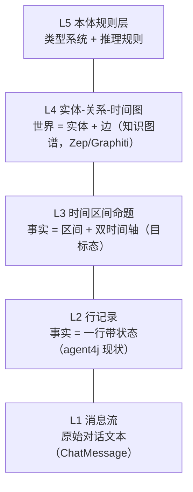
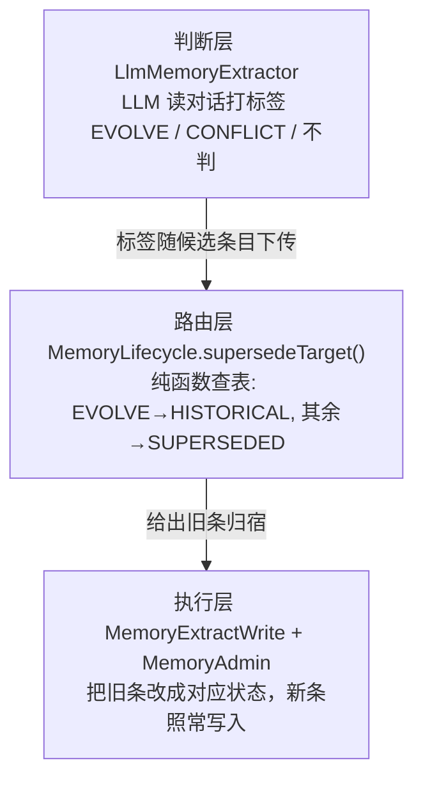
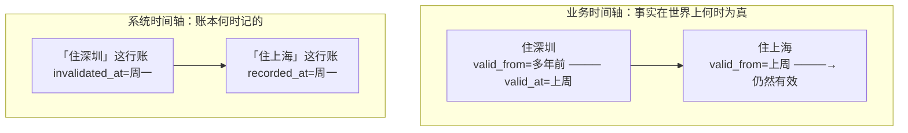
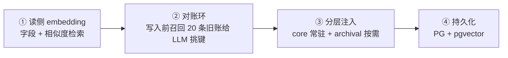

# 讨论沉淀：记忆系统设计——从对账病灶到抽象阶梯

日期：2026-09-10
来源：9 轮架构教学讨论（搬家场景驱动，从「教我 agent 架构」到「更高一层抽象」）
状态：写侧生命周期分流已落地代码（agent-memory 109/109 全绿，未提交）；读侧、对账环、持久化未动
系列：`discussion-*` 讨论沉淀；代码改动事实见 `v1-development-log.md`，本文只沉淀设计结论

---

## 大框架：这场讨论走完的地形

一句话总结：用「我搬到上海了」一个场景，把记忆系统从 L2 行记录一路推演到 L4 知识图谱，落了写侧分流代码，定了四步演进路线，每一步都用主流系统（Zep / Mem0 / Letta / ChatGPT）对照过。



抽象阶梯是包含关系不是替换关系：升层不推翻下层，下层要素变成上层组件（L3 的双时间轴进 L4 后变成边属性）。主流产品大多停在 L2/L3——上不上图是成本收益判断，不是层级越高越对。

记忆系统本身只回答三个问题，没有第四个：

| 问题 | 一句话 | agent4j 现状 |
|------|--------|------|
| 怎么存 | 记下来的东西长什么样、活多久 | 键值条目 + 生命周期状态机 |
| 写什么 | 新对话进来，哪句值得记、要不要改旧的 | LLM 抽取器 + subject 键对账 |
| 怎么读 | 下次对话捞哪几条进上下文 | 关键词召回 + importance 排序 |

这场讨论依次修了「写什么」（分流落地）、「怎么存」（目标态设计）、存储选型（账本 + 索引），「怎么读」的排序问题留到四步路线里。

---

## 一、病灶：搬家场景为什么失败

用户说「我搬到上海了」，系统里已有 ACTIVE 的「住深圳」。失败链条分五层，最可能死在第一层：

| 层 | 发生了什么 |
|----|-----------|
| 1. subject 键漂移 | 旧条键叫「居住城市」（三个月前 LLM 自拟），新抽取起了「搬家」，键对不上，supersede 不触发 |
| 2. 演化被建模为冲突 | 即使键对上，旧机制只有 SUPERSEDED 一种死法，搬家（曾经为真）和记错（从未为真）不分 |
| 3. 历史不可见 | 被顶掉的旧条对所有回忆路径蒸发，agent 答不出「我以前住哪」 |
| 4. 粒度错配 | 整条记录作废，同条里的其他事实连带埋掉 |
| 5. 抽取器失明 | 跨对话场景 LLM 看不见旧账，lifecycle 判断无从谈起 |

根子上的诊断：[LlmMemoryExtractor.java](../agent-memory/src/main/java/io/github/qwzhang01/agent/memory/extract/LlmMemoryExtractor.java) 的默认指令原话是 `Invent a short subject key for each item; do not use a fixed vocabulary`——不是 bug，是一句设计错了的指令。对账机制依赖键，键却由 LLM 每次现场自由发挥。

---

## 二、已落地：生命周期分流（EVOLVE / CONFLICT）

领域建模修正：把「记忆更新」一个事件拆成两个领域事件，落账规则跟着分流。

| 死法 | 触发场景 | 旧条归宿 | 默认上下文 | 历史查询 | 审计 |
|------|---------|---------|:---:|:---:|:---:|
| 演化 EVOLVE | 「我搬到上海了」（旧信息曾经为真） | HISTORICAL（新增枚举） | 不可见 | 可见 | 可见 |
| 冲突 CONFLICT | 「你记错了，我没办过信用卡」（旧信息从未为真） | SUPERSEDED（既有） | 不可见 | 不可见 | 可见 |
| 兜底 null | LLM 没输出 lifecycle / 输出非法值 | SUPERSEDED（保守作废） | — | — | — |

HISTORICAL 与 SUPERSEDED 的区别就一列：历史查询能不能捞回来。这一列是本次改动的全部业务价值——「上个月我住哪」有答案了。兜底选 CONFLICT 不选 EVOLVE 的理由：误标 HISTORICAL 会让从未为真的错误记忆污染历史查询（信息污染），误标 SUPERSEDED 只是丢一条历史（信息缺失），污染比缺失贵。

三层分离是这次改动的架构骨架：



LLM 只是多输出一个标签（决策最小化），执行分流在管线层（可审计），policy 闸门没动。对比 Mem0 把 ADD/UPDATE/DELETE/NOOP 四路决策整个交给模型——两条路线的立场分叉：可审计 vs 高质量。agent4j 选前者，与 tool 治理「结构化留痕 + 可回溯」同一基因。

改动清单（9 个既有文件 + 1 个新建，109/109 全绿 = 96 存量零改动 + 13 新增）：

| 文件 | 改动 |
|------|------|
| [MemoryLifecycle.java](../agent-memory/src/main/java/io/github/qwzhang01/agent/memory/MemoryLifecycle.java)（新建） | EVOLVE/CONFLICT + `supersedeTarget()` 统一映射旧条归宿 |
| [MemoryStatus.java](../agent-memory/src/main/java/io/github/qwzhang01/agent/memory/MemoryStatus.java) | 加 `HISTORICAL` 枚举值 |
| [MemoryEntry.java](../agent-memory/src/main/java/io/github/qwzhang01/agent/memory/MemoryEntry.java) | 加第 12 字段 `lifecycle`，兼容构造器保住全仓 52 处存量调用零改动 |
| [MemoryQuery.java](../agent-memory/src/main/java/io/github/qwzhang01/agent/memory/MemoryQuery.java) | 加 `statuses` 显式状态过滤，不设 = 只回 ACTIVE（现状不变） |
| [InMemoryMemoryStore.java](../agent-memory/src/main/java/io/github/qwzhang01/agent/memory/store/InMemoryMemoryStore.java) | `query()` 按状态集合过滤 |
| [MemoryExtractWrite.java](../agent-memory/src/main/java/io/github/qwzhang01/agent/memory/extract/MemoryExtractWrite.java) | supersede 分支按 `supersedeTarget(candidate.lifecycle())` 分流 |
| [LlmMemoryExtractor.java](../agent-memory/src/main/java/io/github/qwzhang01/agent/memory/extract/LlmMemoryExtractor.java) | FORMAT_HINT 加 lifecycle 判定标准 + `parseLifecycle()` 非法值置 null |
| [MemoryTools.java](../agent-memory/src/main/java/io/github/qwzhang01/agent/memory/tools/MemoryTools.java) | `save_memory` 加 lifecycle 参数；`search_memory` 加 `subject` + `include_history` |
| [MemoryRetriever.java](../agent-memory/src/main/java/io/github/qwzhang01/agent/memory/MemoryRetriever.java) | 新增 `recallBySubject()` / `recallSubjectHistory()` |
| [MemoryAdmin.java](../agent-memory/src/main/java/io/github/qwzhang01/agent/memory/MemoryAdmin.java) | `approve()` 的旧条归宿同样走 `supersedeTarget`，自动写入与人工审批两条路径落账规则一致 |

防御设计：`parseLifecycle()` 只认两个精确枚举名，LLM 输出任何别的值（拼错、自创词）一律降 null，写侧再兜底——LLM 犯错的爆炸半径锁死在「旧条被保守作废」这一种，不会丢数据不会崩管线。

生效边界（架构师必须看清）：这套机制只在「键对得上」的场景生效。跨对话场景抽取器看不见旧账，键漂移后新键旧键对不上，supersede 压根不触发，分流逻辑全程空跑。落账规则修好了，但触发落账的判断上游还是瞎的——这正是四步路线第①②步存在的原因。

---

## 三、主流对照：三把尺子量出的抽象缺口

用主流设计量这次改动，结论：方向正确的战术补丁，不是架构动作。三把尺子全部缺席，所以看着像堆细节——这个感觉是对的。

| 尺子 | 主流做法（Zep/Mem0） | 本次改动 | 差距性质 |
|------|---------|---------|---------|
| 事实的时间模型 | 区间 + 双时间轴（valid_from / valid_at） | 状态枚举，无失效时间戳 | 硬伤：`old.withStatus(target)` 只换状态，没记旧条何时失效，「上个月我住哪」按时间过滤无字段可用 |
| 新旧关系的挂载点 | 失效事件 / 旧边的 invalidation / 操作决策 | 新条目的第 12 字段 | 语义错位：EVOLVE/CONFLICT 描述的是「新条顶掉旧条」这件事的性质，挂在新条本体上等于「离婚原因写在下一张结婚证上」；且新旧条之间无指针关联，链条靠 subject 字符串维系 |
| 判断的时机与信息 | 写入前对比环：候选事实 + 召回旧账一起给 LLM | 抽取时打标签，旧账不在输入里 | 决策环节和数据可见性错配：判断放在了信息不充分的位置 |

三条迁移路径全通，不需要推倒：

1. `HISTORICAL` ≈ Zep 的「valid_at 被填上的边」——将来加 `invalidAt` 字段升级为区间模型，现有 HISTORICAL 条目语义直接兼容，只是补时间戳。
2. `lifecycle` 字段保留、语义重新锚定——第②步对比环落地后，判定从「抽取时打标签」迁移为「对比环的输出」，字段从「猜的关系」变成「对比出的关系」。
3. `supersedeTarget()` 纯函数路由不动——它只消费判定结果，不关心判定从哪来。

主流系统的分层选择（决定我们抄谁、抄到哪层）：

| 系统 | 停在哪层 | 为什么 |
|------|---------|--------|
| Zep / Graphiti | L4 全图 | 场景是企业知识（CRM、客服），实体天然密集，图的收益撑得起构建成本 |
| Mem0 | L2 扁平行 + 向量召回，图是可选插件 | 个人记忆场景，实体关系密度低 |
| ChatGPT | L2 扁平 saved memories + 对话 RAG | 同上 |
| Letta | L2 文本块 | 同上 |

---

## 四、目标态设计：双时间轴，一条记录四个戳

「填 2 个记忆」的直觉（一个是搬家事实、一个是 AI 周一才知道）方向对，但落库形态不是两条记录，是一条记录挂两组时间戳。Java 流计算对齐：业务时间 = event time（事情发生时刻），系统时间 = processing time（系统处理时刻），用户周一才说上周的事就是迟到一周的 late event。会计比喻：账本每行两个日期栏，一栏「事情发生日」，一栏「记账日」，即权责发生制。



两根轴回答两类问题，不可互替：

| 问题 | 用哪根轴 | 例子 |
|------|---------|------|
| 世界当时怎样 | 业务轴 | 「上周约我该约哪」→ 上周落在谁的区间内 → 深圳 |
| 系统当时知道什么 | 系统轴 | 「上周规划为什么约深圳」→ 按 recorded_at ≤ 上周过滤账本，看当时系统已知道什么 → 审计与追责唯一可用的轴 |

三类查询全覆盖：当前时点（valid_from ≤ 今天 且 valid_at 为空）、区间边界（旧条的 valid_at）、过去时点回溯（目标时刻落在谁的区间内）。

边界规则必须定死：`supersedeTarget()` 关闭旧条时，旧条的 `validAt` 填新事实的业务时间（上周），不能填记录时间（周一）——否则「我何时搬家」会答成周一，且两个区间重叠。

现状对照 [MemoryEntry.java](../agent-memory/src/main/java/io/github/qwzhang01/agent/memory/MemoryEntry.java)：只有 `createdAt`，四戳缺三（系统轴缺 `invalidatedAt`，业务轴 `validFrom` / `validAt` 两根全缺）。

---

## 五、更上层抽象：实体-关系-时间图，投影渐进

L4 的四个积木，每个都收编了下层的组件：

| 积木 | 内容 | 收编了什么 |
|------|------|-----------|
| 实体节点 | 人、地、公司；id + 类型 + 别名表（张三/小张/张总是同一节点） | 收编 subject——对账凭证从字符串变成节点身份，键漂移问题结构性消失 |
| 边 | 一条边一个命题：`张三 -[LIVES_IN]-> 深圳` | 收编 subject/content 对，拆成（源实体，边类型，目标实体） |
| 边属性 | 双时间戳 + 置信度 + 出处 | 收编双时间轴、provenance、importance |
| 本体 schema | 哪些实体类型之间允许哪些边 | L2/L3 无对应物，纯增量 |

搬家场景在 L4 的三个结构性变化：对账不再靠字符串（主体是同一节点）；历史链天然挂在实体上（名下所有 LIVES_IN 边按时间排开）；多跳推理有路可走（「是不是在深圳上班」= WORKS_AT + LOCATED_IN 两跳，L2 里靠 LLM 临场拼三条便签）。

真实代价三条，业界因此大多停在 L2/L3：构建成本（每条消息抽实体再抽边，LLM 调用翻倍）；实体消歧（「王总」和「老王」是不是同一人，消歧错误产生脏边，脏边挂在节点上污染该实体未来所有检索——键漂移问题换成了消歧问题）；场景稀疏（个人记忆几百条事实，多跳需求少，图收益撑不起成本）。

结论：不上图库，走投影渐进。现有字段全是图的降维组件——`scope` 对应图分区，`provenance` 对应边出处，`importance` 对应边置信度，双时间轴对应边时间属性。从 L2 升 L4 是给字段换宿主，不是扔掉重写。具体路线：在 `MemoryEntry` 加 `relations` 字段把图投影成行（单实体邻居 + 边类型 + 时间区间），对账和检索先用投影顶着；两个触发判据满足（消歧成为高频问题、多跳查询成为真实产品需求）再换真图存储。依据红线：不验证不投入，Neo4j 先不碰。

---

## 六、存储选型：一本账，三个索引

判据一句话：账本保证事务和精确查询（「这个 scope 下 subject=X 现在的 ACTIVE 条目」「改旧条 + 写新条」原子完成）；索引只负责找得快找得准，坏了能从账本重建。比喻：账本是户口本，唯一权威、改动走手续；索引是名片盒，丢了照户口本重抄。

| 候选 | 角色 | 理由 |
|------|------|------|
| 关系数据库 | 账本（唯一事实源） | scope/subject/status 全是精确结构化查询，对账需要事务；向量库给不了 |
| 向量 | 索引①，第一个该加 | 语义召回：聊「搬家」要捞到「住深圳」，词面重叠永远捞不到——这正是对账上游失明的解药 |
| 全文检索 | 索引②，看账本自带 | PG/SQLite 自带 FTS，不必独立文本库 |
| 知识图谱 | 投影缓行，不建库 | `relations` 字段就是穷人版图；真图库是 Zep 的重武器，v1 学它分层、不学它上库 |

SQLite 只是最小例子不是终点：[MemoryStore.java](../agent-memory/src/main/java/io/github/qwzhang01/agent/memory/MemoryStore.java) 七个方法的接口已切干净，host 自带 PG/MySQL 就用它，账本选谁是部署自由。向量索引不动存储接口，喂给读侧 `HybridRankingStrategy` 插口。

落库两条硬约束：偏索引 `UNIQUE(scope, subject) WHERE status='ACTIVE'`——数据库层强制同一 scope 同一 subject 只有一条 ACTIVE，对账从尽量变成保证；supersede 是改旧条 + 写新条两个操作，JDBC 必须一个事务包住，否则崩在中间就是两条 ACTIVE 打架。

---

## 七、路线图：四步依赖顺序

顺序有讲究：先修对账再落盘，反过来等于把脏账刻进石头。读侧不修，对账召回捞不到该对账的旧账，后面全是空转。



第②步的对账修法（把 LLM 的任务从「自由起键」降级为「先查旧账挑键」）：在 [MemoryExtractWrite.java](../agent-memory/src/main/java/io/github/qwzhang01/agent/memory/extract/MemoryExtractWrite.java) 的 extract 之前，用现成的 `recallForContext(scopes, 20, 最后一条用户消息)` 捞 20 条相关旧记忆，把「subject + content」清单传给抽取器。prompt 骨架：

```text
Existing subjects:
- home-city: 住在深圳
- diet: 不吃香菜
For each memory: set "subject" to an EXISTING one if it updates that topic,
else invent a new short key. If updating, also set "lifecycle":
"EVOLVE" (old content still true historically) or "CONFLICT" (old now false).
```

关键思路是读侧喂写侧，不加任何新组件。挑比编稳定，审计有锚点，保住「LLM 决策最小化」基因。第②步落地后，lifecycle 判定从「抽取时打标签」迁移为「对比环的输出」，三把尺子的第三把（判断时机）就地补齐；顺带把 `invalidAt` / `validFrom` / `validAt` 三戳一起补上（第一把尺子）。

验收断言（写侧闭环的量化判据）：种一条「住深圳(ACTIVE)」，喂对话「我搬上海了」，断言深圳变 HISTORICAL、上海是 ACTIVE、默认 recall 只见上海、MemoryTools 查历史能见深圳。四条全过，写侧闭环。

---

## 八、已做 / 未做清单

已做（本文讨论的直接产出）：

- EVOLVE/CONFLICT 生命周期分流，10 个文件改动，agent-memory 109/109 全绿，JDK 17 全仓 22 模块 BUILD SUCCESS，未提交 git
- 记忆三问框架、三把尺子、双时间轴四戳、抽象阶梯 L1-L5、投影渐进路线、一本账三个索引——设计结论全部收敛，见上文各节

未做（四步路线，一步没动）：

- ① 读侧 embedding（字段 + 相似度检索）——依赖地基，最先做
- ② 对账环（写入前召回旧账给 LLM 对比挑键）
- ③ 分层注入（core 常驻 + archival 按需）
- ④ 持久化（PG + pgvector + 偏索引 + 事务）
- 三把尺子中的时间戳补齐（invalidAt / validFrom / validAt）排在第②步一起做

---

## 九、思考题链（教学线索存档）

这轮讨论的推进方式是「每轮留一题，下轮对答案」，题目本身是知识线索，存档备查：

| 题 | 状态 | 答案要点 |
|----|------|---------|
| 两条矛盾记忆，读侧排序时裁决还是都给模型？ | 已收 | 都不用——写侧分流修好后同一 subject 只有一条 ACTIVE，对账的真正价值是把读侧难题消灭在读侧之前 |
| 对账召回漏了该对账的旧账怎么办？ | 已收 | 靠向量索引（语义召回），不靠更聪明的 prompt——写侧可靠性的地基在读侧 |
| 重要度/相关度/时效三个分数怎么合成排序？ | 未收 | 「怎么读」的主题，四步路线第③步前解决 |
| 兜底为什么选 CONFLICT 不选 EVOLVE？ | 已收 | 误标 HISTORICAL = 错误记忆污染历史查询（信息污染）；误标 SUPERSEDED = 丢一条历史（信息缺失）；污染比缺失贵 |
| 周一说上周搬家，valid_from 填上周还是周一？ | 已收 | 填上周（业务时间）；周一进系统轴 recordedAt——一条记录两组戳的原始动机 |
| 周一说搬上海、周三说搞错了，两条记录八个戳怎么填？ | 未收 | 提示：业务轴上「住上海」从未为真，但系统轴上「周一到周三我们以为他住上海」是真的账 |
| 王总/老王消歧错误合并后，真正严重的是什么？ | 未收 | 提示：消歧错误会传染——脏边挂错节点后，后续每次抽取看到这条脏边时会基于它做新判断 |
