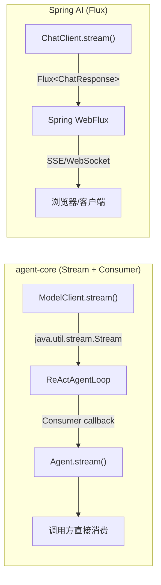

# Stream vs Flux：为什么 agent-core 用 java.util.stream.Stream 而不是 Reactor Flux

> 时间：2026-08-31
> 来源：Stage 1-2 学习过程中的架构讨论
> 核心问题：Spring AI 的流式返回用 `Flux<ChatResponse>`（非阻塞、背压），agent-core 的 `ModelClient.stream()` 返回 `java.util.stream.Stream<StreamEvent>`——为什么不用 Flux？哪个更好？

---

## 问题描述

Spring AI 的 `ChatClient` 流式接口：

```java
// Spring AI
Flux<ChatResponse> stream = chatClient.prompt("hello").stream().content();
```

agent-core 的 `ModelClient` 流式接口：

```java
// agent-core
Stream<StreamEvent> stream = modelClient.stream(request);
```

两者都是"逐 token 返回"的流式语义，但底层抽象完全不同：

| 维度 | `Flux`（Reactor） | `Stream`（JDK） |
|------|-------------------|-----------------|
| 来源 | Project Reactor（`reactor-core`） | JDK 内置 `java.util.stream` |
| 范式 | 响应式（Reactive） | 命令式迭代（Pull-based） |
| 背压 | ✅ 内置背压（Backpressure） | ❌ 无背压 |
| 非阻塞 | ✅ 非阻塞 I/O | ❌ 阻塞式 `iterator.next()` |
| 组合性 | `flatMap` / `merge` / `zip` / `concatMap` | `map` / `filter` / `flatMap`（有限） |
| 调度器 | `publishOn` / `subscribeOn` 可切线程 | 无 |
| 依赖 | 需引入 `reactor-core` | 零依赖 |
| 调试 | 异步栈断裂，调试困难 | 栈跟踪完整 |

---

## 当前设计：两层流式 API，各选不同抽象

agent-core 的流式设计分两层，每层选了不同的抽象方式：

### 第一层：ModelClient（模型客户端层）

```java
public interface ModelClient {
    ModelResponse chat(ModelRequest request);       // 同步
    Stream<StreamEvent> stream(ModelRequest request); // 流式
}
```

返回 `java.util.stream.Stream<StreamEvent>`——JDK 内置的 Pull-based 流。

### 第二层：Agent（Agent 入口层）

```java
public interface Agent {
    String run(String userInput);                                   // 同步
    default void stream(String userInput, Consumer<AgentEvent> listener) {  // 流式
        // fallback: 调 run() 再发一个 ContentDelta + Done
    }
}
```

用 `Consumer<AgentEvent>` 回调——比返回 Stream 更简单，调用方不需要管理流的生命周期。

### 桥接层：ReActAgentLoop

`ReActAgentLoop` 里只有一个 `runLoop`，通过 `ModelInvoker` 函数式接口桥接两种模型调用方式：

```java
// 非流式：chat invoker
execute(config, state) -> runLoop(config, state, noopSink, (client, req, s, sink) -> client.chat(req))

// 流式：stream invoker
stream(config, state, sink) -> runLoop(config, state, sink, ReActAgentLoop::invokeStream)

private static ModelResponse invokeStream(ModelClient client, ModelRequest req,
                                          AgentState state, Consumer<AgentEvent> sink) {
    try (Stream<StreamEvent> events = client.stream(req)) {
        return consumeStream(events, state, sink);  // 迭代 Stream，转发给 Consumer
    }
}
```

`consumeStream` 逐个迭代 `StreamEvent`，把 `ContentDelta` 转发给 `AgentEvent` sink：

```java
private static ModelResponse consumeStream(Stream<StreamEvent> events,
                                           AgentState state, Consumer<AgentEvent> sink) {
    ModelResponse response = null;
    Iterator<StreamEvent> it = events.iterator();
    while (it.hasNext()) {
        StreamEvent event = it.next();
        if (event instanceof StreamEvent.ContentDelta delta) {
            sink.accept(new AgentEvent.ContentDelta(delta.delta()));
        } else if (event instanceof StreamEvent.Done done) {
            response = done.finalResponse();
            break;
        } else if (event instanceof StreamEvent.Error err) {
            state.setStatus(AgentState.Status.ERROR);
            sink.accept(new AgentEvent.Error(err.message(), err.cause()));
            return null;
        }
    }
    return response;
}
```

---

## 为什么选 Stream 而不是 Flux

### 理由 1：零依赖原则

`agent-core` 的 `pom.xml` 只引了 Jackson + SLF4J：

```xml
<dependencies>
    <dependency>
        <groupId>com.fasterxml.jackson.core</groupId>
        <artifactId>jackson-databind</artifactId>
    </dependency>
    <dependency>
        <groupId>org.slf4j</groupId>
        <artifactId>slf4j-api</artifactId>
    </dependency>
</dependencies>
```

`java.util.stream.Stream` 是 JDK 内置的，不需要引入 `reactor-core`。对于一个**基础框架模块**来说，依赖越少越好——下游使用者不会被绑架到反应式栈上。

> 如果 `agent-core` 引了 Reactor，所有依赖 `agent-core` 的模块都被迫接受 Reactive 范式。这在 SDK 设计里是重罪。

### 理由 2：ReAct 循环本质是顺序的

ReAct loop 的核心是：

```
调用模型 → 判断是否有 tool calls → 执行工具 → 结果写回 state → 再调模型 → ...
```

这是一个**同步的 while 循环**（见 `runLoop` 方法），每一步都依赖上一步的结果。这种模式天然是命令式的，不是响应式 pipeline。

`Flux` 的声明式组合（`flatMap`、`concatMap`、`zip`）在顺序 ReAct 循环里没有收益，反而让代码更难读：

```java
// 用 Flux 写 ReAct loop（伪代码）—— 过度工程化
Flux<AgentEvent> streamLoop(AgentConfig config, AgentState state) {
    return Flux.defer(() -> callModel(config, state))
        .flatMap(response -> {
            if (response.hasToolCalls()) {
                return executeTools(response.toolCalls())
                    .then(Flux.defer(() -> streamLoop(config, state)));  // 递归 flatMap
            } else {
                return Flux.just(new AgentEvent.Done(response.content(), state));
            }
        });
}
```

vs 当前的命令式写法——直观清晰：

```java
// 当前 agent-core 的写法
void runLoop(config, state, sink, invoker) {
    while (state.hasStepsRemaining() && !state.isTerminal()) {
        ModelResponse response = invoker.invoke(client, request, state, sink);
        if (response.hasToolCalls()) {
            executeTools(response, state, sink);
        } else {
            sink.accept(new AgentEvent.Done(response.content(), state));
            return;
        }
    }
}
```

### 理由 3：Consumer 回调比 Flux 更简单

Agent 层用 `Consumer<AgentEvent>` 而不是返回 `Flux<AgentEvent>`：

| 方面 | `Consumer<AgentEvent>` | `Flux<AgentEvent>` |
|------|----------------------|-------------------|
| 调用方心智负担 | 低——只需实现一个回调 | 高——需理解 subscribe / backpressure / scheduler |
| 框架控制力 | 完全控制事件发射节奏 | 消费者通过 request(n) 控制速率 |
| 默认 fallback | 极简——调 `run()` 再发一个 delta + Done | 需要返回 `Flux.just(delta, done)` |
| 生命周期 | 调用方不管 | 需要管理 Subscription / dispose |

Agent 接口的 default `stream` 方法是"不实现流式的 stub 也能编译"的关键：

```java
default void stream(ChatMessage userMessage, AgentState state, Consumer<AgentEvent> listener) {
    String answer = run(userMessage, state);  // 直接调同步方法
    if (answer != null && !answer.isBlank()) {
        listener.accept(new AgentEvent.ContentDelta(answer));
    }
    listener.accept(new AgentEvent.Done(answer, state));
}
```

如果用 `Flux`，这个 fallback 要写成 `Flux.create()` 或 `Flux.fromCallable()`，复杂度陡增。

### 理由 4：单 Agent / 单请求场景不需要背压

Spring AI 用 `Flux` 的核心原因之一是**背压**——在 Web 服务器场景下，下游消费者可以控制上游发射速率，防止慢消费者压垮服务器。

但 agent-core 是**一次请求一个 Agent loop**：

```
调用方 → Agent.stream() → ReActAgentLoop.runLoop() → ModelClient.stream()
```

消费者就是调用方自己，不存在多消费者争抢的场景。ReAct loop 内部消费 `ModelClient.stream()` 也是逐个迭代，不存在生产者快于消费者的问题。背压在这里是过度设计。

---

## Spring AI 为什么用 Flux

| 原因 | 说明 |
|------|------|
| **生态一致** | Spring AI 跑在 Spring WebFlux 上，`Flux`/`Mono` 是整个 Spring 反应式栈的标准抽象 |
| **非阻塞 I/O** | Web 服务器（Netty）需要非阻塞，`Flux` 天然适配 SSE / WebSocket 推流 |
| **背压** | 高并发场景下，下游消费者可以控制上游发射速率，避免 OOM |
| **组合性** | `Flux` 的 `flatMap`、`merge`、`concatMap` 适合编排复杂的异步流水线（多模型并行、工具并发执行） |
| **全链路 Reactive** | `WebClient`、`R2DBC`、`DataBuffer` 等全链路都是 Reactive，用 `Stream` 会在某一步阻塞线程，破坏非阻塞语义 |

核心差异：Spring AI 面向**Web 服务器高并发**，agent-core 面向**可嵌入 SDK**。

---

## 对比总结



| 维度 | `Stream` + `Consumer`（agent-core） | `Flux`（Spring AI） |
|------|------|------|
| **依赖** | 零额外依赖（JDK 内置） | 需要 `reactor-core` |
| **背压** | ❌ 无 | ✅ 有 |
| **非阻塞** | ❌ 阻塞式迭代 | ✅ 非阻塞 |
| **复杂度** | 低，直觉清晰 | 高，需理解 Reactive 范式 |
| **适用场景** | 单 Agent 顺序执行、CLI/SDK 嵌入 | Web 服务器高并发、SSE 推流 |
| **组合性** | 弱（需手动编排） | 强（`flatMap`/`merge`/`zip`） |
| **调试** | 简单（栈跟踪完整） | 困难（异步栈断裂） |
| **并发模型** | 调用方线程驱动 | 事件循环 / 线程池调度 |

---

## 什么时候需要 Flux：Adapter 层桥接

如果将来需要在 Web 层暴露 SSE（比如 `agent-spring-boot-starter`），**不需要改 agent-core**——只需在外层 adapter 把 `Consumer` 转成 `Flux`：

```java
// adapter 层：Consumer → Flux
public Flux<AgentEvent> streamAsFlux(Agent agent, String input) {
    return Flux.create(sink -> {
        agent.stream(input, event -> {
            sink.next(event);
            if (event instanceof AgentEvent.Done || event instanceof AgentEvent.Error) {
                sink.complete();
            }
        });
    });
}
```

这样**核心保持简单，Web 层按需引入 Reactive**，是更干净的架构分层：

```
agent-core（零依赖，Stream + Consumer）
    ↓ adapter
agent-spring-boot-starter（引入 Reactor，暴露 Flux / SSE）
    ↓
Spring WebFlux 应用
```

---

## 架构师级洞察

> 流式返回类型的选择不是技术品味问题，是**框架定位**问题。框架面向 Web 服务器高并发 → Flux；框架面向可嵌入 SDK → Stream + Consumer。把场景搞混就会选错。

```text
错误：核心层引入 Flux → 所有下游被迫接受 Reactive → SDK 变重
正确：核心层用 Stream + Consumer → Web 层 adapter 桥接 Flux → 各层各取所需
```

可迁移：这与日志框架的设计如出一辙——SLF4J 核心 API 只有 `void log(String)`，不绑定性何异步框架；Logback / Log4j2 各自实现异步 Appender。核心保持简单，异步是实现细节。

另一个类比：JDBC 是同步阻塞 API，但 Spring Data R2DBC 在上层提供了 Reactive 封装。核心层不绑定性何 Reactive 范式，上层按需桥接。

---

## 面试表述

> agent-core 的 `ModelClient.stream()` 返回 `java.util.stream.Stream`，Agent 层用 `Consumer<AgentEvent>` 回调，而不是像 Spring AI 那样用 `Flux`。
>
> 原因是 agent-core 定位是可嵌入 SDK，不是 Web 服务器框架。ReAct 循环本质是顺序的——调模型、判工具、执行、写状态、再调模型，每步依赖上一步，用 `Flux` 的声明式组合没有收益，反而增加复杂度。
>
> 零依赖也是一个考虑：`Stream` 是 JDK 内置的，不强迫下游引入 Reactor。
>
> 如果将来需要在 Web 层暴露 SSE，我在 adapter 层用 `Flux.create()` 把 `Consumer` 桥接成 `Flux`，核心不变。

---

## 关联

- 证据：`ModelClient.stream()` 返回 `Stream<StreamEvent>`；`Agent.stream()` 用 `Consumer<AgentEvent>`；`ReActAgentLoop.invokeStream()` 消费 Stream 并转发给 Consumer；`pom.xml` 零 Reactive 依赖。
- 决策 4（流式和非流式走同一条 Loop）：本文讨论的是流式返回类型的选择，决策 4 讨论的是流式和非流式共享循环逻辑——两者正交。
- 如果 Stage 3（插件化）引入 Spring Boot 集成，`agent-spring-boot-starter` 里的 adapter 是 Flux 桥接的落地点。
