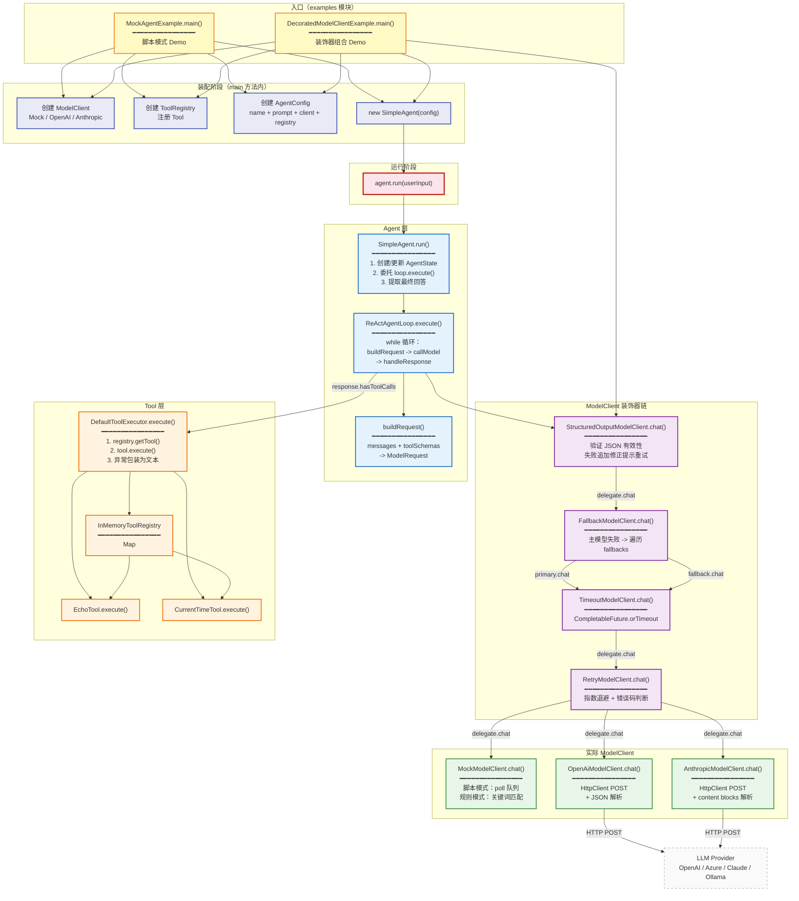
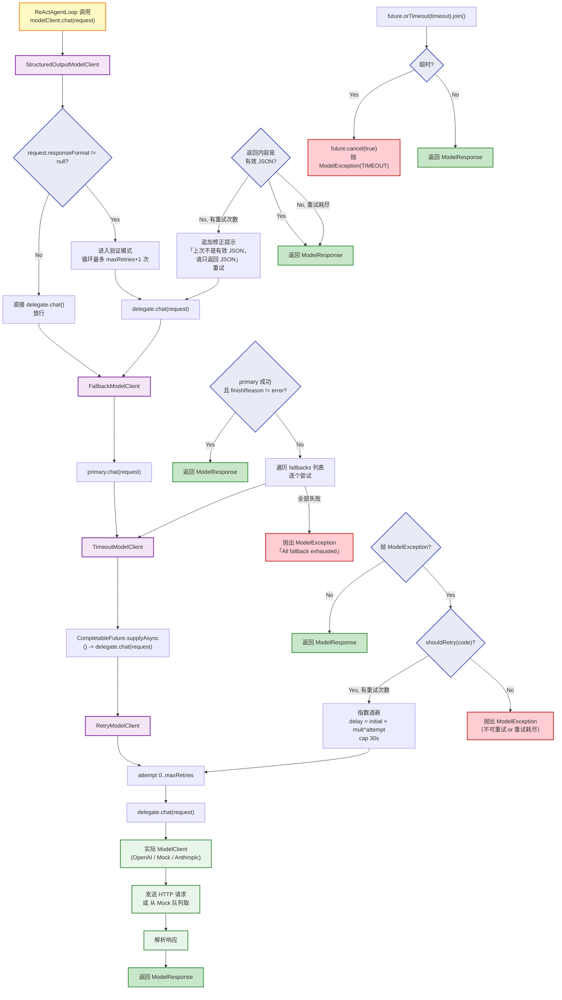
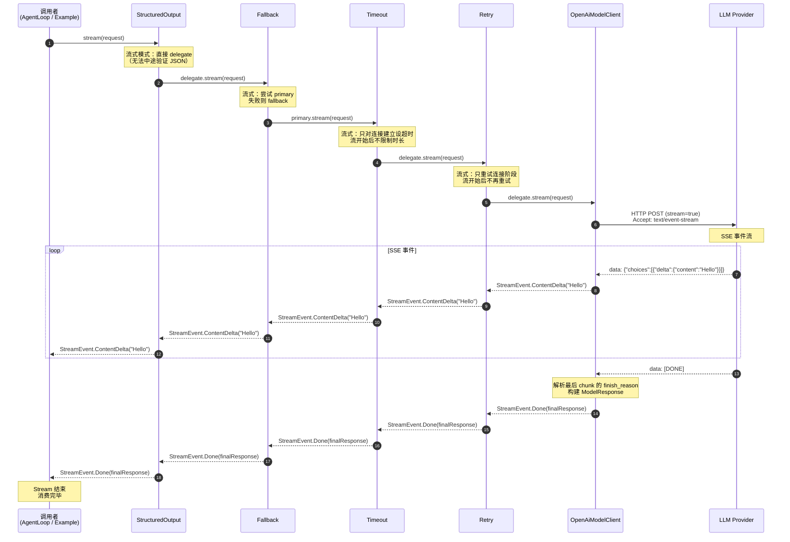
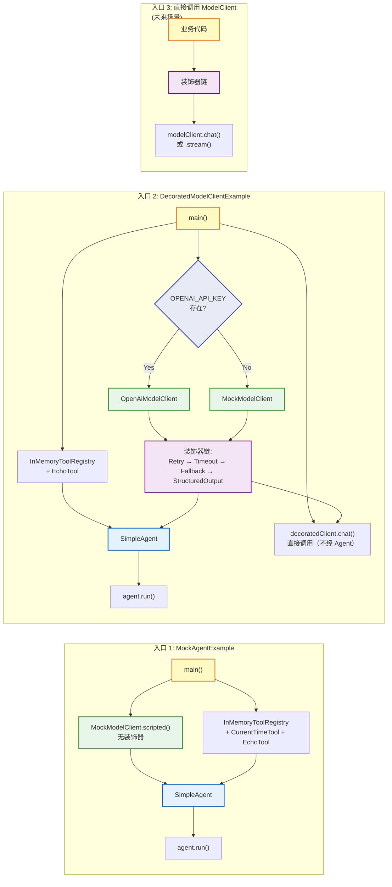

# 执行流程图 - Stage 1-2

> Java Agent Framework 代码执行流程全景
> 从入口到出口，谁触发谁，数据怎么流

---

## 1. 全局调用图（Call Graph）

> 谁调用谁。箭头 = "触发/调用"。



---

## 2. 场景 A：带工具调用的完整执行（时序图）

> `MockAgentExample` 运行 "What time is it now?"
> Mock 脚本预置：第 1 轮返回 tool_call，第 2 轮返回最终文本

```mermaid
sequenceDiagram
    autonumber
    participant User as 👤 用户
    participant Main as MockAgentExample<br/>main()
    participant Agent as SimpleAgent
    participant Loop as ReActAgentLoop
    participant Client as MockModelClient<br/>(脚本模式)
    participant Exec as DefaultToolExecutor
    participant Reg as InMemoryToolRegistry
    participant Tool as CurrentTimeTool

    Note over Main: ━━ 装配阶段 ━━

    Main->>Client: MockModelClient.scripted()<br/>.respondToolCalls(get_current_time)<br/>.respondText("final answer")
    Main->>Reg: new InMemoryToolRegistry()
    Main->>Reg: register(CurrentTimeTool)
    Main->>Reg: register(EchoTool)
    Main->>Agent: new SimpleAgent(config)

    Note over Main: ━━ 运行阶段 ━━

    User->>Main: "What time is it now?"
    Main->>Agent: agent.run("What time is it now?")

    Note over Agent: 创建 AgentState<br/>messages = [system, user]<br/>status = IDLE

    Agent->>Loop: loop.execute(config, state)
    Note over Loop: status = RUNNING

    %% ============ Step 1: 模型返回 tool_call ============
    rect rgb(255, 243, 224)
        Note over Loop: Step 1
        Loop->>Loop: buildRequest(messages + toolSchemas)
        Loop->>Client: chat(request)
        Note over Client: scriptedResponses.poll()<br/>返回第 1 个预设响应
        Client-->>Loop: ModelResponse(toolCalls=[get_current_time])

        Note over Loop: response.hasToolCalls() == true
        Loop->>Loop: addMessage(assistantWithTools)
        Note over Loop: status = EXECUTING_TOOL

        Loop->>Exec: execute(ToolCall("get_current_time"))
        Exec->>Reg: getTool("get_current_time")
        Reg-->>Exec: CurrentTimeTool
        Exec->>Tool: execute(arguments)
        Tool-->>Exec: "当前时间: 2026-08-13 14:30"
        Exec-->>Loop: "当前时间: 2026-08-13 14:30"

        Loop->>Loop: addMessage(tool result)
        Note over Loop: status = RUNNING
    end

    %% ============ Step 2: 模型返回最终答案 ============
    rect rgb(232, 245, 233)
        Note over Loop: Step 2
        Loop->>Loop: buildRequest(messages + toolSchemas)
        Loop->>Client: chat(request)
        Note over Client: scriptedResponses.poll()<br/>返回第 2 个预设响应
        Client-->>Loop: ModelResponse(content="final answer")

        Note over Loop: response.hasToolCalls() == false
        Loop->>Loop: addMessage(assistant content)
        Note over Loop: status = DONE
    end

    Loop-->>Agent: return state (DONE)
    Note over Agent: 遍历 messages 找最后的<br/>ASSISTANT 消息，提取 content
    Agent-->>Main: "final answer"
    Main-->>User: 打印结果
```

---

## 3. 场景 B：装饰器链执行（时序图）

> `DecoratedModelClientExample` 装配了完整装饰器链。
> 展示一次 `chat()` 调用如何穿过多层装饰器。

```mermaid
sequenceDiagram
    autonumber
    participant Loop as ReActAgentLoop
    participant SO as StructuredOutput<br/>ModelClient
    participant FB as Fallback<br/>ModelClient
    participant TO as Timeout<br/>ModelClient
    participant RT as Retry<br/>ModelClient
    participant Real as OpenAiModelClient<br/>(或 Mock/Anthropic)
    participant LLM as LLM Provider

    Loop->>SO: chat(request)

    Note over SO: 检查 request.responseFormat<br/>有 JSON 格式？→ 走验证逻辑

    SO->>FB: delegate.chat(request)

    Note over FB: 尝试 primary（TO）

    rect rgb(232, 245, 233)
        Note over FB,RT: 正常路径（primary 成功）
        FB->>TO: primary.chat(request)
        TO->>RT: delegate.chat(request)
        RT->>Real: delegate.chat(request)
        Real->>LLM: HTTP POST /chat/completions
        LLM-->>Real: 200 OK + JSON body
        Real-->>RT: ModelResponse(content, "stop")
        RT-->>TO: ModelResponse
        TO-->>FB: ModelResponse
        FB-->>SO: ModelResponse
    end

    Note over SO: 验证 JSON 有效性<br/>有效 → 返回<br/>无效 → 追加修正提示重试

    SO-->>Loop: ModelResponse

    %% ============ 异常路径 ============
    rect rgb(255, 235, 238)
        Note over FB,LLM: 异常路径（primary 失败 → fallback）

        FB->>TO: primary.chat(request)
        TO->>RT: delegate.chat(request)
        RT->>Real: attempt 1: delegate.chat()
        Real->>LLM: HTTP POST
        LLM-->>Real: 500 Server Error
        Real-->>RT: ModelException(MODEL_ERROR)

        Note over RT: shouldRetry(MODEL_ERROR) = true<br/>退避 500ms
        RT->>Real: attempt 2: delegate.chat()
        Real->>LLM: HTTP POST
        LLM-->>Real: 500 Server Error
        RT-->>TO: ModelException（重试耗尽）

        Note over TO: 不拦截 ModelException<br/>直接抛出
        TO-->>FB: ModelException

        Note over FB: primary 抛异常<br/>→ 尝试 fallbacks[0]
        FB->>Real: fallback.chat(request)
        Note over Real: 这里 fallback 通常是 MockModelClient
        Real-->>FB: ModelResponse("Fallback response")
        FB-->>SO: ModelResponse
    end
```

---

## 4. 装饰器链逐层展开

> 每个装饰器做什么、什么时候拦截、什么时候放行



---

## 5. ReAct 循环内部流程（带触发者标注）

> 每一步标注「谁触发谁」和「触发条件」

```mermaid
flowchart TD
    Entry["🔔 触发者: SimpleAgent.run()<br/>调用 loop.execute(config, state)"]

    Init["ReActAgentLoop.execute()<br/>━━━━━━━━━━━━━━━━<br/>status = RUNNING"]

    LoopCheck{"🔄 循环条件<br/>hasStepsRemaining &&<br/>!isTerminal()?<br/>━━━━━━━━━━━━━━━━<br/>触发者: ReActAgentLoop 自身"}

    StepInc["currentStep++<br/>━━━━━━━━━━━━━━━━<br/>触发者: Loop 循环体"]

    %% ============ Step 1: 构建请求 ============
    BuildReq["📦 构建 ModelRequest<br/>━━━━━━━━━━━━━━━━<br/>触发者: Loop → buildRequest()<br/>━━━━━━━━━━━━━━━━<br/>从 state.messages 拷贝<br/>+ registry.getToolSchemas()"]

    %% ============ Step 2: 调用模型 ============
    CallModel["🤖 调用模型<br/>━━━━━━━━━━━━━━━━<br/>触发者: Loop → modelClient.chat()<br/>━━━━━━━━━━━━━━━━<br/>进入装饰器链<br/>→ 最终到达 Real Client"]

    CallModelCatch{"modelClient.chat()<br/>是否抛异常?"}

    ErrorPath["❌ 错误路径<br/>━━━━━━━━━━━━━━━━<br/>status = ERROR<br/>lastError = e.getMessage()<br/>return state"]

    %% ============ Step 3: 处理响应 ============
    CheckToolCalls{"response.hasToolCalls()?<br/>━━━━━━━━━━━━━━━━<br/>触发者: Loop 判断响应"}

    %% ============ Tool 路径 ============
    AddAssistantTool["📝 记录 assistant 消息<br/>━━━━━━━━━━━━━━━━<br/>触发者: Loop → addMessage()<br/>━━━━━━━━━━━━━━━━<br/>ChatMessage.assistantWithTools()"]

    SetExecTool["status = EXECUTING_TOOL<br/>━━━━━━━━━━━━━━━━<br/>触发者: Loop"]

    ToolLoop["🔄 遍历 response.toolCalls<br/>━━━━━━━━━━━━━━━━<br/>触发者: Loop for 循环"]

    ExecTool["🔧 执行工具<br/>━━━━━━━━━━━━━━━━<br/>触发者: Loop → toolExecutor.execute()<br/>━━━━━━━━━━━━━━━━<br/>→ DefaultToolExecutor<br/>  → registry.getTool()<br/>    → tool.execute()"]

    AddToolResult["📝 记录 tool 结果<br/>━━━━━━━━━━━━━━━━<br/>触发者: Loop → addMessage()<br/>━━━━━━━━━━━━━━━━<br/>ChatMessage.tool(id, name, result)"]

    SetRunning["status = RUNNING<br/>━━━━━━━━━━━━━━━━<br/>触发者: Loop"]

    BackToLoop["回到循环顶部<br/>━━━━━━━━━━━━━━━━<br/>触发者: Loop while"]

    %% ============ Final Answer 路径 ============
    AddAssistantFinal["📝 记录最终答案<br/>━━━━━━━━━━━━━━━━<br/>触发者: Loop → addMessage()<br/>━━━━━━━━━━━━━━━━<br/>ChatMessage.assistant(content)"]

    SetDone["status = DONE<br/>━━━━━━━━━━━━━━━━<br/>触发者: Loop"]

    ReturnState["返回 state<br/>━━━━━━━━━━━━━━━━<br/>触发者: Loop → return"]

    %% ============ Max Steps ============
    MaxSteps["⚠️ 超出最大步数<br/>━━━━━━━━━━━━━━━━<br/>status = MAX_STEPS_EXCEEDED<br/>触发者: Loop 循环退出后"]

    %% ============ 提取答案 ============
    Extract["SimpleAgent 提取最终回答<br/>━━━━━━━━━━━━━━━━<br/>触发者: SimpleAgent<br/>━━━━━━━━━━━━━━━━<br/>从后往前找 ASSISTANT 消息<br/>提取 content"]

    ReturnAnswer["返回 String 给调用者<br/>━━━━━━━━━━━━━━━━<br/>触发者: SimpleAgent → return"]

    %% ============ 连接 ============
    Entry --> Init --> LoopCheck
    LoopCheck -->|Yes| StepInc --> BuildReq
    BuildReq --> CallModel
    CallModel --> CallModelCatch
    CallModelCatch -->|Yes| ErrorPath
    CallModelCatch -->|No| CheckToolCalls

    CheckToolCalls -->|Yes| AddAssistantTool
    AddAssistantTool --> SetExecTool
    SetExecTool --> ToolLoop
    ToolLoop --> ExecTool
    ExecTool --> AddToolResult
    AddToolResult --> ToolLoop
    ToolLoop -->|遍历完| SetRunning
    SetRunning --> BackToLoop
    BackToLoop --> LoopCheck

    CheckToolCalls -->|No| AddAssistantFinal
    AddAssistantFinal --> SetDone
    SetDone --> ReturnState

    LoopCheck -->|No| MaxSteps
    MaxSteps --> ReturnState

    ReturnState --> Extract
    Extract --> ReturnAnswer

    %% ============ 样式 ============
    classDef trigger fill:#fff9c4,stroke:#f57f17,stroke-width:2px
    classDef loop fill:#e3f2fd,stroke:#1565c0,stroke-width:2px
    classDef decision fill:#e8eaf6,stroke:#3f51b5,stroke-width:2px
    classDef tool fill:#fff3e0,stroke:#ef6c00,stroke-width:2px
    classDef model fill:#f3e5f5,stroke:#7b1fa2,stroke-width:2px
    classDef error fill:#ffcdd2,stroke:#c62828,stroke-width:2px
    classDef success fill:#c8e6c9,stroke:#388e3c,stroke-width:2px

    class Entry trigger
    class Init,StepInc,SetExecTool,SetRunning,SetDone,BuildReq,BackToLoop loop
    class LoopCheck,CallModelCatch,CheckToolCalls decision
    class AddAssistantTool,AddToolResult,AddAssistantFinal,ExecTool,ToolLoop tool
    class CallModel model
    class ErrorPath,MaxSteps error
    class ReturnState,Extract,ReturnAnswer success
```



---

## 6. 流式调用执行流

> `stream()` 的执行路径与 `chat()` 不同
> 装饰器对流式的处理方式也不同



---

## 7. 数据流转图

> 一个 `String userInput` 如何变成 `String response`<br/>
> 中间经历了哪些数据结构变换

```mermaid
flowchart LR
    Input["👤 String userInput<br/>━━━━━━━━━━━━━━━━<br/>'What time is it?'"]

    State1["AgentState<br/>━━━━━━━━━━━━━━━━<br/>messages: [<br/>  ChatMessage(SYSTEM, prompt),<br/>  ChatMessage(USER, input)<br/>]"]

    Request1["ModelRequest<br/>━━━━━━━━━━━━━━━━<br/>model: null<br/>messages: [...]<br/>tools: [schema, schema]"]

    Response1["ModelResponse<br/>━━━━━━━━━━━━━━━━<br/>content: null<br/>toolCalls: [ToolCall(id, name, args)]<br/>finishReason: 'tool_calls'"]

    State2["AgentState<br/>━━━━━━━━━━━━━━━━<br/>messages: [<br/>  system,<br/>  user,<br/>  assistantWithTools,<br/>  tool(result)<br/>]"]

    Request2["ModelRequest<br/>━━━━━━━━━━━━━━━━<br/>messages: [...4 条...]"]

    Response2["ModelResponse<br/>━━━━━━━━━━━━━━━━<br/>content: 'final answer'<br/>toolCalls: null<br/>finishReason: 'stop'"]

    State3["AgentState<br/>━━━━━━━━━━━━━━━━<br/>messages: [...5 条...]<br/>status: DONE"]

    Output["👤 String response<br/>━━━━━━━━━━━━━━━━<br/>'final answer'"]

    Input -->|"SimpleAgent.run()<br/>构造 State"| State1
    State1 -->|"buildRequest()<br/>拷贝 messages + 注入 tools"| Request1
    Request1 -->|"modelClient.chat()<br/>经装饰器链 -> LLM"| Response1
    Response1 -->|"hasToolCalls() == true<br/>执行工具 + addMessage"| State2
    State2 -->|"buildRequest()<br/>第二轮循环"| Request2
    Request2 -->|"modelClient.chat()"| Response2
    Response2 -->|"hasToolCalls() == false<br/>addMessage(assistant)"| State3
    State3 -->|"从后往前找<br/>ASSISTANT 消息"| Output

    classDef io fill:#fff9c4,stroke:#f57f17,stroke-width:2px
    classDef state fill:#e3f2fd,stroke:#1565c0,stroke-width:2px
    classDef req fill:#f3e5f5,stroke:#7b1fa2,stroke-width:2px
    classDef resp fill:#e8f5e9,stroke:#388e3c,stroke-width:2px

    class Input,Output io
    class State1,State2,State3 state
    class Request1,Request2 req
    class Response1,Response2 resp
```



---

## 8. 三种入口的触发路径对比



---

## 9. 组件触发关系矩阵

> 横轴 = 触发者，纵轴 = 被触发者
> ✅ = 会触发，❌ = 不会触发，🔀 = 条件触发

| 触发者 ↓ \ 被触发者 →           | SimpleAgent | ReActAgentLoop | ModelClient           | ToolExecutor   | ToolRegistry | Tool        | LLM Provider |
|--------------------------|-------------|----------------|-----------------------|----------------|--------------|-------------|--------------|
| **main()**               | ✅ 创建+调用     | ❌              | ✅ 创建                  | ❌              | ✅ 创建         | ❌           | ❌            |
| **SimpleAgent**          | -           | ✅ 调用 execute() | ❌                     | ❌              | ❌            | ❌           | ❌            |
| **ReActAgentLoop**       | ❌           | -              | ✅ 调用 chat()           | ✅ 调用 execute() | ❌            | ❌           | ❌            |
| **StructuredOutput**     | ❌           | ❌              | ✅ delegate            | ❌              | ❌            | ❌           | ❌            |
| **Fallback**             | ❌           | ❌              | ✅ primary + fallbacks | ❌              | ❌            | ❌           | ❌            |
| **Timeout**              | ❌           | ❌              | ✅ delegate            | ❌              | ❌            | ❌           | ❌            |
| **Retry**                | ❌           | ❌              | ✅ delegate            | ❌              | ❌            | ❌           | ❌            |
| **DefaultToolExecutor**  | ❌           | ❌              | ❌                     | -              | ✅ getTool()  | ✅ execute() | ❌            |
| **OpenAiModelClient**    | ❌           | ❌              | ❌                     | ❌              | ❌            | ❌           | ✅ HTTP POST  |
| **AnthropicModelClient** | ❌           | ❌              | ❌                     | ❌              | ❌            | ❌           | ✅ HTTP POST  |
| **MockModelClient**      | ❌           | ❌              | ❌                     | ❌              | ❌            | ❌           | ❌ (无外部调用)    |

---

## 10. 异常处理流程图

> 不同层捕获什么异常、怎么处理

```mermaid
flowchart TD
    LLMError["LLM 返回错误<br/>━━━━━━━━━━━━━━━━<br/>4xx / 5xx / 网络超时"]

    ModelEx["ModelClient 抛出<br/>ModelException(ErrorCode)<br/>━━━━━━━━━━━━━━━━<br/>NETWORK_ERROR / TIMEOUT /<br/>RATE_LIMITED / AUTH_ERROR /<br/>INVALID_REQUEST / MODEL_ERROR"]

    RetryCatch{"RetryModelClient<br/>捕获"}
    RetryCheck{"shouldRetry(code)?"}
    RetryYes["退避后重试<br/>━━━━━━━━━━━━━━━━<br/>maxRetries 次<br/>指数退避 500ms × 2^n<br/>cap 30s"]
    RetryNo["向上抛出"]
    RetryExhausted["重试耗尽<br/>向上抛出"]

    TimeoutCatch{"TimeoutModelClient<br/>捕获"}
    TimeoutCheck{"是 TimeoutException?"}
    TimeoutYes["包装为<br/>ModelException(TIMEOUT)"]
    TimeoutNo["解包原异常<br/>向上抛出"]

    FallbackCatch{"FallbackModelClient<br/>捕获"}
    FallbackCheck{"还有 fallback?"}
    FallbackYes["尝试下一个 fallback<br/>━━━━━━━━━━━━━━━━<br/>fallbacks[index+1].chat()"]
    FallbackNo["抛出<br/>ModelException(MODEL_ERROR)<br/>'All fallback exhausted'"]

    StructuredCatch{"StructuredOutput<br/>捕获?"}
    StructuredNo["向上抛出"]

    LoopCatch{"ReActAgentLoop<br/>捕获"}
    LoopHandle["status = ERROR<br/>lastError = e.getMessage()<br/>return state"]
    LoopThrow["异常不向上传播<br/>转为 state.status = ERROR"]

    AgentHandle{"SimpleAgent<br/>处理"}
    AgentError["status == ERROR<br/>return '[Agent error: ...]'"]

    ToolError["Tool 执行异常"]
    ToolExCatch["DefaultToolExecutor<br/>捕获"]
    ToolWrap["包装为文本<br/>━━━━━━━━━━━━━━━━<br/>'[ERROR] Tool xxx failed: ...'<br/>返回给 Loop（非异常）"]

    %% ============ 连接 ============
    LLMError --> ModelEx
    ModelEx --> RetryCatch

    RetryCatch --> RetryCheck
    RetryCheck -->|Yes| RetryYes
    RetryCheck -->|No| RetryNo
    RetryYes -->|重试成功| OK["正常返回"]
    RetryYes -->|重试失败| RetryExhausted
    RetryExhausted --> TimeoutCatch
    RetryNo --> TimeoutCatch

    TimeoutCatch --> TimeoutCheck
    TimeoutCheck -->|Yes| TimeoutYes
    TimeoutCheck -->|No| TimeoutNo
    TimeoutYes --> FallbackCatch
    TimeoutNo --> FallbackCatch

    FallbackCatch --> FallbackCheck
    FallbackCheck -->|Yes| FallbackYes
    FallbackCheck -->|No| FallbackNo
    FallbackYes -->|成功| OK
    FallbackNo --> StructuredCatch

    StructuredCatch --> StructuredNo
    StructuredNo --> LoopCatch

    LoopCatch --> LoopHandle
    LoopHandle --> LoopThrow
    LoopThrow --> AgentHandle
    AgentHandle --> AgentError

    ToolError --> ToolExCatch
    ToolExCatch --> ToolWrap
    ToolWrap --> LoopAsText["Loop 收到文本<br/>（不是异常）<br/>addMessage(tool result)"]

    classDef error fill:#ffcdd2,stroke:#c62828,stroke-width:2px
    classDef handle fill:#fff3e0,stroke:#ef6c00,stroke-width:2px
    classDef decision fill:#e8eaf6,stroke:#3f51b5,stroke-width:2px
    classDef success fill:#c8e6c9,stroke:#388e3c,stroke-width:2px

    class LLMError,ModelEx,FallbackNo,AgentError error
    class RetryYes,FallbackYes,TimeoutYes,ToolWrap,LoopHandle handle
    class RetryCatch,RetryCheck,TimeoutCatch,TimeoutCheck,FallbackCatch,FallbackCheck,StructuredCatch,LoopCatch,AgentHandle decision
    class OK,RetryNo,TimeoutNo,StructuredNo,LoopThrow,LoopAsText success
```



---

## 总结：触发链路一览

```
main()
  │
  ├── 装配阶段 ──────────────────────────────────────────
  │    ├── new MockModelClient / OpenAiModelClient / AnthropicModelClient
  │    ├── new InMemoryToolRegistry() + register(Tool)
  │    ├── new AgentConfig(name, prompt, client, registry, maxSteps)
  │    └── new SimpleAgent(config)
  │         └── 内部创建 ReActAgentLoop(DefaultToolExecutor(registry))
  │
  └── 运行阶段 ──────────────────────────────────────────
       └── agent.run(userInput)
            │
            ├── SimpleAgent.run()
            │    ├── 创建 AgentState（systemPrompt + userInput）
            │    ├── loop.execute(config, state)
            │    │
            │    └── ReActAgentLoop.execute()
            │         │
            │         └── while (hasStepsRemaining && !isTerminal)
            │              │
            │              ├── buildRequest() → ModelRequest
            │              │
            │              ├── modelClient.chat(request)
            │              │    │
            │              │    └── 装饰器链（由外到内）
            │              │         ├── StructuredOutput → 验证 JSON
            │              │         ├── Fallback → 主备切换
            │              │         ├── Timeout → 超时控制
            │              │         ├── Retry → 重试退避
            │              │         └── Real Client → HTTP/Mock
            │              │              └── LLM Provider（OpenAI / Claude / ...）
            │              │
            │              ├── if hasToolCalls:
            │              │    ├── addMessage(assistantWithTools)
            │              │    ├── for each toolCall:
            │              │    │    └── toolExecutor.execute()
            │              │    │         └── DefaultToolExecutor
            │              │    │              ├── registry.getTool(name)
            │              │    │              └── tool.execute(arguments)
            │              │    ├── addMessage(tool result)
            │              │    └── continue loop
            │              │
            │              └── if final answer:
            │                   ├── addMessage(assistant)
            │                   ├── status = DONE
            │                   └── return state
            │
            └── 提取最后 ASSISTANT 消息 → return String
```
