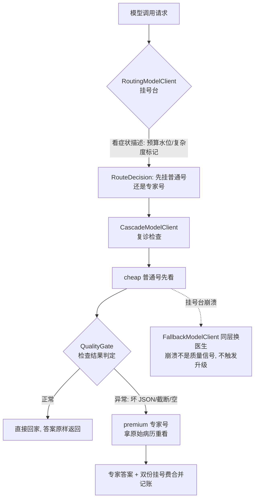

# E2 架构理解笔记：路由信号为什么要分两层

> 配套记录：实验数据与发现见 [experiment-e2-model-routing.md](experiment-e2-model-routing.md) · 决策五字段见 [architecture-stance-decision-25-routing-two-layers-precall-router-postcall-cascade.md](architecture-stance-decision-25-routing-two-layers-precall-router-postcall-cascade.md) · pre-call 预算路由的上一课见 [stage-18-article-4-model-routing.md](stage-18-article-4-model-routing.md)
> 状态：E2 已完成（2026-09-10），agent-observability 160/160 绿，未提交 git
> 本文回答一个问题：**路由的判断依据从哪来——调用前猜，还是调用后看？**

---

## 1. 为什么做：一个被直觉绑架的问题

E2 之前，仓库里已经有一套路由：`RoutingModelClient` 问 `BudgetAwareRouter`，按余量三档选模型。但它只看钱——余量健康走 premium，吃紧走 cheap。它看不见两件事：

- 这单任务**本身难不难**（一个 3 条消息的闲聊和一个 10 条消息的架构审查，在它眼里只差预算数字）
- 模型答出来的东西**到底好不好**（它答完就下班，答的是不是坏 JSON 它不管）

当时有两个候选方案解决这个缺口：

- 方案 A（直觉方案）：调用前预判任务复杂度——消息长、有"analyze/design/审查"这类标记，就升 premium。便宜的逻辑，业界也有 LLM-as-router 分类器路由的先例。
- 方案 B（验证方案）：cheap 先答，答完看一眼质量，不行再让 premium 重答。多花一次钱，但判断基于证据。

按直觉 A 应该赢：B 对每个失败要付双份钱。**但这是假设，不是结论**——决策 25 的问题"路由信号从哪拿"悬而未决，需要实验落定。E2 就是把两个方案都做出来，放进同一个任务集里对比，让数据说话。

---

## 2. 做了什么：三个类，各守一个信号

E2 的代码增量集中在 `agent-observability/routing/`，三个主类 + 一个实验 harness。关键是每个类**住哪一层**，这是全部架构含义所在：

| 类 | 层 | 信号 | 判断时机 |
|----|----|------|---------|
| `ComplexityRouter` | ModelRouter 策略（pre-call） | 消息数阈值 + 任务标记 | 调用前 |
| `RuleBasedQualityGate`（实现 `QualityGate` 接口） | 独立判定器（post-call） | 坏 JSON / 截断 / 空响应 | 调用后 |
| `CascadeModelClient` | 装饰器，位于路由层之上 | 组合上面两者 | 调用后 |

### 2.1 分层不是偏好，是信息结构的物理边界

为什么复杂度路由住在 `ModelRouter` 里，质量门却必须住装饰器？看两个接口签名就懂：

```java
// ModelRouter 能看见什么：
RouteDecision route(ModelRequest request, BudgetSnapshot budget);
// request + budget，构造上看不见任何响应——它是"调用前"的接口

// QualityGate 能看见什么：
Verdict judge(ModelResponse response);
// response——它是"调用后"的接口
```

`route()` 的参数列表里没有响应，pre-call 是这个接口的**宿命**，不是它的缺陷。要让路由器做 post-call 判定，只能改接口签名（把 `lastResponse` 塞进去）或 hack（绕过类型边界存全局状态）——两者都是把信息结构问题当成实现问题来解。

所以答案是：**信号在哪一层产生可观测，判定就住哪一层**。预算水位和任务标记在调用前可观测 → `ModelRouter` 策略；响应质量只在调用后可观测 → 路由层之上的装饰器。`ComplexityRouter` 证明现有接口零改动能承载 pre-call 增量；`CascadeModelClient` 证明 post-call 增量也只是一个装饰器，不是新框架。

### 2.2 心智模型：医院分诊



挂号台护士（pre-call 路由）看一眼症状描述就分诊——便宜、快，但只能看表面。复诊检查（post-call 质量门）拿到化验单才判断要不要转专家——贵一点，但基于实际证据。**分诊省不了复诊的钱，复诊也不替代分诊**：两层回答的是不同的问题（"先试谁" vs "要不要再试贵的"）。

### 2.3 级联的三条硬规矩

`CascadeModelClient` 的行为契约，每条都对应一个反直觉的设计决定：

**规矩一：升级时 premium 拿原始请求，不带 cheap 的失败响应。**
反面做法是"把 cheap 的坏答案塞给 premium 说：这是上一位的误诊，你修正一下"。看起来省上下文，实际三输：premium 继承 cheap 的幻觉、KV cache 前缀被新内容打掉、premium 的答案从此耦合在 cheap 的错误上。Clean re-issue 让级联**可证明等价于**"premium 从零作答，仅在 cheap 已过关时跳过"。

**规矩二：cheap 崩溃不升级，异常穿透。**
崩溃（`ModelException`）是可用性问题，坏答案（gate fail）是质量问题——两个信号，两个归宿。崩溃该由 tier 内的 `FallbackModelClient` 兜（同层换医生），质量问题才升级（转专家）。混在一起的后果：级联会静默吞掉所有供应商故障，用户以为服务正常。正确的组装是纵深：`Cascade(Fallback(cheapA, cheapB), premium)`。

**规矩三：失败的钱也记账。**
升级时返回的 `TokenUsage` 是两次尝试的总和——cheap 的失败也是真实支出，账目必须诚实。省这行代码不会让钱少花一分，只会让对账月变成玄学现场。

### 2.4 质量门 v1 只认"可证明的坏"

`RuleBasedQualityGate` 三个信号全是客观可判的：结构化输出解析失败（JSON 括号不平衡）、finishReason 异常（`error` / `length` 截断）、内容为空。没有打分模型、没有 LLM-as-judge。

这是刻意的上限：门只拦得住"可证明的坏"，拦不住"流畅但错误"——cheap 写了一段语法完美但事实全错的 JSON，v1 门放行。打分门（v2）需要标注数据，且打分本身要花 token，会侵蚀级联的成本优势。先把客观信号做对，主观信号留给有数据时再议——与决策 22（规则断言不做 LLM-as-judge）同一肌肉。

---

## 3. 解决什么问题：决策 25 的三个子问题各归各位

E2 之前悬着的架构问题，实验后逐个有了落点：

| 子问题 | E2 前的状态 | E2 后的答案 |
|--------|------------|------------|
| 预算信号放哪 | 已解决（BudgetAwareRouter，Stage 18） | 不动，pre-call 经济信号住 ModelRouter |
| 复杂度信号放哪 | 悬空（stage-18-article-4 明说"留给 v2"） | ComplexityRouter：pre-call 内容信号也住 ModelRouter，零改动插入 |
| 质量信号放哪 | 不存在（没人想过要看答案质量） | CascadeModelClient + QualityGate：post-call 信号住路由层之上的装饰器 |

推荐组装形态定型：

```text
Observing(Cascade(Routing(Fallback(cheapA, cheapB), premium), gate))
  外层观测：每次调用记账
  级联层：质量验证（E2 新增）
  路由层：pre-call 选人（经济 + 复杂度信号）
  tier 内：可用性兜底（Stage 1 已有）
```

从外到内四层，每层一个职责，没有一层需要理解另一层的内部。

---

## 4. 有没有解决：数据回答，其中一个答案是反直觉的

14 任务 × 三配置 × 校准价格（premium $2.50/$10.00、cheap $0.15/$0.60 每 1M token，确定性模拟）：

```
config            cost($)  premium calls  cheap calls    defects
all-premium      0.002095             14            0          0
pre-route        0.001226              4           10          3
cascade          0.000409              3           14          0  (escalations: 3)
```

**解决了的：**

- 决策 25 落定：两层分离经实验验证成立，接口边界无需改动。
- "级联双重付费所以更贵"的直觉被推翻：cascade 成本是 pre-route 的 1/3、all-premium 的 1/5。原因藏在 prompt 费里——pre-route 对 4 个深线程**盲升** premium（4 次全价调用），而这些任务 cheap 大多答得对；cascade 只在 3 个**可证明失败**的任务上付费升级。盲预承诺比事后验证贵。
- 质量盲区关闭：pre-route 把 3 个坏 JSON 原样送达用户（缺陷 3），cascade 全部拦下升级（缺陷 0）。
- 工业界印证方向：Anthropic 模型路由、OpenAI GPT-5 auto 模式走的是级联/验证路线，纯预判分类器是少数派——实验数据解释了为什么。

**没解决的（诚实边界）：**

- "流畅但错误"的响应 v1 门拦不住（客观信号的上限，打分门是 v2，需标注数据）。
- 流式场景的固有代价：gate 要等 cheap 流到 Done 才能判定，判定期间用户看不到增量输出（首 token 延迟 = cheap 全程）。缓解方案"先流 cheap 给用户、门失败再切"会引入 UX 抖动，留产品权衡。
- 实验是校准价格的确定性模拟，真实 API 计费验证需要 `OPENAI_API_KEY` 环境再跑一遍。
- KV cache 交叉点：级联升级重发原请求理论上不破坏 premium 侧前缀稳定性（clean re-issue 的副产品），但对缓存命中率的实际影响留给 E3 量化。

**实验方法本身的一课**：我最初按直觉写了断言"pre-route 应比 cascade 便宜"，数据直接推翻它。这提醒一个实验纪律——**断言固化的是假设，数据否定断言时，改的应该是假设**。最终这条被推翻的直觉反而成了 E2 最重要的发现。

---

## 5. 一句话带走

路由的分层不是组织代码的习惯，是信息可达性的物理边界：**调用前能看见的信号（预算、复杂度表面）归路由策略，调用后才存在的信号（答案质量）归级联装饰器**。两层之间不传内部状态，只传原样请求与审计 reason。而实验证明：在合适的价差下，为证据付验证费，比为猜测付预承诺费便宜——这不是工程优化，是这套分层的结构性优势。

---

## 附：交付物索引

| 交付物 | 位置 |
|--------|------|
| 质量门接口 + v1 实现 | `agent-observability/src/main/java/io/github/qwzhang01/agent/observability/routing/QualityGate.java` · `RuleBasedQualityGate.java` |
| 级联装饰器 | 同目录 `CascadeModelClient.java` |
| 预判路由策略 | 同目录 `ComplexityRouter.java` |
| 测试 + 实验 harness | `agent-observability/src/test/java/.../routing/` 四个测试类，160/160 绿 |
| 实验数据与发现 | [experiment-e2-model-routing.md](experiment-e2-model-routing.md) |
| 决策立场卡 | [architecture-stance-decision-25-routing-two-layers-precall-router-postcall-cascade.md](architecture-stance-decision-25-routing-two-layers-precall-router-postcall-cascade.md) |
