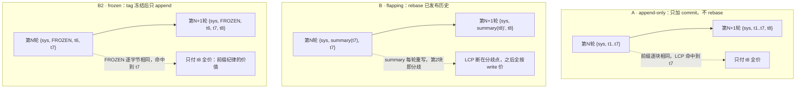

# E3 架构理解笔记：前缀稳定性为什么是计费事件，不是编译错误

> 配套记录：实验数据与五策略结果见 [experiment-e3-prompt-caching.md](experiment-e3-prompt-caching.md) · 决策五字段见 [architecture-stance-decision-26-cache-visibility-and-prefix-stability.md](architecture-stance-decision-26-cache-visibility-and-prefix-stability.md) · KP3 原始问题见 [learning-path-2026-09-knowledge-points.md](learning-path-2026-09-knowledge-points.md)
> 状态：E3 已完成（2026-09-10），agent-observability 176/176 绿，未提交 git
> 本文回答一个架构问题：**缓存命中是编译期查不了的运行时事实，契约该怎么写、写在哪、靠什么执行？**

---

## 1. 为什么做：契约与后验事实的矛盾

决策 26 悬着两个问题：ContextBuilder 的契约要不要写进「前缀稳定性」条款；决策 9（compaction 就地改写历史）打掉 KV 缓存前缀的真实代价是多少。

两个问题背后是同一个矛盾：**prompt cache 的命中与否，在代码写完那一刻还不存在**。它是请求序列在供应商侧运行出来的结果——本次 prompt 与同模型上一发 prompt 的最长公共前缀（LCP）有多长，命中就有多长。编译器看不见它，类型系统拦不住它。而架构里所有成熟的约束手段——接口签名、类型、断言——全是编译期或构造期的。

直觉还有第二个预设：改写历史 = 缓存死亡 = 更贵。E2 已经教过一课（断言固化的是假设），这个预设同样要交给数据审判。

所以 E3 的架构任务天然分三段，顺序本身就是论证：**先让不可见的东西可见（计量），再用可见性做出判定（模拟 + 实验），最后才轮到契约成文（条款）**。没有计量就没有立场——条款里每个数字（24%、结论反转）都来自先行的可见性，而不是来自思辨。

---

## 2. 做了什么：四块增量，各守一个层次

| 增量 | 位置 | 架构角色 |
|------|------|---------|
| `TokenUsage.cachedTokens` | agent-core | 计量口径：全链路统一语言的唯一定义点 |
| `CacheSimulatingModelClient` | agent-observability/routing | 边界观测：对请求序列做 LCP 判定的装饰器 |
| `CachePricing` | agent-observability/routing | 纯函数计价：定价是数据，不是散落的 if |
| ContextBuilder 前缀稳定性条款 | agent-core javadoc | 弱契约：SHOULD 级纪律 + 计费事件兜底 |

### 2.1 计量口径先于契约：看不见的东西管不了

做什么：`TokenUsage` 从 3 字段变 4 字段，加 `cachedTokens`。

为什么它必须第一个做：命中率、成本、预算上限的争论，全部以「命中了多少 token」为原子事实。这个事实此前在 API 响应里存在（OpenAI 的 `prompt_tokens_details.cached_tokens`、Anthropic 的 `cache_read`），在系统里不存在——两家口径还不同。所有下游接线（Cascade 合并、Metrics 聚合、Trajectory JSON 往返、两家供应商 client）需要同一种语言，语言只能有一个定义点，所以它住 agent-core。

怎么做的两个关键决定：

- **子集语义而非分片语义**：`promptTokens` = 完整计费 prompt（含命中部分），`cachedTokens ⊆ promptTokens`。后果是所有按 `promptTokens` 做预算与统计的存量代码（KP2 四本账）语义不变——加法不破坏存量。Anthropic 的 `cache_creation` 折叠进 `promptTokens`（真实支出，按写价），`cache_read` 进 `cachedTokens`。
- **schema 演进纪律**：compact constructor 钳制（负值归零、超 prompt 截断）+ 3 参兼容构造器默认 0 → 全部既有构造点零改动；JSON 读档 `asInt(0)` 兼容旧 trajectory；golden 快照加一行字段名，作为 schema 演进的 tripwire。

### 2.2 模拟器为什么是装饰器，为什么住那个目录

做什么：`CacheSimulatingModelClient` 包装任意 `ModelClient`，按 model id 分缓存域，记上一发 prompt，LCP 计命中，把结果写回 usage。

为什么是装饰器：LCP 比较的对象是「本次 prompt vs 同域上一发 prompt」——**缓存命中是请求序列的属性**。序列，只有 ModelClient 边界看得见。这是决策 5（装饰器优于继承）第四次验证：E1 Handoff、E2 Cascade、E3 CacheSimulator，三个「序列级判定」全部落在同一边界。它住 `agent-observability/routing/` 而不是 `agent-model`，也是在说同一句话：它不是供应商适配（不真发请求），它是对请求序列的观测与判定，与 Cascade 同族。

为什么按 model id 分域：不同模型的 KV cache 物理上不通用——cheap 攒的缓存 premium 用不了。这个分域顺带落定了 E2 留下的交叉点：级联升级的 clean re-issue 在 premium 域是**冷启动**（首次 LCP=0），构造上无跨域污染；双计费 39 token 诚实入账。E2 的设计在缓存维度拿到量化确认。

两个非功能决定同样属于架构：**确定性**（无随机、同序列同结果）——对照实验的前提，可复现不是测试技巧，是实验有效性的组成部分；**供应商已报值优先**（`Math.max(reported, simulated)`）——真实 API 报了 cachedTokens 就用真的，模拟只兜底，装饰器因此在真实链路可用，不是实验专用玩具。

### 2.3 计价为什么是纯函数

做什么：`CachePricing` record，三段互斥计价 `cached×read + written×write + (prompt−cached−written)×input`，整数 microUSD，`anthropic(...)`（读 0.1x、写 1.25x）与 `openAiStyle(...)`（读 0.5x、写免费）两个工厂。

为什么互斥：written 是「新写入缓存的部分」，它替代基价而不是叠加在基价上——首版把 written 同时算了基价和写价（双重计费），数据立刻露出破绽。三段切干净，账才立得住。

为什么参数化：发现 2 的「结论反转」（OpenAI 写免费风格下 flapping $0.003051 反胜 stable $0.003135，Anthropic 风格下 stable 胜）之所以一句话就能测出来，是因为定价被建模成数据而不是散落在逻辑里的 if——**换计价风格 = 换 record 实例，模拟器零改动**。供应商差异被隔离在一个纯函数后面，这正是参数化该赚的钱。

### 2.4 契约为什么是 SHOULD 级：弱契约 + 强可见性

做什么：ContextBuilder javadoc 加前缀稳定性条款——改写历史应优先 FROZEN summary，避免每轮重生成；flapping 损失约 24% 缓存价值（Anthropic 风格，E3 数据）；写免费供应商下纪律收益需重算。

为什么不是强约束。两种强制方案都试过推演，都失败：

- **接口签名传缓存状态**（`build(state, cacheContext)`）：core 层依赖运行时观测概念，层次倒挂；更根本的是 ContextBuilder 在调用链上不知道 prompt 将发给哪个模型、跟谁比 LCP——缓存域信息只在 ModelClient 边界存在。这与 E2 的教训同构：信号在哪层产生可观测，机制才能住哪层。
- **运行时强制**（检测到改写就抛异常）：改写历史本身是合法操作（决策 9 的 compaction 是正当功能），错的是「改写产物不稳定」这个细化维度。粗粒度 MUST 会把正当操作一起禁掉。

所以执行机制不在条款里，在计量里：**违规不报编译错，它会出现在 cachedTokens 和账单上**。弱契约负责说清楚应该怎么做，强可见性负责让你发现没做到——两个弱机制叠出一个强闭环。

### 2.5 心智模型：git 的已发布历史纪律

对写代码的人，KV cache 前缀匹配和 git 是同构的：缓存 = 已 push 的 commit 链；LCP = 从 HEAD 往回数到第一个分歧；改写中间历史 = rebase 已发布分支，之后所有 hash 全变、下游缓存全部失效；冻结 summary = 打 tag 后只 append 新 commit，老前缀照常命中；model id 分域 = 不同 remote 仓库，commit 链互不相通。

同体量对照 B vs B2 是整套实验的支点：两者 prompt 体量几乎一样（676 vs 666 token），唯一变量是 summary 是否冻结——稳定性单独值 24% 由此才测得干净。

---

## 3. 解决什么问题：三个悬空点各归各位

| 悬空点 | E3 前 | E3 后 |
|--------|-------|-------|
| 决策 26 契约之问 | 悬空：要不要写、写成什么强度 | 写：SHOULD 级条款 + 计费事件执行机制，数字来自实验 |
| 决策 9 张力（改写历史的代价） | 直觉预设「改写 = 缓存死亡 = 更贵」 | 细化：体量缩减压过缓存损失（flapping $0.003932 仍比 baseline $0.004413 便宜）；错不在「改写」在「产物不稳定」——决策 9 被细化而非推翻 |
| E2 交叉点（级联升级的前缀命运） | 留给 E3 量化 | 域隔离冷启动：premium 域首次 LCP=0，无跨域污染，双计费 39 token 诚实 |

---

## 4. 有没有解决：数据回答，两个反直觉

三个发现（完整数据与论证见实验笔记）：

1. **体量缩减压过缓存损失**：全量改写把 prompt 从 1946 缩到 676 token，即使命中率从 0.81 掉到 0.49，总成本仍比不压缩基线低。compaction 打掉前缀是真的，但省下的体量更大。
2. **稳定性单独值 24%，且是供应商定价的**：同体量下 frozen 比 flapping 多保住 24% 缓存价值（Anthropic 风格，写 1.25x）；切到 OpenAI 风格（写免费）结论反转，flapping 反胜——前缀纪律不是普适真理，是写计价结构的产物。
3. **tail-only 是显式计价下的折中**：头部保住命中率 0.70，尾部付写惩罚；写免费风格下它同样不优，再次指向发现 2。

诚实边界：实验是确定性模拟（粗分词、校准价格），真实 API 计费验证未做；Anthropic `cache_control` 显式断点未建模；D 场景用 6 个独立单轮任务，只验证域隔离语义，不做成本对比。

实验方法本身的一课：首版断言「全量改写必更贵」被数据推翻后，改的不是数据也不是嘴，是实验设计——加 B2 同体量对照，把稳定性从体量缩减里分离出来。**对照实验的命门是分离变量**，与 E2 的「数据否定断言时，改的应该是假设」是同一块肌肉的两次收缩。

---

## 5. 一句话带走

对编译期不可查的运行时事实，架构的正确姿势不是把它塞进类型系统，而是一条三段线：**先建计量（cachedTokens 全链路可见），再做判定（分域 LCP 模拟 + 对照实验），契约只写到 SHOULD——剩下的交给计费事件执行。** 弱契约不是妥协，是信息结构决定的正确强度。

---

## 附：交付物索引

| 交付物 | 位置 |
|--------|------|
| 计量口径 | `agent-core/.../model/ModelResponse.java`（TokenUsage 第四字段 + 兼容构造器） |
| 缓存模拟装饰器 | `agent-observability/.../routing/CacheSimulatingModelClient.java` |
| 缓存计价 | `agent-observability/.../routing/CachePricing.java` |
| 契约条款 | `agent-core/.../agent/ContextBuilder.java`（javadoc prefix-stability clause） |
| 实验 harness + 单测 | `agent-observability/src/test/java/.../routing/`（E3CacheExperimentTest + CacheSimulatingModelClientTest 8 用例 + CachePricingTest 7 用例） |
| 实验数据与发现 | [experiment-e3-prompt-caching.md](experiment-e3-prompt-caching.md) |
| 决策立场卡 | [architecture-stance-decision-26-cache-visibility-and-prefix-stability.md](architecture-stance-decision-26-cache-visibility-and-prefix-stability.md) |
