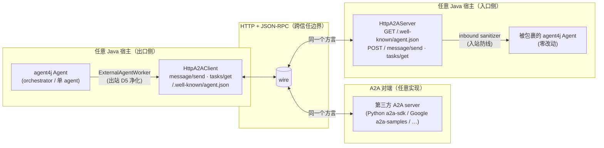

# 实验记录：KP6 A2A 双向落地——协议公民的工程事实（2026-09-11）

> 性质：KP6（A2A 协议）的实验收口笔记，对应提交 `7faba88`（agent-mcp 76/76，全仓 22 模块 BUILD SUCCESS）。
> 前置：KP1 handoff 心智模型（决策 24 `currentConfig` 换胸牌）、A2A 四步规划（协议模型对齐 → HttpA2AClient → A2AServer → 安全硬化）。
> 关联：`learning-path-2026-09-knowledge-points.md` §KP6、`CHANGELOG.md` 0.1.2「HTTP A2A, both directions」、代码 `agent-mcp/src/main/java/io/github/qwzhang01/agent/mcp/a2a/`。

---

## 一图收口：agent4j 的两张嘴

北极星兑现：出口（当客户端委托任务给真实第三方）与入口（把自家 agent 暴露成 A2A 端点给非 Java 客户端调进来）双向都通。两端说同一个方言：`A2AJson` 是双方共用的 wire codec——一个方言两张嘴，client 用它造请求解响应，server 用它解请求造响应，两端不可能说出两套方言。

---

## 心智模型：A2A 是 handoff 的跨进程版本（自测判据答案）

KP6 判据「说清 handoff 与 A2A 的映射」，落地后的完整答案：

| 维度 | handoff（决策 24，同 JVM） | A2A（跨进程/信任边界） |
|------|---------------------------|------------------------|
| 控制权转移 | `currentConfig` 内存写，下轮循环换人 | task 生命周期在 wire 上往返，SERVER 持状态 |
| 历史转移 | 三件套直接内存携带 | 消息化为 parts，contextId 跨任务串会话 |
| 身份 | 注册名（`in-process:name`） | URL 即身份（一端点一 agent，规范规则） |
| 信任 | 同信任域，无条件信任 | 对端自报家门（AgentCard），不可信输入 |
| 失败语义 | 异常/循环内消化 | 三层：传输失败/任务失败/暂停等输入 |
| 成本 | 一次内存写 | 每次往返都是网络 + 序列化 |

映射句：handoff 是进程内 A2A（零成本退化），A2A 是跨进程 handoff（每次交接都要过 wire）。`ExternalAgentWorker` 是两个世界之间的桥——它通过 `A2AClient` 接口消费协议，接口后面是 InProcess 还是 HTTP 它不知道也不需要知道。

---

## 关键认知：六个一手工程事实

### 1. 身份物理：SERVER 分配任务 id，client 只持映射

规范铁律：wire 上的任务 id 由 SERVER 分配。这不是细节，是跨信任边界的身份物理——资源的一等 id 必须由资源持有方分配（同 HTTP 服务器分配 URL、数据库分配主键），调用方的 id 只是本地引用。因此 `HttpA2AClient` 内部持 `localToRemoteTask`（ConcurrentHashMap），`getTaskStatus(本地id)` 先查映射再上 wire。

三个直接推论（都有测试钉死）：

- `getTaskStatus_unknownLocally_returnsNull_neverCallsWire`——本地没发过的任务，连网络都不碰。一个 client 实例发的任务不能被另一个实例 poll（v1 无共享任务注册表，by design：分布式任务注册表 = 引入分布式一致性，v1 的正确选择是不做）。
- `getTaskStatus_afterServerRestart_returnsNull_notFound`——server 重启丢 in-memory store，规范错误码 `-32001` 被翻译成 null 而非异常：任务「不存在了」是合法答案不是事故。
- 挂号单比喻：你拿的是本地小票，医院系统里是它自己的病历号；换一个窗口（另一个 client 实例）报小票号查不到，得回原来的窗口。`contextId` 是病历本——跨多次挂号把同一会话串起来。

这也回答了更早的思考题「input-required 时上下文存在谁手里」：存在 SERVER 手里。换胸牌模式下历史始终在 A 的循环里；跨进程后任务（历史、状态、产物）成为对端的一等资源，client 手里只有句柄。

### 2. 方言 contract：metadata 是逃生舱，不许私自造词

`A2ATask` 比规范富（`taskType`/`sender`/`deadline` 无规范对应），`A2AJson.messageSendRequest` 让它们骑 `params.metadata`——规范明文预留的扩展位。反过来规范比 v1 富的地方（非 text parts、带描述的 skills），解析端跳过而非拒绝整条消息。

原则：扩展走规范预留的逃生舱，不发明非规范顶层字段。严格实现的 spec peer 会忽略 metadata 仍 round-trip 它认识的部分；私自造的顶层字段在严格实现那里要么整条被拒、要么被静默丢弃——两种都制造不可调试的互操作分歧。测试 `metadata_ridesTheWire` 钉死。

### 3. REJECTED 与 FAILED 是两种死法

`A2ATaskStatus` 落了 7 状态枚举（SUBMITTED/WORKING/INPUT_REQUIRED/COMPLETED/FAILED/CANCELED/REJECTED），wire label 用规范方言（`"input-required"` 不是枚举名）。两个死法必须分开：

- REJECTED：跑之前被拒（server 侧 inbound policy 挡下），agent 从未运行——策略行为。
- FAILED：跑了失败（`AgentState.Status.ERROR`/`MAX_STEPS_EXCEEDED` 或异常）——执行事故。

消费方对两者的正确响应不同：REJECTED 该换对端或放弃（重试同一对端大概率再被拒），FAILED 才可能值得重试。审计语义完全不同。`HttpA2AServer` 里 inbound sanitizer 抛异常 → 存档 REJECTED + agent 永不跑，测试 `inboundSanitizer_blockingReject_rejectsTaskWithoutRunningAgent`。

已知不一致（诚实记录）：`InProcessA2AClient` 对 unknown recipient 标 FAILED 并抛 `IllegalArgumentException`——语义上更像 REJECTED（没跑就终局），方言对齐时保留了既有行为。in-process 的失败语义是历史包袱，HTTP 侧是新方言的干净起点。

另一个设计点：`A2ATaskStatus.fromLabel` 对未知 label 返回 null 而非抛异常——对端可能演化新状态，fail-open（当 working）还是 fail-closed（当 failed）由调用方决定，协议解析层不做全球决策。

### 4. 三层失败语义：传输断了 ≠ 任务失败了

`A2AClient` javadoc 定的 contract，两个实现共享：

| 层 | 语义 | 异常/返回 | 例子 |
|----|------|-----------|------|
| 传输失败 | 调用本身断了，不存在任务答案 | `A2AHttpException` | 连接拒绝、非 200、JSON-RPC error envelope |
| 任务失败 | 任务跑了且失败——失败就是答案 | `IllegalStateException` | failed/canceled/rejected |
| 暂停等输入 | 对端干了活，在等补充——是数据不是异常 | `{"status":"input-required",...}` | peer 停在 INPUT_REQUIRED |

区分的本质：「任务失败」是业务结果（调用方该按业务处理），「传输失败」是基础设施事故（调用方该按重试/熔断处理）。混为一谈的框架会让上层无法区分「该放弃」和「该重试」。测试 `transportFailure_connectionRefused_throwsA2AHttpException` 与 `agentErrorState_becomesFailedTask_exception` 分别钉住两端。

### 5. 入站防线是出站 D5 的镜像

`ExternalAgentWorker` 的 outbound D5：我们 agent 的输出出 wire 前净化（防污染别人）。`HttpA2AServer` 的 inbound sanitizer：wire text 进我们 agent 的 prompt 前净化（防被污染）——同一个人，两个门口。两道防线都是 `UnaryOperator<String>`，throwing sanitizer 在 server 侧等于拒绝任务（见认知 3）。

模块边界纪律照旧：agent-mcp 不依赖 agent-security（同 mcp client 的纪律），Stage 9 的 `ResultSanitizer` 在装配层插入。框架给挂载点，策略归宿主。

### 6. Loud refusal：不支持的能力大声说

v1 三处「大声拒绝」，每一处对应一个「悄悄撒谎」的诱惑：

| 场景 | 撒谎版本 | 实际行为 |
|------|----------|----------|
| `sendMessage` over HTTP | 映射到 message/send——静默在对端 CREATE 一个任务 | `UnsupportedOperationException` |
| 续跑（`message.taskId`） | 静默当新任务重跑 | `-32001` 拒绝 |
| JSON-RPC notification（无 id） | 假装处理不回应 | `-32600` 拒绝 |

配套的诚实声明在 AgentCard 上：`capabilities.streaming=false`、`pushNotifications=false` 写进卡片，对端看得见。卡片 D7 信任注释原话：remote card is a self-report——它是 ROUTING input，永远不是 TRUST input。

---

## agent4j 对照：改造前后

| 项 | 改造前（自有方言） | 改造后（规范方言） | 存量兼容 |
|----|--------------------|--------------------|----------|
| 任务状态 | 自由字符串（"running"） | `A2ATaskStatus` 7 值枚举，wire label 规范方言 | `getTaskStatus` 返回枚举，unknown → null |
| 任务模型 | 6 字段，无 contextId/status/artifacts | 9 字段（补 spec `contextId`/`status`/`artifacts`） | 6 参 legacy 构造器 |
| 卡片 | 5 字段，无 url/capabilities | 7 字段（补 spec `url`/`A2ACapabilities`） | 5 参 legacy 构造器 |
| 传输 | InProcessA2AClient（假传输） | + HttpA2AClient / HttpA2AServer（真 HTTP，JDK 内置零新依赖） | 接口不变，170 处存量构造点零改动 |
| 测试 | 42（agent-mcp 既有） | 76（+17 新：RoundTrip 9 真回环 socket 零 mock + Protocol 9 raw JSON） | orchestrator 45/45 不变 |

D6 决策（Stage 11：协议模型 100% 真实只假传输）的兑现验证：换 HttpA2AClient 调用方零改动——`ExternalAgentWorker` 消费的是 `A2AClient` 接口，接口契约在两个实现间逐条对齐（三层失败语义、output 约定、unknown → null）。

「Delegation shape vs observed shape」一个 record 两种形态：6 参构造的是「要发出去的任务」（contextId/status/artifacts 尚不存在），9 参构造的是「wire 报告的任务」。`recipient` 字段是传输相对的：in-process 用来选注册 agent，HTTP 下仅信息性（你构造 client 用的 URL 才是收件人）。

---

## 计划 vs 实际（四步规划验收对照）

| 步骤 | 计划验收 | 实际 | 判定 |
|------|----------|------|------|
| ① 协议模型对齐 | 测试迁移全绿；InProcess 替身能模拟 input-required | 76/76 全绿；InProcess 无 input-required 路径（同步执行不产生） | 半 |
| ② HttpA2AClient | 拉真实第三方 server（a2a-samples/Python sdk）跑通完整往返 | loopback 自家 server 完整往返（真 socket 零 mock） | 半 |
| ③ A2AServer | Python sdk 客户端调 agent4j，长任务停 input-required 补信息续跑 | 端点三件全做；server 侧同步执行不产生 input-required，只有 client 侧能消费 | 半 |
| ④ 安全硬化 | 克隆卡片攻击被拒；artifact 藏注入被拦 | 入站 sanitizer + reject 有测试；AgentCard 签名验证未做 | 半 |

「半」的诚实解读：v1 证明的是自家两端方言一致（loopback 双向），没证明和陌生人说话（第三方互操作）。按「先证伪后投入」的纪律，第三方互操作是下一个证伪点——`HttpA2AExample` 已给出 loopback 演示（discover → send → poll → reject → supervisor 路由），拿 Google a2a-samples 或 Python a2a-sdk 对接是现成的下一步实验。

---

## 上轮思考题收口：sendTask 同步契约保不住时怎么办

问题回顾：规范对齐后 `A2AClient.sendTask` 的「一调用一返回」契约在三种场景下保不住——任务可能停 input-required（要补输入再续）、流式分批回（SSE）、长任务要轮询。v1 的临时解：input-required 作为数据返回 `{"status":"input-required","taskId":...,"contextId":...}`，任务失败抛异常。

进化的方向已经从代码里显形：

1. **句柄化**：`sendTask` 的返回从「最终结果」进化成「任务生命周期句柄」（TaskHandle：`status()` / `result()` / `continueWith(text)`）。身份物理（认知 1）决定了句柄天然成立——server 本来就持有任务全部状态，client 的 local→remote 映射就是句柄的雏形。
2. **续跑的连接材料是 contextId**：规范语义「groups messages belonging to one conversation across tasks」。续输入不是新任务，是同 contextId 的新 message 携带 `message.taskId`——server 侧 v1 用 `-32001` 大声拒绝的正是这个入口。
3. **传导链与断裂点**：句柄化的变化会传导 `A2AClient.sendTask` 签名 → `ExternalAgentWorker.execute`（目前同步 execute，工具调用形状）→ orchestrator 的 Worker 契约 → 图执行模型（等待远程任务变成显式等待节点）。第一个断点是工具执行的同步模型：远程任务暂停等输入时，本地工具调用还没返回——工具层无法自然表达「暂停」。
4. **真正的解法在 Runtime 层**：远程 input-required 映射成本地 agent 的暂停（AgentState + checkpoint，决策 8 的领地），续输入映射成恢复。「A2A 任务生命周期对上 agent4j 第 2 层能力」指的就是这个对接，v1 有意没做——它要求续跑契约（message history 落库 + 恢复语义）先机制化，属于 handoff 生产硬化同一条欠账线。

---

## 诚实边界（v1 不做清单）

- 同步执行 only：无 `message/stream`（SSE）、无 push notifications、无 webhook。
- 无续跑：携带 `message.taskId` 的 message 被拒（`-32001`）。
- server 侧不产生 input-required：agent 同步跑完，只有 COMPLETED/FAILED/REJECTED 三种终局；client 侧能消费对端的 input-required。
- in-memory task store：server 重启即丢（配 partial index 的 PG 任务库是显然的 v2 方向，记忆主线路线同款思路）。
- 绑定 `127.0.0.1` only：生产部署需反代 + host 参数（v2）。
- 无 AgentCard 签名验证：卡片是 self-report，克隆卡片只改 URL 的 shadowing 攻击 v1 无防御（trust-on-first-use 的已知风险）。
- agent 跑在 handler 线程（cachedThreadPool daemon）。
- 未对真实第三方 A2A 实现做过互操作验证。

---

## 三段式收口

**做对了什么**：双向 HTTP 落地零新依赖（JDK HttpClient/HttpServer），方言 contract 三原则（SERVER 分配 id、metadata 逃生舱、跳过不拒绝）全部有测试钉死；三层失败语义 + REJECTED/FAILED 分离 + loud refusal 让协议层的新方言干净；入站防线与出站 D5 对偶成对；170 处存量构造点零改动验证了 D6「换传输不改调用方」的承诺。

**缺什么**：第三方互操作零验证（说自家话 ≠ 和陌生人说话）；server 侧 input-required 无生成路径（长任务暂停语义单腿）；AgentCard 无签名验证（路由输入无信任根）；任务 store 无持久化；sendTask 同步契约的句柄化进化未启动。

**怎么做**：下一个证伪实验拉真实第三方对端（Google a2a-samples / Python a2a-sdk）做互操作往返，暴露方言偏差；input-required 的 server 侧生成等续跑契约（contextId + message history 落库）机制化后一起做，落在 Runtime 层暂停/恢复的对接点上；签名验证（JWS + JCS）在出现第二个可信对端需求时再投入。

---

## 思考题（留下轮）

入站 sanitizer 是 `UnaryOperator<String>` 只管 text。当 v2 支持 file/data parts 后，一个 file part 里藏的注入 payload 应该在哪一层被拦——HTTP 层、parts 解析层、还是 agent prompt 组装层？提示：回到 KP5 三层论的失败语义分层，想想 file part 的「工具输出」和「用户输入」双重身份。
