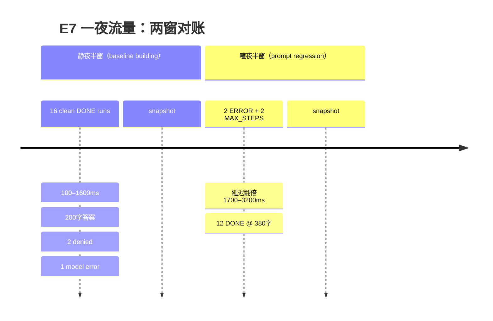

# 实验记录：KP7 在线评估——生产即持续验证（2026-09-12）

> 性质：KP7（在线评估）的落地实验笔记，对应新增包 `observability.health`：`HealthReport` / `HealthPipeline`，测试 `HealthPipelineTest` / `E7HealthPipelineExperimentTest`。  
> 关联：`learning-path-2026-09-knowledge-points.md` §KP7、`stage-18-article-2-how-to-evaluate.md`（Stage 18 原始方法学）、Decision 22（不做 LLM-as-judge）。

---

## 一图收口：五指标覆盖矩阵

```
指标                    数值来源              内容来源            覆盖层标注
────────────────────────────────────────────────────────────────────────────
① 过程完成率            RunMetrics.status     —                   PROCESS 层（非结果层）
② 单任务成本            RunMetrics.costMicros —                   FULL（未接价目表=未知）
③ 延迟 P50/P95          RunMetrics.durationMs —                   FULL
④ 安全信号              denied+modelErrors   —                   PROCESS 代理
⑤ 输出漂移              —                    Done.finalAnswer    TRIPWIRE（启发式带）
```

一图读法：五指标里只有漂移需要内容载体；其余四个全部从 `RunMetrics` 数值投影拿。这就是双订阅设计的直接原因——数值投影有账本没内容，内容投影有答案没账本。

---

## 心智模型（KP7 自测判据答案）

**判据：列出 agent4j 已有资产里哪些直接是评估原料。**

| 资产 | 评估角色 | 消费方式 |
|------|---------|---------|
| `RunMetrics`（M18.1） | 数值投影：完成率/成本/延迟/安全的原料 | `MetricsSink.onRun` 直接吃行 |
| `AgentEvent.Done.finalAnswer` | 内容投影：漂移的唯一内容载体 | `Consumer<AgentEvent>` 订阅 |
| `Expectation` 四断言（D7） | 离线结果层判定 | `EvaluationRunner` 黄金集回归 |
| `EvalDataset` 黄金集（D7+M18.4） | 离线回归的案例集 | 同上 |
| `TurnTrace`（A5） | 在线逐轮观测（token/延迟/召回） | chat 引擎每轮发布，消费者订阅 |
| `CostMeter`/`PricingTable`（M18.2） | 成本换算 | `MetricsCollector` 已接线 |

**决策 22 的替代路径兑现状态**：规则断言（`Expectation` 四种）+ 黄金集回归（`EvaluationRunner`）已就绪；采样人审靠 Moonlit M7（进行中）；本实验补上了在线监控这条腿——「eval 不是上线前的测试，是上线后的监控」从此有结构承载。

---

## 关键认知：三个一手工程事实

### 事实 1：五指标拆两投影——没有单一出口能算全

「评估管道 = 事件流的纯下游消费者」这个命题，落地时第一件被证伪的事是：**agent4j 事件系统里不存在一个能喂饱全部五指标的出口**。

- `MetricsSink.onRun`（数值投影）：有完成率/成本/延迟/安全的全部原料，但 `RunMetrics` 是纯数值行——零内容。
- `AgentEvent.Done`（内容投影）：带着 `finalAnswer`，但 loop 里没人给它记账本。

结论：评估是「一次运行、三个投影」（D1）之外的**第四投影**——横跨数值与内容。`HealthPipeline` 于是实现两个接口：`MetricsSink`（吃 run 行）+ `Consumer<AgentEvent>`（吃 Done 事件）。类比 KP4：路由器是拔掉照常跑的装饰器，评估管道是拔掉照常跑的消费者——**没有生产类 import 这个包**。

### 事实 2：完成率天生是两层的——在线层只能看到过程

在线管道能回答「loop 是否正常终止」（DONE/ERROR/MAX_STEPS），答不了「任务是否真办成了」。`processCompletionRate` 字段名、`succeeded()` 只认 DONE、javadoc 逐条写明——把过程层冒充结果层，是仪表盘开始撒谎的经典路径。

结果层的三个去向：确定性断言（`Expectation`）、黄金集回归（`EvaluationRunner`）、采样人审（Moonlit M7）。在线层只负责在两次回归之间给出过程置信度。

### 事实 3：漂移检测的最小可行形态是「内容载体 + 滚动基线」

v1 漂移 = 当前内容窗平均答案长度 vs 上一快照窗平均，带内（±30%）STABLE、带外 SUSPECTED。三个诚实设计：

- **BASELINE_BUILDING**：样本 < 5 或首窗，不算 STABLE 也不算 SUSPECTED——两三个样本的「分布」是噪音穿上了比值的外衣。
- **snapshot 是对账点不是纯查询**：每次快照把当前窗均值滚成新基线。监控每 5 分钟快照一次 = 相邻 5 分钟窗互比，滑动语义明确写进 javadoc/测试（非幂等是特性不是 bug）。
- **SUSPECTED = 去查，不是去页人**：±30% 是启发式绊线，生产换分布检验（PSI/KS），v1 钉死的是结构（内容载体 + 滚动基线），不是统计学。

---

## 实验结果：一夜流量两窗对比

模拟 32 runs：前半 16 个干净 DONE（100–1600ms、200 字答案、2 次 governance 拒绝、1 次模型错误）；后半模拟 prompt 回归——2 ERROR + 2 MAX_STEPS、延迟翻倍、答案变 380 字（12 个 DONE 进内容窗）。单 run 成本 0.5 USD。

| 指标 | 静夜半窗（16 runs） | 全夜窗（32 runs） |
|------|------------------|------------------|
| 过程完成率 | 1.000 | 0.875 |
| 单任务成本（microUSD） | 500,000 | 500,000 |
| 延迟 P50 / P95 (ms) | 800 / 1600 | 1600 / 3100 |
| 拒绝工具 / 模型错误 | 4 / 1 | 6 / 3 |
| 漂移 | BASELINE_BUILDING（avg 200） | SUSPECTED（avg 277.1 vs 基线 200，ratio ≈ 1.386） |

读法：静夜半窗一切健康，漂移在攒基线；下半夜五个指标全亮——完成率掉、P95 翻倍、错误三倍、漂移绊线跳 SUSPECTED。一夜之内，五个健康指标从同一份事件流里算出来，生产链路零改动。

## 一夜流量事件时序



---

## 诚实边界（v1）

- 过程完成率 ≠ 结果完成率；结果层在离线链路（断言/黄金集/人审）
- 成本为 0 = 未接价目表（`costKnown()` 显式标注），不是免费
- 安全信号是过程代理（denied 计数 + 模型错误），不是安全判决
- 漂移是绊线不是统计检验；生产应换 PSI/KS 分布检验，v1 钉结构不钉统计
- 窗口在内存（环形缓冲，默认 100 行/投影），进程重启清零；持久化健康史是 v2（`RunRegistry` 是天然接点）
- 窗口满 100 后逐出旧行——指标是「最近 100 run」口径，不是全历史口径
- 漂移内容窗只吃 DONE 事件的 finalAnswer；ERROR/MAX_STEPS 的答案不进窗（失败 run 无内容可测）

---

## 漂移渐变盲区（复审推演，2026-09-12 补）

v1 滑动基线对渐变结构性失明：答案长度每天慢涨 5% 时，相邻窗比较 ratio 恒 ≈ 1.00x 深在 ±30% 带内，且基线被流量拖着同速爬升——对照物与被对照物一起漂，绊线永不触发。这是模式选择（滑动 + 均值代理 = 最便宜一格）的代价，不是 bug。数学推演、PSI/KS 检验词汇、锚定基线 + `reAnchor()` 的 v2 规格，全部落档 `experiment-kp7-drift-baseline.md`（KP7 补底笔记）。

---

## 思考题答案（2026-09-12 收口）

### 题 1：周 vs 周固定基线，哪个结构要改

`driftSnapshot()` 里 `baselineAvgAnswerChars = current` 这行无条件翻滚是对账点的核心消费方式——snapshot 既当查询又当基线更新器。要固定基线，把这行从「每次快照」拆成「锚周期到点或显式 `reAnchor()` 才写」：锚周期内 snapshot 只读基线做对账，不再滚动。配套语义：锚周期是治理参数（prompt 版本变更 / 周期到点时重锚），重锚要留痕（谁、何时、旧基线值）。详见 `experiment-kp7-drift-baseline.md` §Part C。

### 题 2：Subject 若要吃 TurnTrace，最小改动是什么

最小改动在桥接层（caller 一行），不动 `Subject` 接口：`Expectation.Outcome(finalText, totalTokens, toolCallCount)` 三个字段从 TurnTrace 拿两个——`finalText` 从 chat 引擎的最终回复取，`totalTokens` 用 `TurnTrace.promptTokens + TurnTrace.completionTokens` 求和。`toolCallCount` TurnTrace 里没有，仍是 caller 从 Governance 记录侧补的口子。这不破坏「eval = 纯下游」：TurnTrace 是 chat 引擎主动发布的 `AgentEvent`，桥接 lambda 只是又一个订阅者，与 `HealthPipeline` 吃 Done 同构——数据流方向不变（生产 → 消费者），eval 依然不反向 import 生产类。真正的边界在 `toolCallCount`：它暴露了「chat 引擎的 TurnTrace 不含工具维度」这个事实，硬要全量字段要么改 TurnTrace 定义（改生产，破坏纯下游），要么 caller 双订阅拼装（保持纯下游，桥接层变两行）。

### 题 3：在线 0.875 vs 黄金集 1.0 是否矛盾

不矛盾——两个数字量的是不同层。在线层是过程完成率（28/32 run 的 loop 正常终止），黄金集是结果层通过率（确定性断言全过）。同一夜的实验恰好给了反例：下半夜 prompt 回归让 4 个 run ERROR/MAX_STEPS（过程失败），但黄金集是干净 Mock 主体跑的，跑不进这 4 个失败。两个口径组合才是健康全貌：黄金集证明「代码没坏」，在线层证明「生产在坏」——正是它们不一致时最有信息量，说明回归只发生在真实流量形态（长上下文、真实工具链）上，黄金集对这类回归天生盲。这正是 KP7 心智模型（eval 是上线后的监控）的数字版：单一层给不出「最近 100 run 的过程置信度」，回归期间黄金集绿灯只是「已知形态没坏」。

---

## 新思考题

1. 相邻窗漂移是滑动比较，若想要「周 vs 周」固定基线，`HealthPipeline` 的哪个结构要改？（提示：对账点消费基线的方式）
2. `EvaluationRunner.Subject` 若要吃 TurnTrace，最小改动是什么？这会破坏「eval = 纯下游」吗？（提示：Outcome 三个字段的出处）
3. 在线层报 0.875 过程完成率、离线黄金集报 1.0 通过率——两个数字矛盾吗？各说明什么？
4. 若把窗口从 100 扩到 10 万，`HealthPipeline` 哪个设计先崩？（提示：内存环形缓冲 vs 逐出顺序，以及快照全量重算）
5. PSI 用等频 10 桶切基准分布，为什么不用等宽 10 桶？（提示：右偏长尾落在哪个桶、`ln(a/b)` 的空桶项）
