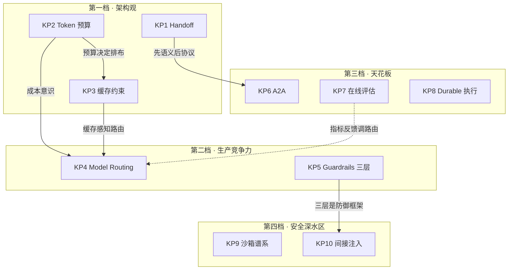

# 学习知识点大纲：最该搞懂的 10 个 KP（2026-09）

> 来源：2026-09-08 业界对照分析深化，是 `learning-path-2026-09-arch-gap.md` 的配套教学大纲。
> 性质：知识点整理 + 自测题库，不是设计蓝图。每个 KP 四件套：心智模型 / 关键认知 / agent4j 对照 / 自测。
> 筛选标准（三问）：不懂它会不会在 agent4j 设计上做错？学完能不能直接变成实验？它在生产事故里出现频率高不高？

## 对原学习计划的两处修正

1. **Guardrails 从第一优先级降档到第二档**：agent4j 治理中间层（决策 7 / 12 / 13：GovernedToolExecutor + Sanitizer + 全留痕审计）已是业界水准，input / output 两层是增量插入点，不是心智模型重装。先补会改变设计观的东西。
2. **A2A 规范从周 1 挪到周 2**：没有 handoff 心智模型直接读协议事倍功半。先概念（handoff），后协议（A2A）。

---

## 第一档 · 会改架构观（不懂就在设计上做错）

### KP1 · Handoff：转移的是三件套，不是消息

**心智模型**：handoff 转移三样可分离资产——对话历史（context）、任务目标（task）、循环控制权（control）。orchestrator 则是控制权不转移，子 agent 只是图节点。

**关键认知**：
- handoff 后 A 的循环结束、B 开始自己的循环。"接力"与"调用"的本质区别：循环拥有权归谁。
- 历史搬运三策略：全量携带 / 携带摘要 / 只携带任务描述。OpenAI Agents SDK 把 handoff 实现为工具调用 + `input_filter` 裁剪。
- 回程是独立问题：单向接力（默认）≠ 干完回传结果（A2A 的 task 生命周期），两种语义。
- 边界：≤10 个 agent、线性分诊（客服路由类）handoff 赢；并行分叉、全局状态、复杂回退 orchestrator 赢。

**agent4j 对照**：`ReActAgentLoop` 的循环拥有权固定在 agent 入口。E1 实验本质：loop 拥有权能否作为一等公民传递。

**P3 落定（2026-09-12）**：`AgentState.lastActiveAgentName` 只存名字；续跑经 `HandoffTargetResolver` 从入口图解析，未知名字 fail-closed。目标 agent 的工具走 `AgentConfig.toolExecutor`（显式挂治理链），loop 不重织宿主装饰。从入口 `run(input, state)` 即可续成 B，不必再订阅 `AgentEvent.Handoff` 换入口。

**自测**：不看资料，说清 handoff 与 orchestrator 各自的死穴。

### KP2 · Token Budgeting：窗口是预算，不是容器

**心智模型**：上下文窗口当钱花，四本账（system / 工具定义 / 历史 / 输出余量），超支策略比分配策略更重要。

**关键认知**：
- 工具定义是隐形大户：几十个工具的 schema 可能吃掉两三成窗口。
- 输出 headroom 不预留 = 模型没空间回答。
- 超支截谁是产品姿态：截历史（失忆）/ 截工具（残废）/ 拒绝服务（诚实）。
- 预算是运行时一等指标，不是配置文件里的静态数字。

**agent4j 对照**：A2（SUMMARY 独立槽位）+ A3（ExtraText 预算）是点状预算；缺管整个 messages 的全局预算管理器。

**KP2 落定（2026-09-12）**：`ContextWindowBudget` 把四本账写成 record（`historyBudget()` = total − system − tools − output）；`ContextWindowEnforcer` 是 `ContextBuilder` 装饰器，超限丢最旧逻辑单元（assistant+tool 成对）。Decision 24 P2：`HandoffInputFilter` 挂在 `HandoffSpec` 上，只裁下一跳的 **请求**，不改 `AgentState`。三种携带：`IDENTITY`（全量，默认）/ `keepWithin(budget)`（复用同一套 trim）/ `lastTurn()`（从最后一条 USER 起）。摘要携带不是 filter，走目标 `ContextBuilder` 压缩。详见 `experiment-kp2-context-window-budget.md`。

**自测**：给 agent4j 设计全局预算器，说清四本账占比与超支截断顺序。

### KP3 · Prompt Caching：缓存反向约束上下文设计

**心智模型**：成本量级由缓存命中率决定，命中率由前缀稳定性决定——"内容怎么排"比"内容是什么"更影响成本。

**关键认知**：
- 前缀匹配：system + 工具定义绝对稳定地放最前，易变内容靠后。
- compaction 就地改写历史 = 主动打掉缓存（与决策 9 的张力点）；解法：压缩只动尾部、时机对齐对话自然边界。
- Anthropic 机制要点：`cache_control` 断点（数量有限）设在稳定边界上；写约 1.25x、读约 0.1x 的价格结构决定"稳定前缀"值多少钱。

**agent4j 对照**：E3 实验本质：ContextBuilder 契约要不要写死"前缀稳定性"。

**E3 落定（2026-09-10）**：契约写进 ContextBuilder javadoc（弱约束 + 代价告知），可见性做硬（TokenUsage.cachedTokens 全链路）。两个反直觉发现：①体量缩减压过缓存损失（flapping 改写仍比不压缩便宜），稳定性变量单独值 24%；②计价风格反转结论——写免费（OpenAI 式）时 flapping 反超 stable，前缀纪律是供应商定价的，不是普适真理。详见 `experiment-e3-prompt-caching.md` 与决策 26。

**自测**：说清 agent4j compaction 对缓存命中率的影响链。

---

## 第二档 · 决定生产竞争力（不懂就贵、就慢）

### KP4 · Model Routing：模型选择是运行时决策

**心智模型**：路由器是装饰器不是框架核心——拔掉它，框架照常工作。

**关键认知**：
- 三形态：静态路由（step 类型 → 模型）/ 级联（先小后大）/ 语义路由（难度预判）。
- 业界口径：大部分 step（工具调用解析、格式化、简单判断）小模型够用，混合路由实测省 60–80%。
- 判错代价不对称：小材大用是质量事故，大材小用只是费钱 → 级联比预判安全。
- 路由信号从哪拿决定侵入深度：step 元数据（浅）vs 历史语义（深）。

**agent4j 对照**：`agent-observability` 已有 `RoutingModelClient` 骨架。E2 的真问题：路由信号从哪拿。

**KP4 落定（2026-09-12 补档）**：E2 三配置对照实验（14 任务 × 校准价格）落定三层结论——①预判路由最便宜的直觉被推翻：pre-route $0.001226 > cascade $0.000409，盲升级 4 个深线程全价 premium 比「cheap 先试 + 3 次有据升级」贵 3 倍；②级联零缺陷：3 个坏 JSON 全被质量门拦下升级，交付 0 缺陷，验证比预判便宜且安全（Anthropic 路由 / GPT-5 auto 同路线）；③决策 25 落定：pre-call 信号归 `ModelRouter`（Budget/Complexity 两策略），post-call 质量信号归 `CascadeModelClient` 装饰器（`RuleBasedQualityGate` 三信号全客观可判），合成组装 `Observing(Cascade(Routing(Fallback(...))))`。策略族补齐：Budget 经济 / Complexity 内容 / Cascade 质量。详见 `experiment-e2-model-routing.md`。

**自测**：说清判错代价不对称，以及为什么级联比预判安全。

### KP5 · Guardrails 三层论：三个时机，三种失败语义

**心智模型**：治理不是一个平面，是三个时机——input（进 loop 前）/ tool（loop 中）/ output（见用户前），每层失败语义不同。

**关键认知**：
- 失败语义分层：input 挡 → 拒答或改写重试；tool 挡 → 降级执行；output 挡 → 拦截或重生成。
- OpenAI 的 input guardrail 与首次模型调用并行跑（赌不触发），是延迟敏感场景的关键设计。
- 每条规则显式声明 fail-open / fail-closed，不能有默认。

**agent4j 对照**：中间层已达标（决策 7/12/13）。input 插入点：ContextBuilder 之后、ModelInvoker 之前；output 插入点：AgentEvent sink 之前。

**KP5 落定（2026-09-12）**：`Guardrail` / `GuardrailChain` 挂在 `AgentConfig`。INPUT 在 `buildRequest` 之后、模型调用之前；OUTPUT 在写 assistant / 发 `Done` 之前。Block 拒答；Rewrite 只改请求（INPUT，账本不动）或改落库与 Done（OUTPUT）。每条规则必报 `FAIL_CLOSED` / `FAIL_OPEN`。`SanitizerGuardrail` 把 Stage 9 `ResultSanitizer` 接到这两道门。工具层仍是 `GovernedToolExecutor`。详见 `experiment-kp5-guardrails.md`。

**自测**：在 agent4j 里指出 input / output 两层的插入点。

---

## 第三档 · 决定天花板（不懂就做不大）

### KP6 · A2A：协议解决跨信任边界协作

**心智模型**：MCP 是手（agent → tool），A2A 是握手（agent → agent）；handoff 是 A2A 在进程内的零成本退化。

**关键认知**：
- Agent Card：能力发现标准（技能、端点、认证要求），`.well-known` 路径下自描述。
- task 生命周期（submitted / working / input-required / completed / failed）对应"会话"粒度，不是"回合"。
- agent4j 缺的是 handoff 语义层，不是协议层——先有语义，A2A 只是把语义 RPC 化。

**KP6 落定（2026-09-11，commit 7faba88）**：双向 HTTP 落地——`HttpA2AClient`（message/send / tasks/get / agent-card 发现）+ `HttpA2AServer`（把既有 Agent 包成协议端点，agent 零改动），方言 codec `A2AJson` 两端共用。一手工程事实六条（SERVER 分配任务 id 的身份物理、metadata 逃生舱、REJECTED/FAILED 两种死法、三层失败语义、入站防线镜像出站 D5、loud refusal），v1 诚实边界（无 SSE/推送/续跑，127.0.0.1 only，无卡片签名验证），第三方互操作是下一个证伪点。详见 `experiment-kp6-a2a-protocol.md`。

**A2A v2 落定（2026-09-12）**：① 续跑——`message.taskId` 只续 `input-required`（未知 id 仍 `-32001`；completed/failed 续跑 `-32602`）；`A2AInputRequiredException` 让 server 侧能停；`continueTask` 复用同一 task/context。② SSE——`message/stream` 出 `status(working)` → `artifact` → `status(terminal)`。③ 推送——`tasks/pushNotification/set` 绑 webhook，非 working 状态 POST 任务 JSON（已完成再绑也会立刻推一次）。卡片广告 `A2ACapabilities.v2()`（streaming+push，无 history）。仍无第三方互操作、无卡片签名、任务仍内存。

**自测**：说清 handoff 与 A2A 的映射关系。

### KP7 · 在线评估：生产 = 持续验证

**心智模型**：eval 不是上线前的测试，是上线后的监控；地基是 trace，不是指标。

**关键认知**：
- 五个健康指标：task completion rate / cost per task / latency P50·P95 / safety violation 计数 / 输出分布漂移。
- 决策 22（不做 LLM-as-judge）的替代路径：规则断言 + 采样人审 + 黄金集回归；代价是覆盖不了开放式任务。
**agent4j 对照**：TurnTrace（A5）+ 修复后的 promptTokens = 评估体系最贵的部分（数据管道）已就绪，Moonlit M7 黄金集是第一个消费者。这项资产容易被自己低估。

**KP7 落定（2026-09-12）**：在线监控这条腿补上——新包 `observability.health`：`HealthPipeline` 双订阅（`MetricsSink.onRun` 吃数值投影、`Consumer<AgentEvent>` 吃 `Done.finalAnswer` 内容投影）算五指标，`HealthReport` 逐指标带覆盖层标注（过程完成率≠结果完成率、0 成本=未知非免费、漂移=绊线非统计）。一手工程事实三条：①五指标必须拆两投影（无单一出口喂得饱）；②评估是「一次运行三投影」之外的第四投影；③漂移最小可行形态=内容载体+滚动基线（snapshot 是对账点，非幂等是特性）。诚实边界：窗口在内存、漂移只吃 DONE 事件、±30% 是启发式带非分布检验。详见 `experiment-kp7-online-evaluation.md`。

**自测**：列出 agent4j 已有资产里哪些直接是评估原料。

### KP8 · Durable Execution：可恢复 ≠ 可持久化

**心智模型**：checkpoint 落盘只是入场券，门槛是"任意点恢复后语义不变"。

**关键认知**：
- 最大的坑是外部副作用：已发的消息、已扣的配额不能重放 → 工具幂等是分布式执行的前置条件。
- 业界两条路线：durable execution as a service（Temporal 派）/ actor + event sourcing（Orleans 派）。
- 单 JVM 的真天花板不是吞吐，是进程重启 = 执行中工具调用状态丢失。

**KP8 地基盘点（2026-09-12）**：比旧自诊「完全空白」乐观——三层地基已在：①`FileCheckpointStore` 崩溃恢复经测试钉死（`EnterpriseTaskManagerTest.crashRecoveryFromCheckpointFiles`：新 RunManager + 同目录 + recover 后 prepare 恰好 1 次）；②三层幂等已写透（`stage-6-article-4-idempotency.md`：节点级/Run 级 cursor/副作用 idempotency key，框架管 Run 级、节点管副作用级）；③Webhook eventId 幂等占坑已在生产链路（Stage 13 D8 三件套）。真缺口两块：①间隙问题未落——「副作用已发生但 result 未写回 state」的窗口（`agent-platform-modules-map.md` §3 已识别，幂等键挂 ToolExecutor 层还是 Checkpoint 层答案不同）；②Temporal/Orleans 两条业界路线未对照（checkpoint 落盘 vs 事件溯源重放的语义差异）。补法：间隙问题做 E8 实验（杀进程于工具执行中，看恢复重放）；路线对照靠文献（不进实验）。

**KP8 落定（2026-09-12）**：两块缺口都补上了。①E8 实验（`E8SideEffectGapExperimentTest` 六场景 7 断言）：游标保护、isResuming 守卫、幂等键三保护各管各的跨度被钉死；一手发现——**恢复粒度=上次暂停而非上个节点**（RunManager 只在 PAUSED 时写 checkpoint，B/C 类节点恢复后重放到第 2 次暂停点）；教科书幂等键公式被修正（`runId:nodeId:attempt` 在重试下铸新键导致一次逻辑访问交付两次 → `runId:nodeId:visitOrdinal`，ordinal 从持久化 trace 数本节点 SUCCESS 记录，跨崩溃跨重试稳定）。②Temporal/Orleans 对照落档（`experiment-kp8-durable-execution.md`）：durable execution 的本质变量是**持久化频率**而非介质——Temporal 每 step 落盘（事件溯源、重放即恢复）、Orleans 快照+尾巴重放、agent4j 只在 PAUSED 落盘（间隙=两个暂停点间的全部副作用窗口，靠三保护兜底）。诚实边界：模拟崩溃非真 kill -9、单 JVM、Temporal/Orleans 未实跑。详见 `experiment-kp8-durable-execution.md`。

**自测**：说清"checkpoint 落盘"与"可恢复执行"差在哪；agent4j 的工具是否全部幂等。

---

## 第四档 · 安全深水区（懂了才知道边界在哪）

### KP9 · 沙箱谱系：隔离等级与任务风险匹配

**心智模型**：ClassLoader → Process → Docker → microVM → WASM 不是越强越好，是风险等级 / 启动延迟 / 逃逸面的三角权衡。

**关键认知**：
- 升级触发条件：跑不可信代码（Docker）/ 多租户不可信代码（microVM）/ 有生态约束的不可信代码（WASM）。
- 决策 21 在"单租户 + 半可信工具"前提下成立；做多租户 coding agent 那天被推翻。

**KP9 落定（2026-09-12，commit 5d58580）**：`SandboxRiskLevel`/`SandboxTier`/`SandboxPolicy`/`SandboxEscalator` 四件落，乐观升级（blocked→Process，timeout 不升级），`-Xmx` 真实生效。dsh 三借鉴点落一：`SandboxTier` javadoc 的谱系表（startup/逃逸面/v1 状态三列）是文档级诚实报告的雏形。未落二：`enforcement: partial` 字段化诚实报告（执行结果里声明「我保证什么/不保证什么」）、方言失败正交（沙箱死法与代码死法分开报）。详见 `experiment-kp9-sandbox-spectrum.md`。

**KP9 落定·续（2026-09-12）**：两个未落项全落。①enforcement 诚实报告 → `SandboxReport`：纯下游翻译器（tier × outcome → guarantees/notGuaranteed/escalationNote），与 HealthPipeline（KP7）同构——enforcement 做事、report 翻译成人类可审计的承诺；占位 tier 零保证大声声明。②方言失败正交 → `SandboxResult.FailureKind` 四桶（SANDBOX_FAILURE/BLOCKED_BY_POLICY/TIMEOUT/CODE_FAILURE），正交于 tier，deriveKind 按 timedOut+error 前缀全推导 + 6 参源兼容构造器（既有构造点零改动）。外加升级熔断预算（思考题 2 代码化）：`escalationBudget` 默认 3 次，防 chatty-blocked 源把乐观升级反向利用成 denial-of-wallet；烧完 BLOCKED 原样返回。agent-sandbox 63/63。详见 `experiment-kp9-sandbox-spectrum.md` 事实 4 与思考题 2/3。

**自测**：说清决策 21 被推翻的具体触发条件。

### KP10 · 间接注入：最危险的输入不是用户输入

**心智模型**：用户输入你有防备；深水是工具输出、检索内容、memory 里的注入指令（间接注入）。

**关键认知**：
- 攻击面：网页抓取、邮件、文件内容、memory 表——一切进入上下文的非用户内容。
- 防御纵深：指令/数据分离标记（spotlighting）→ 工具输出当不可信输入（Sanitizer 已做）→ scoped 短期凭证 → 关键动作二次确认。
- 业界共识是"降低概率 + 限制爆炸半径"，不是"杜绝"。

**agent4j 对照**：`InjectionDefenseExample` 是雏形；缺"检索内容入上下文前净化"和"工具凭证 scoped identity"。

**KP10 落定（2026-09-12）**：`SanitizingContextBuilder` 落 agent-security（实现 agent-core 的 `ContextBuilder`，装饰器形态，与 ContextWindowEnforcer/SanitizerGuardrail 同构）：①净化——TOOL 角色消息过 `ResultSanitizer`（Stage 9 模式库，提前到请求边界）；②spotlighting——非 SYSTEM 消息包 `[UNTRUSTED CONTENT BEGIN/END]` 定界符 + 头部固定 DATA_ONLY_NOTICE（transient SYSTEM、byte-stable 保 KV cache）。state 纪律：净化视图给模型、原始字节留台账（Decision 12）。防御纵深四层全齐：L1 spotlighting（新）/ L2 工具输出门（既有）/ L3 检索内容进请求前净化（新，对任意 delegate 生效）/ L4 scoped identity（`IdentityConstrainedPermissionChecker`，既有）。agent-security 59/59。详见 `experiment-kp10-indirect-injection.md`。

**自测**：画出一条间接注入的完整攻击链，并标出每层防御的拦截点。

---

## KP 依赖图

## 搞懂顺序（对齐四周计划）

- 第 1 周：只带 KP1 / KP2 / KP3 的问题读文献，其他跳过。
- 第 2 周：KP6 + KP4——读 OpenAI Agents SDK 源码验证 KP1 的答案；读 LangGraph 时留意 KP4 的路由信号长什么样。
- 第 3–4 周：三个实验内化——E1 → KP1，E2 → KP4 + KP2，E3 → KP3。
- KP5 / KP7 / KP8 / KP9 / KP10：文献带过 + 边界判断，不进本轮实验。

## 十条自测判据汇总

| KP | 搞懂判据（答案不能靠背） |
|----|--------------------------|
| KP1 | 脱稿说清 handoff 与 orchestrator 各自的死穴 |
| KP2 | 设计 agent4j 全局预算器：四本账占比、超支截谁 |
| KP3 | 说清 compaction 对缓存命中率的影响链 |
| KP4 | 说清判错代价不对称，为什么级联比预判安全 |
| KP5 | 指出 agent4j input / output 两层的插入点 |
| KP6 | 说清 handoff 与 A2A 的映射 |
| KP7 | 列出已有资产里哪些直接是评估原料 |
| KP8 | 说清 checkpoint 落盘与可恢复执行差在哪 |
| KP9 | 说清决策 21 被推翻的触发条件 |
| KP10 | 画出间接注入攻击链 + 每层防御拦截点 |

## 文献清单

见 `learning-path-2026-09-arch-gap.md` §五（Anthropic / OpenAI 指南、MCP / A2A 规范、context engineering 系列）。
