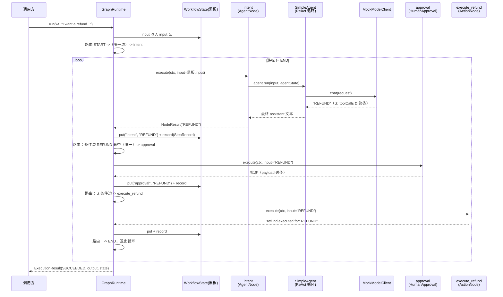

# Stage 5 概念与数据流（Workflow Graph Runtime）

> 对应阶段：Stage 5 - Workflow 和 Graph Runtime
> 定位：概念清单 -> 概念与类的映射 -> 一次执行的完整数据流
> 配套：架构设计见 [architecture-stage-5.md](architecture-stage-5.md)，代码在 `agent-workflow/` 模块

---

## 一、有哪些概念（15 个，分 4 组）

一句话总纲：**图是确定性控制平面，节点可以是不确定性决策点，黑板承载全部运行状态。**

### A. 结构概念（定义期，图是什么）

| # | 概念                    | 一句话定义                                    |
|---|-----------------------|------------------------------------------|
| 1 | **Workflow（图定义）**     | nodes + edges 的不可变图纸，定义一次执行 N 次；图是数据不是代码 |
| 2 | **WorkflowNode（节点）**  | 行为单元：做一件事，返回一个 output，不管路由               |
| 3 | **Edge（边）**           | 路由声明：from -> to + 可选条件谓词；条件放边上，节点保持单一职责  |
| 4 | **START / END（虚拟节点）** | 图的出入口，不是真实节点；入口边从 START 出发，终止边指向 END     |

### B. 执行概念（运行期，图怎么跑）

| # | 概念                    | 一句话定义                                               |
|---|-----------------------|-----------------------------------------------------|
| 5 | **GraphRuntime（解释器）** | 游标循环：路由 -> 执行 -> 写黑板 -> 前进，从 START 走到 END           |
| 6 | **Blackboard（黑板）**    | 全图唯一共享可变状态，三区：input（只读）/ variables（节点输出）/ trace（轨迹） |
| 7 | **输出流动**              | output 自动写黑板（key = node id），并成为下一节点的 `ctx.input()`  |
| 8 | **显式跳转**              | 节点返回 `NodeResult.jump(next, out)` 直接指定下一跳，优先级高于边    |

### C. 治理概念（可靠性，跑挂了怎么办）

| #  | 概念                     | 一句话定义                                   |
|----|------------------------|-----------------------------------------|
| 9  | **RetryPolicy（节点级重试）** | 失败原地重试（总尝试 = 1 + maxRetries），固定/指数退避    |
| 10 | **onError 边（失败路由）**    | 节点重试耗尽后不走正常边，路由到恢复节点；错误消息作为下游 input     |
| 11 | **maxSteps（环保护）**      | 条件边成环 A->B->A 时，步数上限强制熔断（默认 25）         |
| 12 | **路由确定性**              | 多条条件边同时命中 = 二义性报错；零命中且无兜底 = 死端报错；路由必须确定 |

### D. 协作概念（人机与并行）

| #  | 概念                          | 一句话定义                                                         |
|----|-----------------------------|---------------------------------------------------------------|
| 13 | **Human-in-the-loop（人工审批）** | 审批节点阻塞等待决定；批准则 payload 透传，拒绝则抛异常（可被 onError 接住）               |
| 14 | **Fork-Join（节点内并行）**        | 一个节点内部并行跑多条分支序列，ALL_OF 聚合成 Map / ANY_OF 取最快                   |
| 15 | **Trace（执行轨迹）**             | 每步一条 StepRecord（节点/状态/耗时/尝试次数/摘要），Stage 14 RL trajectory 的数据源 |

### 概念之间的三个核心关系

```text
关系 1：Agent 与 Workflow —— Agent 是图的一个节点（AgentNode），不是图的对立面
        图 = 确定性（下一步代码说了算）；AgentNode 内部 = 不确定性（LLM 说了算）
        爆炸半径 = 一个节点：路由可单测，LLM 失败被 Retry/onError 捕获

关系 2：图与黑板 —— 图是静态知识（可序列化、可复用、可 YAML 化）
        黑板是动态数据（每次运行一份、可快照 = Stage 6 Checkpoint 就绪）

关系 3：治理同构 —— Agent 层与 Workflow 层是同一套治理哲学的两个粒度
        步数保护 / 重试 / 执行记录，两层概念一一对应、行为一致
```

---

## 二、概念用哪些类表达（映射表）

### 核心抽象（`agent-workflow/.../workflow/`）

| 概念    | 类 / 记录                        | 关键成员                                                                          | 备注                                             |
|-------|-------------------------------|-------------------------------------------------------------------------------|------------------------------------------------|
| 图定义   | `Workflow` (final class)      | `nodes` / `outgoingEdges` / `errorEdges` / `retryPolicies` + `START`/`END` 常量 | 不可变，`Collections.unmodifiableMap`              |
| 图构建   | `WorkflowBuilder`             | `node()` / `edge().when()/otherwise()` / `onError()` / `build()`              | build() 快速失败校验定义                               |
| 节点    | `WorkflowNode` (interface)    | `id()` + `execute(NodeContext)`                                               | 唯一必须实现的两个方法                                    |
| 节点结果  | `NodeResult` (record)         | `output` + `next`（可空）                                                         | `of(out)` 走边 / `jump(next, out)` 显式跳转          |
| 边     | `Edge` (record)               | `from` / `to` / `condition: Predicate<WorkflowState>`                         | `matches(state)` 判定可通行                         |
| 黑板    | `WorkflowState`               | `getInput()` / `get/put(key)` / `record()` / `getTrace()`                     | ConcurrentHashMap + CopyOnWriteArrayList（并行安全） |
| 节点上下文 | `NodeContext` (interface)     | `state()` / `input()` / `inputAs(Class)`                                      | inputAs 用 Jackson 做类型转换                        |
| 解释器   | `GraphRuntime`                | `run(wf, input)` / `maxSteps(n)`（默认 25）                                       | 游标主循环 + 路由 + 重试包装                              |
| 执行结果  | `ExecutionResult` (record)    | `status` / `output` / `errorMessage` / `state` + `trace()`                    | 不抛运行异常，FAILED 也返回结果对象                          |
| 轨迹条目  | `StepRecord` (record)         | `nodeId` / `status` / `durationMs` / `attempts` / `summary`                   | success/failed 静态工厂                            |
| 重试策略  | `RetryPolicy` (record)        | `maxRetries` / `initialBackoffMs` / `multiplier`                              | `NONE` / `fixed()` / `backoff()` 工厂            |
| 审批服务  | `ApprovalService` (interface) | `approve(Request)`                                                            | 可插拔：Mock / Console；Stage 6 换成暂停-恢复实现           |
| 异常    | `WorkflowException`           | 内嵌 `ApprovalRejectedException`                                                | 定义期抛异常；运行期转 ExecutionResult.FAILED             |

### 节点类型库（`agent-workflow/.../workflow/nodes/`）

| 类                   | 表达的概念                       | 复用什么                                         |
|---------------------|-----------------------------|----------------------------------------------|
| `ActionNode`        | 确定性 Java 逻辑（lambda 即节点）     | -                                            |
| `AgentNode`         | LLM 决策点（不确定性收敛在节点内）         | agent-core 的 `Agent` + `AgentState`（节点内多轮记忆） |
| `ToolNode`          | 确定性工具调用（图决定调，不是模型决定）        | agent-core 的 `Tool`                          |
| `RouterNode`        | 复杂代码路由（输出 route key，边做相等比较） | -                                            |
| `HumanApprovalNode` | 人工审批卡点                      | `ApprovalService`                            |
| `ParallelNode`      | fork-join 并行（分支 = 节点序列）     | CompletableFuture.supplyAsync                |
| `JoinPolicy` (enum) | 并行收敛策略                      | ALL_OF（聚合 Map）/ ANY_OF（取最快）                  |

### 概念协作图

```mermaid
graph LR
    Builder["WorkflowBuilder<br/>定义期"] -->|build() 校验| WF["Workflow<br/>不可变图"]
    WF -->|解释执行| RT["GraphRuntime<br/>游标循环"]
    RT -->|读写| BB["WorkflowState<br/>黑板三区"]
    RT -->|包装执行| Node["WorkflowNode<br/>7 种实现"]
    Node -->|NodeResult| RT
    RT -->|判定| Edge["Edge<br/>条件/无条件"]
    RT -->|产出| Res["ExecutionResult<br/>+ StepRecord trace"]
    HAN["HumanApprovalNode"] -.->|阻塞询问| AS["ApprovalService"]
    PN["ParallelNode"] -.->|fork-join| JP["JoinPolicy"]
    RT -->|失败时| Retry["RetryPolicy"] & OnErr["onError 边"]
```

---

## 三、一次执行的数据流（跟着 REFUND 场景走）

场景取自验收示例 `WorkflowSupportFlowExample`：用户说 "I want a refund for order 1001"，mock 模型把意图分类为 REFUND。

图定义：

```text
START -> intent(AgentNode) --QUERY--> lookup(ToolNode) -> END
                            --REFUND--> approval(HumanApproval) -> execute_refund -> END
                            --otherwise--> handoff(Action) -> END
```

### 3.1 端到端时序



### 3.2 黑板逐拍演化（最直观的一张表）

| 拍 | cursor         | 动作                                                     | input 区                | variables 区                                            | trace 区                   |
|---|----------------|--------------------------------------------------------|------------------------|--------------------------------------------------------|---------------------------|
| 0 | START          | run() 写入 input                                         | `"I want a refund..."` | {}                                                     | []                        |
| 1 | START          | 路由（唯一无条件边）                                             | 不变                     | 不变                                                     | 不变                        |
| 2 | intent         | AgentNode 执行                                           | 不变                     | `{intent: "REFUND"}`                                   | [intent SUCCESS]          |
| 3 | intent         | 路由：`"REFUND".equals(s.get("intent"))` 唯一命中 -> approval | 不变                     | 不变                                                     | 不变                        |
| 4 | approval       | 审批通过，payload 透传                                        | 不变                     | `{intent:..., approval: "REFUND"}`                     | [+approval SUCCESS]       |
| 5 | approval       | 路由：无条件边 -> execute_refund                              | 不变                     | 不变                                                     | 不变                        |
| 6 | execute_refund | ActionNode 执行                                          | 不变                     | `{..., execute_refund: "refund executed for: REFUND"}` | [+execute_refund SUCCESS] |
| 7 | END            | 退出循环，组装结果                                              | 不变                     | 不变                                                     | 不变                        |

返回：`ExecutionResult(SUCCEEDED, output="refund executed for: REFUND", state=黑板)`。

### 3.3 数据流的 4 条铁律（从上表归纳）

```text
铁律 1（输出流动）：node 的 output -> 黑板 variables[node.id] -> 下一个节点的 ctx.input()
                   例外：onError 路由时，下游 input = 错误消息

铁律 2（路由优先级）：显式跳转 result.next
                        > 条件边唯一命中（多条命中 = 二义性异常）
                        > 无条件边兜底（otherwise）
                        > 都没有 = 死端异常
                   注意：无条件边只在零条件命中时生效（否则 otherwise 永远成立）

铁律 3（节点内部自治）：图不关心节点内部发生什么
                   AgentNode 内部：input 变 user 消息进 AgentState.messages，
                   ReAct 循环（可能多步 tool call），最终 assistant 文本 = 节点 output
                   节点持有自己的 AgentState，跨执行保留对话记忆

铁律 4（状态只在两处）：静态 = Workflow（定义期不变）
                       动态 = WorkflowState（运行期只增不改黑板键）
                       节点实例字段（如 AgentNode.agentState）是第三态：跨 run 保留，共享需谨慎
```

### 3.4 失败路径的数据流（对照记忆）

```text
节点抛异常
  -> executeWithRetry 捕获，按 RetryPolicy 重试（attempts 累计）
  -> 重试耗尽：
     有 onError 边：trace 记 FAILED -> lastOutput = e.getMessage() -> cursor = onError 目标
                   （下游收到的 input 是错误消息，恢复节点据此决策）
     无 onError 边：trace 记 FAILED -> 返回 ExecutionResult.FAILED(errorMessage, state)
  -> 审批拒绝是失败路径的特例：ApprovalRejectedException 走同样机制
```

### 3.5 GraphRuntime 主循环伪码（数据流的代码视角）

```java
String cursor = route(wf, START, null, state);        // START 是虚拟节点，先路由再执行
Object lastOutput = state.getInput();                 // 首节点的 input = 工作流输入

while (!END.equals(cursor)) {
    if (++steps > maxSteps) return failed("可能成环");  // 铁律：环保护
    NodeContext ctx = NodeContext.of(state, lastOutput);
    ExecOutcome out = executeWithRetry(wf, node, ctx); // RetryPolicy 包装
    if (out.failure() != null) { /* onError 边或 FAILED，见 3.4 */ }
    state.put(node.id(), out.result().output());       // 铁律 1 前半
    state.record(StepRecord.success(...));             // 轨迹
    lastOutput = out.result().output();                // 铁律 1 后半
    cursor = route(wf, node.id(), out.result().next(), state); // 铁律 2
}
return success(lastOutput, state);
```

---

## 附：与 Agent 层的概念对照（面试速答）

| 问                     | 一句话答                                                           |
|-----------------------|----------------------------------------------------------------|
| Agent 和 Workflow 的区别？ | 下一步谁说了算：LLM 说了算是 Agent，代码（图）说了算是 Workflow                      |
| 为什么 Agent 是节点？        | 不确定性关进盒子，图保持确定性、可测试、可审计，爆炸半径 = 一个节点                            |
| 状态存哪？                 | 黑板（WorkflowState 三区）；快照黑板 = Checkpoint（Stage 6 的接入口）           |
| 为什么条件在边上？             | 看图定义即知全部可能路径，审计不用读节点代码                                         |
| 并行怎么做？                | v1 节点内 fork-join（ParallelNode），图级并行调度留给 v2                     |
| 治理怎么保证？               | 三件套同构 Agent 层：maxSteps 环保护 / RetryPolicy 退避 / StepRecord trace |
